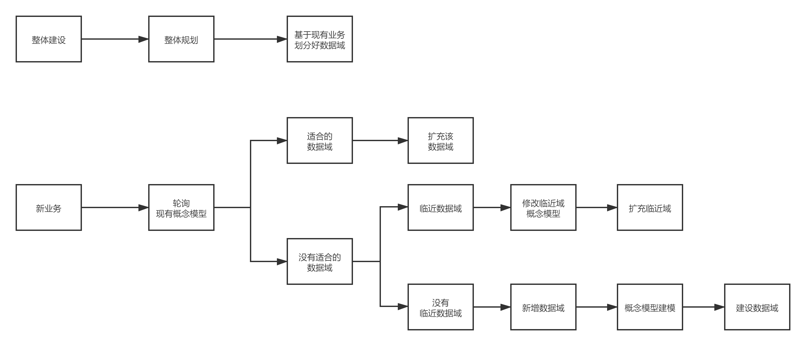
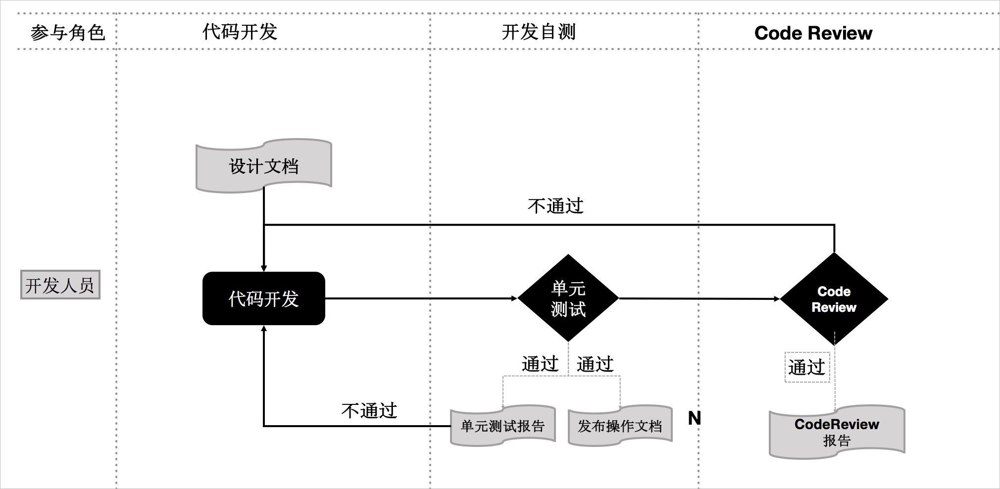
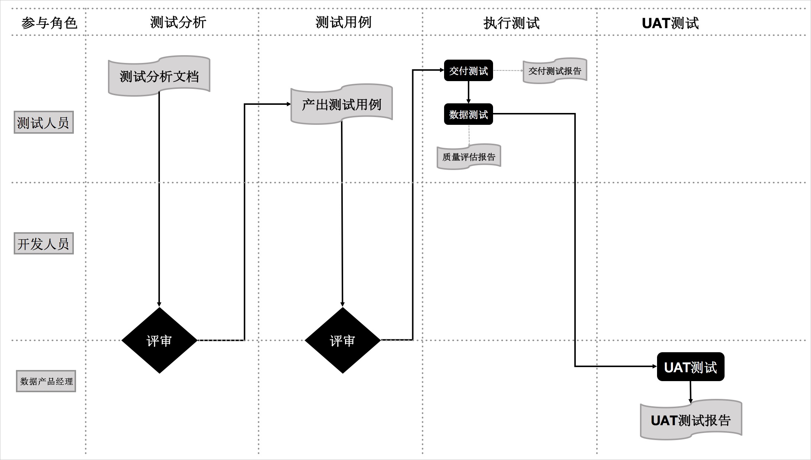
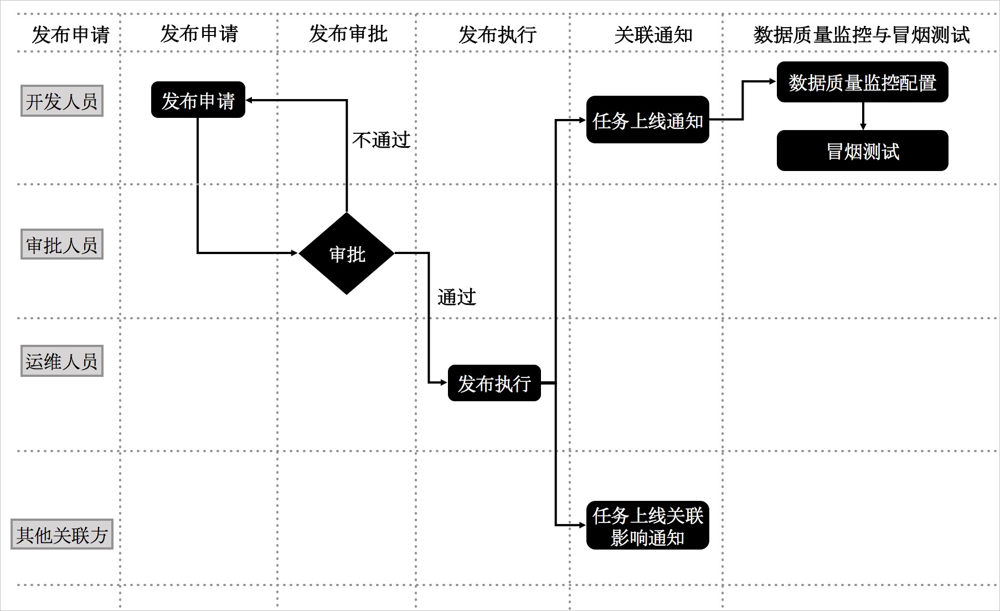

# 中台体系建设方法论

## 0x00.基本概念术语确定

### a.关于表设计`键`的术语

- 键：键是唯一标识一个实体的一个或者多个数据属性。在物理数据库中，键可以由表的一个或者多个列组成，它们的值唯一标识关系表中的一行。
- 复合键：由两个或者多个属性组成的键。
- 自然键：由现实世界中已经存在的属性组成的键。例如，美国公民被分配了一个唯一（不保证一定正确，但实际上非常接近唯一）的社会保险号（SSN）。如果隐私法允许的话，SSN可能被用作Person实体的自然键（假设组织的人员范围仅限于美国）。
- 代理键：不具有业务含义的键。
- 候选键：在逻辑数据模型中的实体类型可能具有0或多个候选键，简称为唯一标识（注解：某些人不主张在逻辑数据模型中标识候选键，因此没有固定标准）。例如，假设我们只涉及美国公民，那么SSN。Person实体类型的一个候选键，同时姓名与电话号码的组合（假设组合是唯一的）是第二个可能的候选键。这两个键都被称作候选键是因为它们是物理数据模型中主键、次键或者非键的候选目标。
- 主键：实体类型的首选键。
- 备用键：也就是次键，是表中行的另一个唯一标识。
- 外键：在一个实体类型中表示另一个实体类型的主键或者次键的一个或多个属性。

> 对上述不够明确的同学推荐阅读：[Choosing a Primary Key: Natural or Surrogate?](http://www.agiledata.org/essays/keys.html)

### b.关于数据仓库的表设计

- 3nf：
- 维度建模：

### c.数仓中的一些基本概念

- 业务板块：比数据域更高维度的业务划分方法，适用于特别庞大的业务系统。
- 维度：维度建模由Ralph Kimball提出。维度模型主张从分析决策的需求出发构建模型，为分析需求服务。维度是度量的环境，是我们观察业务的角度，用来反映业务的一类属性 。属性的集合构成维度 ，也可以称为实体对象。例如， 在分析交易过程时，可以通过买家、卖家、商品和时间等维度描述交易发生的环境。
- 属性（维度属性）：维度所包含的表示维度的列称为维度属性。维度属性是查询约束条件、分组和报表标签生成的基本来源，是数据易用性的关键。
- 度量：在维度建模中，将度量称为事实 ， 将环境描述为维度，维度是用于分析事实所需要的多样环境。度量通常为数值型数据，作为事实逻辑表的事实。
- 指标：指标分为原子指标和派生指标。原子指标是基于某一业务事件行为下的度量，是业务定义中不可再拆分的指标，是具有明确业务含义的名词 ，体现明确的业务统计口径和计算逻辑，例如支付金额。
- 原子指标 = 业务过程 + 度量
- 派生指标 = 时间周期 + 修饰词 + 原子指标，派生指标可以理解为对原子指标业务统计范围的圈定。
- 业务限定：统计的业务范围，筛选出符合业务规则的记录（类似于SQL中where后的条件，不包括时间区间）。
- 统计周期：统计的时间范围，例如最近一天，最近30天等（类似于SQL中where后的时间条件）。
- 统计粒度：统计分析的对象或视角，定义数据需要汇总的程度，可理解为聚合运算时的分组条件（类似于SQL中的group by的对象）。粒度是维度的一个组合，指明您的统计范围。例如，某个指标是某个卖家在某个省份的成交额，则粒度就是卖家、地区这两个维度的组合。如果您需要统计全表的数据，则粒度为全表。在指定粒度时，您需要充分考虑到业务和维度的关系。统计粒度常作为派生指标的修饰词而存在。

基本概念之间的关系和举例如下图所示:

## 0x01.数据划分之横向拆分

> 在阿里巴巴的数据体系中，我们建议将数据仓库分为三层，自下而上为：数据引入层（ODS，Operation Data Store）、数据公共层（CDM，Common Data Model）和数据应用层（ADS，Application Data Service）。

数据仓库的分层和各层级用途如下图所示。

- 数据引入层（ODS，Operation Data Store）：将原始数据几乎无处理的存放在数据仓库系统，结构上与源系统基本保持一致，是数据仓库的数据准备区。主要完成基础数据引入到数据平台的职责，同时可以基础数据记录的历史变化的。 
- 数据公共层（CDM，Common Data Model，又称通用数据模型层），包含DIM维度表、DWD和DWS，由ODS层数据加工而成。主要完成数据加工与整合，建立一致性的维度，构建可复用的面向分析和统计的明细事实表，以及汇总公共粒度的指标。
  - 公共维度层（DIM，Dimension）：基于`维度建模`理念思想，建立整个企业的一致性维度。降低数据计算口径和算法不统一风险。 公共维度层的表通常也被称为逻辑维度表，维度和维度逻辑表通常一一对应。建立一致性维度是整个企业数据仓库搭建的重中之重。
  - 明细粒度事实层（DWD，Data Warehouse Details）：以业务过程作为建模驱动，基于每个具体的业务过程特点，构建最细粒度的明细层事实表。可以结合企业的数据使用特点，将明细事实表的某些重要维度属性字段做适当冗余，即宽表化处理。 明细粒度事实层的表通常也被称为逻辑事实表。
  - 公共汇总粒度事实层（DWS，Data Warehouse Service）：以分析的主题对象作为建模驱动，基于上层的应用和产品的指标需求，构建公共粒度的汇总指标事实表，以宽表化手段物理化模型。构建命名规范、口径一致的统计指标，为上层提供公共指标，建立汇总宽表、明细事实表。 公共汇总粒度事实层的表通常也被称为汇总逻辑表，用于存放派生指标数据。
- 数据应用层（ADS，Application Data Service）：存放数据产品个性化的统计指标数据。根据CDM与ODS层加工生成，ADS层更像是一个逻辑上的概念，里面可能包含了宽表层的一些数据指标，同样为了方便更喜欢讲统计后的不可复用的结果直接对接应用的数据放置再应用数据层。

### 0.数据规范定义

> 规范定义是指以维度建模、3NF范式建模作为理论基础，构建总线矩阵，划分和定义数据域、业务过程、维度、度量、原子指标、修饰类型、修饰词、时间周期、衍生指标等。细粒度的划分便于指标的规则沉淀。
> 衍生指标构成：原子指标、业务限定、时间周期、统计粒度。其中原子子标必须有，时间周期、业务限定、统计粒度等可选。

解释一下：这里算子指标就是我们已经存在的事实表，在这基础上我们会有一定的维度限定条件举个例子。订单表可以使用时间周期限定（最近一个月）也可以使用特定的业务限定（移动端支付/pc支付）等当然有的指标也是同样可以用于统计维度的，但是我们对目前这个指标用sql理解就是where后面的条件，而统计维度则是基于这个维度进行分组聚合例如统计某一个地区（北京或上海的用户）或某一周产业（电子产品或者母婴等）使用sql方式去理解这里其实就是group by后面的字段，通过前面的限界条件可以得到一个新的衍生指标，这就是我们结果数据。一般这类衍生的指标是直接服务于数据应用或者发布成数据服务，存储在ads层
基于上述的数据定义，结合数据及业务的可持续发展，建议进行的表命名规范，所有的规范初期都是比较繁琐复杂，但坚持下来可以带来的复利是可以见到的：
- ODS：`ods_[业务库名]_{业务库原始表名}[_delta]`
- DWD：`dwd_{主题缩写}_{业务过程缩写}[_自定义标签缩写]_{单分区增量全量标识}`
- DWS：`dws_{数据域缩写}[_自定义标签缩写]_{刷新周期标识}`
- ADS：`ads_ [_业务应用缩写][_维度][_自定义标签缩写]_{刷新周期标识}`
- DIM：`dim_{维度定义}`

### 1.数据引入层（ODS，Operation Data Store）又叫操作数据层

> ODS层存放您从业务系统获取的最原始的数据，是其他上层数据的源数据。业务数据系统中的数据通常为非常细节的数据，经过长时间累积，且访问频率很高，是面向应用的数据。注意数据引入时的类型转换（业务系统与数仓间的类型，具体根据数仓选型来定），其他尽量与源系统一直即可。

#### a.数据引入层表设计

本教程中，在ODS层主要包括的数据有：交易系统订单详情、用户信息详情、商品详情等。这些数据未经处理，是最原始的数据。逻辑上，这些数据都是以二维表的形式存储。虽然严格的说ODS层不属于数仓建模的范畴，但是合理的规划ODS层并做好数据同步也非常重要。本教程中，使用了6张ODS表：

- 记录用于拍卖的商品信息：`ods_auction` 
- 记录用于正常售卖的商品信息：`ods_sale` 
- 记录用户详细信息：`ods_users_extra` 
- 记录新增的商品成交订单信息：`ods_biz_order_delta`
- 记录新增的物流订单信息：`ods_logistics_order_delta`
- 记录新增的支付订单信息：`ods_pay_order_delta`

> **说明：**
> 1. 表或字段命名尽量和业务系统保持一致，但是需要通过额外的标识来区分增量和全量表。例如，我们通过`_delta`来标识该表为增量表。
> 2. 命名时需要特别注意冲突处理，例如不同业务系统的表可能是同一个名称。为区分两个不同的表，您可以将这两个同名表的来源数据库名称作为后缀或前缀。例如，表中某些字段的名称刚好和关键字重名了，可以通过添加`_col1`后缀解决。

#### b.数据引入层存储

为了满足历史数据分析需求，您可以在ODS层表中添加时间维度作为分区字段。实际应用中，您可以选择采用**增量**、**全量存储**或**拉链存储**的方式。

- 增量存储

以天为单位的增量存储，以业务日期作为分区，每个分区存放日增量的业务数据。 举例如下：

1月1日，用户A访问了A公司电商店铺B，A公司电商日志产生一条记录t1。1月2日，用户A又访问了A公司电商店铺C，A公司电商日志产生一条记录t2。采用增量存储方式，t1将存储在1月1日这个分区中，t2将存储在1月2日这个分区中。

|记录|用户|店铺|日期(分区)|
|-|-|-|-|
|t1|A|B|20200101|
|t2|A|C|20200102|

1月1日，用户A在A公司电商网购买了B商品，交易日志将生成一条记录t1。1月2日，用户A又将B商品退货了，交易日志将更新t1记录。采用增量存储方式，初始购买的t1记录将存储在1月1日这个分区中，更新后的t1将存储在1月2日这个分区中。

|记录|用户|商品|状态|日期(分区)|
|-|-|-|-|-|
|t1|A|B|购买|20200101|
|t2|A|B|退货|20200102|

> **说明：**交易、日志等事务性较强的ODS表适合增量存储方式。这类表数据量较大，采用全量存储的方式存储成本压力大。此外，这类表的下游应用对于历史全量数据访问的需求较小（此类需求可通过数据仓库后续汇总后得到）。例如，日志类ODS表没有数据更新的业务过程，因此所有增量分区UNION在一起就是一份全量数据。

- 全量存储

以天为单位的全量存储，以业务日期作为分区，每个分区存放截止到业务日期为止的全量业务数据。 例如， 1月1日，卖家A在A公司电商网发布了B、C两个商品，前端商品表将生成两条记录t1、t2。1月2日，卖家A将B商品下架了，同时又发布了商品D，前端商品表将更新记录t1，同时新生成记录t3。采用全量存储方式， 在1月1日这个分区中存储t1和t2两条记录，在1月2日这个分区中存储更新后的t1以及t2、t3记录。

|记录|用户|商品|状态|日期(分区)|
|-|-|-|-|-|
|t1|卖家A|商品B|上架|20200101|
|t2|卖家A|商品C|上架|20200101|
|t1|卖家A|商品B|下架|20200102|
|t2|卖家A|商品C|上架|20200102|
|t3|卖家A|商品D|上架|20200102|

> **说明：**对于小数据量的缓慢变化维度数据，例如商品类目，可直接使用全量存储。

- 拉链存储

拉链存储通过新增两个时间戳字段（start_dt和end_dt），将所有以天为粒度的变更数据都记录下来，通常分区字段也是这两个时间戳字段。

拉链存储举例如下。

|商品|start_dt|end_dt|卖家|状态|
|-|-|-|-|-|
|B|20160101|20160102|A|上架|
|C|20160101|30001231|A|上架|
|B|20160102|30001231|A|下架|

> 这样，下游应用可以通过限制时间戳字段来获取历史数据。例如，用户访问1月1日数据，只需限制 `stat_dt` <= '20160101' AND `end_dt` > '20160101'。

- 缓慢变化维度

构建数据架构时不推荐使用代理键，推荐使用自然键作为维度主键，主要原因有两点：
- 数据中台使用的一般都是分布式计算引擎，生成全局唯一的代理键工作量非常大。当遇到大数据量情况下，这项工作就会更加复杂，且没有必要。
- 使用代理键会增加ETL的复杂性，从而增加ETL任务的开发和维护成本。
- 因为是分布式系统，统一不重复的代理键维护起来并不容易。

在不使用代理键的情况下，缓慢变化维度可以通过快照方式处理。
快照方式下数据的计算周期通常为每天一次。基于该周期，处理维度变化的方式为每天一份全量快照。

例如商品维度，每天保留一份全量商品快照数据。任意一天的事实表均可以取到当天的商品信息，也可以取到最新的商品信息，通过限定日期，采用自然键进行关联即可。该方式的优势主要有以下两点：
- 处理缓慢变化维度的方式简单有效，开发和维护成本低。
- 使用方便，易于理解。数据使用方只需要限定日期即可取到当天的快照数据。任意一天的事实快照与任意一天的维度快照通过维度的自然键进行关联即可。

该方法的弊端主要是存储空间的极大浪费。例如某维度每天的变化量占总体数据量比例很低，极端情况下，每天无变化，这种情况下存储浪费严重。该方法主要实现了通过牺牲存储获取ETL效率的优化和逻辑上的简化。请避免过度使用该方法，且必须要有对应的数据生命周期制度，清除无用的历史数据。

#### c.数据同步加载与处理

ODS的数据需要由各数据源系统同步到数据仓库，才能用于进一步的数据开发。在使用数据集成的过程中，建议您遵循以下规范：
- 一个系统的源表只允许同步到数据中台一次，保持表结构的一致性。
- 数据集成仅用于离线全量数据同步，实时增量数据同步要使用流式的方式处理。
- 数据集成全量同步的数据直接进入全量表的当日分区。
- 同步数据主要有两步：
  - 全量初始化。对于同步的每个表，全量初始化的数据都会独立存储在数据仓库中的全量基线表中，这个表名的默认格式为：源表名_base。
  - 增量数据同步。增量数据实时同步到数据仓库中。并存储在增量日志表中，每个同步表对应一个增量日志表。在增量数据同步时，会使用合并多条记录到一个文件的方式写入到数据仓库中。增量日志表在数据仓库中存储的表名的默认格式为：源表名_log。
  - 根据同步到数据仓库中的全量基线表和增量日志数据得到某个时刻表的全量数据，可以使用sql合并全部数据写入新的表的方式来进行数据合并。
- ODS层的表建议以统计日期及时间分区表的方式存储，便于管理数据的存储成本和策略控制。
- 数据集成可以自适应处理源系统字段的变更：
  - 如果源系统字段的目标表在数据仓库不存在，可以由数据集成自动添加不存在的表字段。
  - 如果目标表的字段在源系统不存在，数据集成填充NULL。

#### d.数据存储及生命周期管理

|数据表类型|存储方式|最长存储保留策略|
|-|-|-|
|ODS流水型全量表|按天分区|不可再生情况下永久保存。日志（非常大，例如一天数据大于100GB）数据保留24个月。自主设置是否保留历史月初数据。自主设置是否保留特殊日期数据。|
|ODS镜像型全量表|按天分区|重要的业务表及需要保留历史的表视情况保存。ODS全量表的默认生命周期管理为保留2天，并采用ds=max_pt(tablename)方式进行数据访问。ODS增量表。按天分区。有对应的全量表则最多保留最近14天分区数据。无全量表的增量数据需永久保留。|
|ODS ETL过程临时表|按天分区|最多保留最近7天分区。|
|BDSync非去重数据|按天分区|由应用通过中间层做保留历史处理，默认ODS层不保留历史。|

#### e.数据质量规范

- 每个ODS全量表必须配置唯一性字段标识。
- 每个ODS全量表必须做分区空数据监控。
- 建议对重要表的重要枚举类型字段做枚举值变化及枚举值分布监控。
- 建议对ODS表的数据量及数据记录数设置上周同比无变化监控，用于监控源系统是否下线或者已迁移。
- 只有有监控要求的表才创建数据质量管控层，应由DataWorks的数据质量配置完成。
- 每个ODS层全表都必须要有注释。

### 2.数据公共层（CDM，Common Data Model）

> 数据公共层CDM可以细分为三层，分别为公共维度层（DIM，Dimension）、明细粒度事实层（DWD，Data Warehouse Details）、公共汇总粒度事实层（DWS，Data Warehouse Service），下面分别介绍：

#### a.公共维度层（DIM，Dimension）

公共维度层（DIM）基于维度建模理念，建立整个企业的一致性维度。

公共维度层主要由维度表（维表）构成。维度是逻辑概念，是衡量和观察业务的角度。维表是根据维度及其属性将数据平台上构建的表物理化的表，采用宽表设计的原则。因此，构建公共维度层（DIM）首先需要定义维度。

##### I.定义维度

在划分数据域、构建总线矩阵时，需要结合对业务过程的分析定义维度。

作为维度建模的核心，在企业级数据仓库中必须保证维度的唯一性。以A公司的商品维度为例，有且只允许有一种维度定义。例如，省份code这个维度，对于任何业务过程所传达的信息都是一致的。

##### II.设计维表

完成维度定义后，您就可以对维度进行补充，进而生成维表了。维表的设计需要注意：
- 建议维表单表信息不超过1000万条。
- 维表与其他表进行Join时，建议您使用Map Join。使用mapjoin缓存小表，可以有效避免数据倾斜。
- 避免过于频繁的更新维表的数据。

在设计维表时，您需要从下列方面进行考虑：
- 维表中数据的稳定性。例如A公司电商会员通常不会出现消亡，但会员数据可能在任何时候更新，此时要考虑创建单个分区存储全量数据。如果存在不会更新的记录，您可能需要分别创建历史表与日常表。日常表用于存放当前有效的记录，保持表的数据量不会膨胀；历史表根据消亡时间插入对应分区，使用单个分区存放分区对应时间的消亡记录。
- 是否需要垂直拆分。如果一个维表存在大量属性不被使用，或由于承载过多属性字段导致查询变慢，则需考虑对字段进行拆分，创建多个维表。
- 是否需要水平拆分。如果记录之间有明显的界限，可以考虑拆成多个表或设计成多级分区。
- 核心的维表产出时间通常有严格的要求。

设计维表的主要步骤如下：
1. 完成维度的初步定义，并保证维度的一致性。
2. 确定主维表（中心事实表，本教程中采用星型模型）。此处的主维表通常是数据引入层（ODS）表，直接与业务系统同步。例如，s_auction是与前台商品中心系统同步的商品表，此表即是主维表。
3. 确定相关维表。数据仓库是业务源系统的数据整合，不同业务系统或者同一业务系统中的表之间存在关联性。根据对业务的梳理，确定哪些表和主维表存在关联关系，并选择其中的某些表用于生成维度属性。以商品维度为例，根据对业务逻辑的梳理，可以得到商品与类目、卖家、店铺等维度存在关联关系。
4. 确定维度属性，主要包括两个阶段。第一个阶段是从主维表中选择维度属性或生成新的维度属性；第二个阶段是从相关维表中选择维度属性或生成新的维度属性。以商品维度为例，从主维表（ s_auction）和类目 、卖家、店铺等相关维表中选择维度属性或生成新的维度属性。
5. 尽可能生成丰富的维度属性。
6. 尽可能多地给出富有意义的文字性描述。
7. 区分数值型属性和事实。
8. 尽量沉淀出通用的维度属性。

##### III.公共维度汇总层（DIM）维表规范

公共维度汇总层（DIM）维表命名规范：`dim_{业务板块名称/pub}_{维度定义}[_{自定义命名标签}]`，所谓pub是与具体业务板块无关或各个业务板块都可公用的维度，如时间维度。举例如下：
- 公共区域维表 `dim_pub_area`
- A公司电商板块的商品全量表 `dim_asale_itm`

#### b.明细粒度事实层（DWD，Data Warehouse Details）

> 明细粒度事实层以业务过程驱动建模，基于每个具体的业务过程特点，构建最细粒度的明细层事实表。您可以结合企业的数据使用特点，将明细事实表的某些重要维度属性字段做适当冗余，即宽表化处理。

公共汇总粒度事实层（DWS）和明细粒度事实层（DWD）的事实表作为数据仓库维度建模的核心，需紧绕业务过程来设计。通过获取描述业务过程的度量来描述业务过程，包括引用的维度和与业务过程有关的度量。度量通常为数值型数据，作为事实逻辑表的依据。事实逻辑表的描述信息是事实属性，事实属性中的外键字段通过对应维度进行关联。

事实表中一条记录所表达的业务细节程度被称为粒度。通常粒度可以通过两种方式来表述：一种是维度属性组合所表示的细节程度，一种是所表示的具体业务含义。

作为度量业务过程的事实，通常为整型或浮点型的十进制数值，有可加性、半可加性和不可加性三种类型：
- 可加性事实是指可以按照与事实表关联的任意维度进行汇总。
- 半可加性事实只能按照特定维度汇总，不能对所有维度汇总。例如库存可以按照地点和商品进行汇总，而按时间维度把一年中每个月的库存累加则毫无意义。
- 完全不可加性，例如比率型事实。对于不可加性的事实，可分解为可加的组件来实现聚集。

事实表相对维表通常更加细长，行增加速度也更快。维度属性可以存储到事实表中，这种存储到事实表中的维度列称为维度退化，可加快查询速度。与其他存储在维表中的维度一样，维度退化可以用来进行事实表的过滤查询、实现聚合操作等。

明细粒度事实层（DWD）通常分为三种：事务事实表、周期快照事实表和累积快照事实表。
- 事务事实表用来描述业务过程，跟踪空间或时间上某点的度量事件，保存的是最原子的数据，也称为原子事实表。
- 周期快照事实表以具有规律性的、可预见的时间间隔记录事实。
- 累积快照事实表用来表述过程开始和结束之间的关键步骤事件，覆盖过程的整个生命周期，通常具有多个日期字段来记录关键时间点。当累积快照事实表随着生命周期不断变化时，记录也会随着过程的变化而被修改。

##### I.明细粒度事实表设计原则

明细粒度事实表设计原则如下所示：
- 通常，一个明细粒度事实表仅和一个维度关联。
- 尽可能包含所有与业务过程相关的事实 。
- 只选择与业务过程相关的事实。
- 分解不可加性事实为可加的组件。
- 在选择维度和事实之前必须先声明粒度。
- 在同一个事实表中不能有多种不同粒度的事实。
- 事实的单位要保持一致。
- 谨慎处理Null值。
- 使用退化维度提高事实表的易用性。

明细粒度事实表整体设计流程如下图所示：

在一致性度量中已定义好了交易业务过程及其度量。明细事实表注意针对业务过程进行模型设计。明细事实表的设计可以分为四个步骤：选择业务过程、确定粒度、选择维度、确定事实（度量）。粒度主要是在维度未展开的情况下记录业务活动的语义描述。在您建设明细事实表时，需要选择基于现有的表进行明细层数据的开发，清楚所建表记录存储的是什么粒度的数据。

##### II.明细粒度事实层（DWD）规范

通常您需要遵照的命名规范为：`dwd_{业务板块/pub}_{数据域缩写}_{业务过程缩写}[_{自定义表命名标签缩写}]_{单分区增量全量标识}`，pub表示数据包括多个业务板块的数据。单分区增量全量标识通常为：**i表示增量，f表示全量**。例如：`dwd_asale_trd_ordcrt_trip_di`（A电商公司航旅机票订单下单事实表，日刷新增量）及`dwd_asale_itm_item_df`（A电商商品快照事实表，日刷新全量）。

本教程中，DWD层主要由三个表构成：
- 交易商品信息事实表：`dwd_asale_trd_itm_di`。
- 交易会员信息事实表：`ods_asale_trd_mbr_di`。
- 交易订单信息事实表：`dwd_asale_trd_ord_di`。

#### c.公共汇总粒度事实层（DWS，Data Warehouse Service）

> 公共汇总粒度事实层以分析的主题对象作为建模驱动，基于上层的应用和产品的指标需求构建公共粒度的汇总指标事实表。公共汇总层的一个表通常会对应一个派生指标。

##### I.公共汇总事实表设计原则

聚集是指针对原始明细粒度的数据进行汇总。DWS公共汇总层是面向分析对象的主题聚集建模。在本教程中，最终的分析目标为：最近一天某个类目（例如：厨具）商品在各省的销售总额、该类目Top10销售额商品名称、各省用户购买力分布。因此，我们可以以最终交易成功的商品、类目、买家等角度对最近一天的数据进行汇总。

> **注意**
> 聚集是不跨越事实的。聚集是针对原始星形模型进行的汇总。为获取和查询与原始模型一致的结果，聚集的维度和度量必须与原始模型保持一致，因此聚集是不跨越事实的。
> 聚集会带来查询性能的提升，但聚集也会增加ETL维护的难度。当子类目对应的一级类目发生变更时，先前存在的、已经被汇总到聚集表中的数据需要被重新调整。

此外，进行DWS层设计时还需遵循以下原则：
- 数据公用性：需考虑汇总的聚集是否可以提供给第三方使用。您可以判断，基于某个维度的聚集是否经常用于数据分析中。如果答案是肯定的，就有必要把明细数据经过汇总沉淀到聚集表中。
- 不跨数据域。数据域是在较高层次上对数据进行分类聚集的抽象。数据域通常以业务过程进行分类，例如交易统一划到交易域下， 商品的新增、修改放到商品域下。
- 区分统计周期。在表的命名上要能说明数据的统计周期，例如_1d表示最近1天，td表示截至当天，nd表示最近N天。

##### II.公共汇总事实表规范

公共汇总事实表命名规范：`dws_{业务板块缩写/pub}_{数据域缩写}_{数据粒度缩写}[_{自定义表命名标签缩写}]_{统计时间周期范围缩写}`。

关于统计实际周期范围缩写，缺省情况下，离线计算应该包括最近一天（_1d），最近N天（_nd）和历史截至当天（_td）三个表。如果出现_nd的表字段过多需要拆分时，只允许以一个统计周期单元作为原子拆分。即一个统计周期拆分一个表，例如最近7天（_1w）拆分一个表。不允许拆分出来的一个表存储多个统计周期。
对于小时表（无论是天刷新还是小时刷新），都用_hh 来表示。
对于分钟表（无论是天刷新还是小时刷新），都用_mm来表示。

举例如下：
- dws_asale_trd_byr_subpay_1d（A电商公司买家粒度交易分阶段付款一日汇总事实表）
- dws_asale_trd_byr_subpay_td（A电商公司买家粒度分阶段付款截至当日汇总表）
- dws_asale_trd_byr_cod_nd（A电商公司买家粒度货到付款交易汇总事实表）
- dws_asale_itm_slr_td（A电商公司卖家粒度商品截至当日存量汇总表）
- dws_asale_itm_slr_hh（A电商公司卖家粒度商品小时汇总表）---维度为小时
- dws_asale_itm_slr_mm（A电商公司卖家粒度商品分钟汇总表）---维度为分钟

##### III.层次调用规范

在完成数据仓库的分层后，您需要对各层次的数据之间的调用关系作出约定。
ADS应用层优先调用数据仓库公共层数据。如果已经存在CDM层数据，不允许ADS应用层跨过CDM中间层从ODS层重复加工数据。CDM中间层应该积极了解应用层数据的建设需求，将公用的数据沉淀到公共层，为其他数据层次提供数据服务。同时，ADS应用层也需积极配合CDM中间层进行持续的数据公共建设的改造。避免出现过度的ODS层引用、不合理的数据复制和子集合冗余。总体遵循的层次调用原则如下：
- ODS层数据不能直接被应用层任务引用。如果中间层没有沉淀的ODS层数据，则通过CDM层的视图访问。CDM层视图必须使用调度程序进行封装，保持视图的可维护性与可管理性。
- CDM层任务的深度不宜过大（建议不超过10层）。
- 一个计算刷新任务只允许一个输出表，特殊情况除外。
- CDM汇总层优先调用CDM明细层，可累加指标计算。CDM汇总层尽量优先调用已经产出的粗粒度汇总层，避免大量汇总层数据直接从海量的明细数据层中计算得出。
- CDM明细层累计快照事实表优先调用CDM事务型事实表，保持数据的一致性产出。
- 有针对性地建设CDM公共汇总层，避免应用层过度引用和依赖CDM层明细数据。

##### 表的其他优化技巧

中间表的利用：适用于数据量非常大，下游任务很多的表。
拆表：适用于个别字段产出极慢的情况，您可以将字段拆分为单独的表。
合表：随着数仓的发展，针对业务重叠或重复的表，您可以进行任务和数据合并。拉链表：合理利用拉链表能减少您的存储消耗。

#### d.设计准则

- 一致性维度规范,公共层的维度表中相同维度属性在不同物理表中的字段名称、数据类型、数据内容必须保持一致。除了以下特例：
  - 在不同的实际物理表中，如果由于维度角色的差异，需要使用其他的名称，其名称也必须是规范的维度属性的别名。例如，定义一个标准的会员ID时，如果在一个表中，分别要表示买家ID，卖家ID，那么设计规范阶段就预先对会员ID分别定义买家ID和卖家ID。
  - 如果由于历史原因，在暂时不一致的情况下，必须在规范的维度定义一个标准维度属性，不同的物理名也必须是来自标准维度属性的别名。
- 维度的组合与拆分
  - 组合原则
    - 将维度所描述业务相关性强的字段在一个物理维表实现，相关性一般指：经常需要一起查询、报表展现，例如商品基本属性和所属品牌；两个维度属性间是否存在天然的关系等。
    - 无相关性的维度可以适当考虑杂项维度，例如交易，可以构建一个交易杂项维度收集交易的特殊标记属性、业务分类等信息。也可以将杂项维度退化在事实表中处理，不过容易造成事实表相对庞大，加工处理较为复杂。
    - 所谓的行为维度是经过汇总计算的指标，在下游的应用使用时将其当维度处理。如果有需要，度量指标可以作为行为维度冗余到维度表中。
  - 拆分与冗余
    - 对于维度属性过多，涉及源较多的维度表，可以做适当拆分。
      - 例如会员表，建议拆分为核心表和扩展表。核心表相对字段较少，刷新产出时间较早，优先使用。扩展表字段较多，且可以冗余核心表部分字段，刷新产出时间较晚，适合数据分析人员使用。
      - 根据维度属性的业务不相关性，将相关度不大的维度属性拆分为多个物理表存储。
    - 数据记录数较大的维度表，可以适当冗余一些子集合，以减少下游扫描数据量：
      - 例如商品表，可以根据当天是否有行为，产出一个有活跃行为的相关维表，以减少应用的数据扫描量。
	  - 可根据所属业务扫描数据范围大小的不同，进行适当子集合冗余。

### 3.数据应用层（ADS，Application Data Service）

## 0x02.数据划分之纵向拆分

数据仓库是面向主题的应用，主要功能是将数据综合、归类并进行分析利用。数据仓库模型设计除横向的分层外，通常还需要根据业务情况纵向划分数据域。数据域是联系较为紧密的数据主题的集合，是业务对象高度概括的概念层次归类，目的是便于数据的管理和应用。

通常，您需要阅读各源系统的设计文档、数据字典和数据模型设计文档，研究逆向导出的物理数据模型。然后，进行跨源的主题域合并，梳理出整个企业的数据域。

数据域是指面向业务分析，将业务过程或维度进行抽象的集合。为保障整个体系的生命力，数据域需要抽象提炼，并长期维护更新，但不轻易变动。划分数据域时，需满足以下两点：
- 能涵盖当前所有的业务需求。
- 能在新业务进入时，无影响地被包含进已有的数据域中和扩展新的数据域。

例如，A公司电商营销业务板块可以划分为如下表所示的数据域。数据域中的每一部分，都是根据实际业务过程进行归纳、抽象得出的。

|数据域|业务过程举例|
|-|-|
|会员和店铺域|注册、登录、装修、开店、关店|
|商品域|发布、上架、下架、重发|
|日志域|曝光、浏览、点击|
|交易域|下单、支付、发货、确认收货（交易成功）|
|服务域|商品收藏、拜访、培训、优惠券领用|
|采购域|商品采购（供应链管理）|

### 数据域建设步骤

1. 前期通过整体规划整体建设已经逐步建成了部分数据域。
2. 当新业务来临，需要轮询已经建设好的数据域概念模型，比对概念模型的规则，找到合适的域就将该业务作为该域的扩充放入该域，否则也可以找到临近的域，修改临近概念模型后再扩充该临近域。
3. 轮询结束还是没有找到合适的域，并无临近域，则新增一个域发起重新建设的流程。

## 0x03.数据仓库研发规范概述

本文将为您介绍数据仓库研发规范的阶段规划、角色职责和整体流程。

在大数据时代，规范地进行数据资产管理已成为推动互联网、大数据、人工智能和实体经济深度融合的必要条件。贴近业务属性、兼顾研发各阶段要点的研发规范，可以切实提高研发效率，保障数据研发工作有条不紊地运作。而不完善的研发流程，会降低研发效率，增加成本与风险。
总而言之，数据资产管理实际上是对物的管理，而研发流程规范管理则是对人的行为的管理。只有落实了作为基础的后者，才能进一步实行数据资产管理方法论。

数据仓库研发规范旨在为广大数据研发者、管理者提供规范化的研发流程指导方法，目的是简化、规范日常工作流程，提高工作效率，减少无效与冗余工作，赋能企业、政府更强大的数据掌控力来应对海量增长的业务数据，从而释放更多人力与财力专注于业务创新。

**阶段规划**

鉴于对日常数据仓库研发工作的总结与归纳，本文将数据仓库研发流程抽象为如下几点：
- 需求阶段：数据产品经理应如何应对不断变化的业务需求。
- 设计阶段：数据产品经理、数据开发者应如何综合性能、成本、效率、质量等因素，更好地组织与存储数据。
- 开发阶段：数据研发者如何高效、规范地进行编码工作。
- 测试阶段：测试人员应如何准确地暴露代码问题与项目风险，提升产出质量。
- 发布阶段：如何将具备发布条件的程序平稳地发布到线上稳定产出。
- 运维阶段：运维人员应如何保障数据产出的时效性和稳定性。

**角色职责**

- 数据产品经理：负责承接、评估业务方提出的数据需求，并组织需求评审、产出产品需求文档，同时需要把控其它更为细化的技术评审。
- 设计人员：根据已定稿的产品需求文档所述需求，进行数据探查，了解数据形态（数据质量、数据分布），同时根据探查结果实现表设计、Mapping设计、调度设计等系分设计工作。
- 开发人员：根据设计人员产出的稿件，制定计划并实现代码，同时进行单元测试与代码评审。
- 测试人员：负责验证需求与结果的一致性，发现代码问题与项目风险。
- 运维人员：负责发布任务，并处理数据、程序、调度、监控告警等异常事件，保障数据产出时效、程序高效运行和生产稳定性。
- 信息安全与合规人员：在需求评审前期，负责需求实现的安全性与合规性。

### 1.需求阶段

数仓的最基本职责是定义和发现在企业决策中使用的信息，随着企业战略方向的改变与业务方对行业判断的变化，需求会不断变化。该特性决定了数据仓库需求的多样性和迭代性。
作为承接业务方数据需求的数据产品经理，在需求阶段需要规范首次需求流程和迭代需求流程。

#### a.首次需求流程

对于业务方首次提出的需求，重点工作在于评估完成该需求的技术、数据、合规的可行性后，以细化需求的方式完成产品需求文档，并组织需求评审会议多方共同敲定需求最终实现方案。

首次需求流程包括以下步骤：

- 提出需求
- 外部沟通：数据产品经理主导，负责与外部门业务方充分沟通。力求获取并理解业务场景（背景）、目标和实现价值。

> **说明：**此处不必与业务方讨论需求实现的途径或细节，双方只了解需要达到什么目标，而不讨论如何实现。

- 完成产品需求文档的初稿：得到充分信息后，按照数据仓库需求模板中的常规需求申请单，将需求转化为产品需求文档的初稿。
- 分析需求
  - 可行性分析：数据产品经理主导，邀请设计、数据安全与合规人员，对需求进行评估。
  - 需求合理性：评估该需求的合理性。
  - 数据可行性：评估当前已有数据能否支撑需求开发，如果缺少数据，则需要另行规划缺失数据的抽取方案。
  - 同时建议进行深入的数据探查，包括但不限于数据完整性、字段离散值分布情况、空值、零值、重复值占比等情况。
  - 技术可行性：评估当前已有数据模型能否支撑需求开发，如果不能，则需要规划模型改造方案，并充分评估其影响。同时在测试环境进行模型测试。

  > **说明：**如果涉及资损、精确对账或其他关键模型的改造，测试人员必须进行测试。

  - 是否满足安全与合规要求：根据企业自身数据安全的要求，严格控制数据内部流向，划分研发过程中数据可流入的库、项目、表、字段等。对于流出外部的数据，更需要严格评估流出数据内容、流出目的地是否符合公司数据安全的要求。

  > **说明：**此项评估是不可跳过的步骤。

  - 实现细节分析：数据产品经理主导，对实现需求的细节关键点进行确认，包括但不限于数据口径、接口格式、供数频率和需求优先级。
- 完善产品需求文档：完善产品需求文档的初稿。
- 评审需求：数据产品经理主导，邀请设计人员、测试人员发起需求评审会。会议内容主要包括：
  - 各方提出对于产品需求文档中各细节的疑问。
  - 共同达成对于疑问的解决方案。
  > **说明：**评审会议上不得遗留影响后续研发流程的关键问题，否则视为评审不通过。

- 确认需求：N个工作日（视各企业实际情况而定）内如果无异议，则产品需求文档定稿，并开始进入后续的涉及与开发阶段。

#### b.迭代需求流程

对于同一需求，在完成首次需求评审并定稿产品需求文档后，业务方再次提出的需求，均属于迭代需求。

迭代需求的流程与首次需求流程类似，均需进行可行性分析、实现细节分析。分析完成后，视实际情况来定是否需要再次进行需求评审，最终将新老需求合并至产品需求文档终稿。

迭代需求流程包括以下步骤：

- 申请需求变更

数据产品经理完成业务方迭代需求对接后，将新的需求录入数据仓库需求模板的迭代需求申请单中。说明 如果企业具备需求相关管理平台，建议通过平台+数据库形式规范化存储不断迭代的每个需求版本。

- 评审需求变更

原则上需求评审需由数据产品经理发起评审会议来完成，但如果需求迭代内容不多，评审方式可视情况而定选择邮件或现场会议方式，具体视变更内容由变更委员会决定。
评审内容仍为实现需求必须面对的技术可行性、数据可行性、安全与合规要求性展开讨论，如果多方有异议，则必须共同达成一致性解决方案。

- 确认并合并需求

数据产品经理将上一版本定稿的产品需求文档内容，与本次评审定稿的产品需求文档内容进行合并。
如果两个工作日内无异议，则视为需求确认。

### 2.设计阶段

完成需求阶段的工作后，数据产品经理会产出最终版本的产品需求文档，以供设计人员进行设计工作。

设计工作包含数据探查和系分设计两部分：

- 数据探查旨在了解来源数据的数据形态，例如数据质量、数据分布等。结合业务场景，帮助分析和判断需求实现的可行性以及找出潜在的数据问题和风险。
- 系分设计则包括表设计、Mapping设计和调度设计等最实际的设计工作。

设计完毕后，最终将产出供开发人员参照实施开发的ETL设计文档、数据探查文档、调度设计文档，为需求的有效实现打下坚实基础。

设计阶段的流程包括以下步骤：

- 数据探查：数据探查的目的是了解数据的形态，找到潜在问题与风险。数据探查是决定数据可靠性的关键步骤。数据探查报告可以为后续开发提供指导，并作为依据指定开发计划。数据探查的内容主要包括但不限于以下内容：
  - 源表数据主键字段重复数。
  - 源表字段空值/异常值的统计数。
  - 源表之间关联关系。
  - 源表字段的数据格式。
  - 源表增量规则。

> **说明：**探查完成后，最终产出数据探查报告。如果发现当前数据无法支撑需求的实现，则要将需求退回给数据产品经理，由数据产品经理发起迭代需求流程。

- 系分设计，系分设计包括表设计、Mapping设计和调度设计三部分。
- 表设计，表设计是指依据需求设计目标产出表、中间产出表。包含表名、表名解释、字段名、字段类型、字段注释以及字段安全等级等。表设计的步骤如下所示：
  1. 设计表名、字段名：要求相同的字段在不同表中的字段名相同。
  2. 设计主键和外键。
  3. 设计字段注释：通过标注字段注释、枚举值来表明字段含义，如果枚举值过多，建议为枚举值创建维表。
  4. 设计表分区：建议所有表都创建为分区表。
  5. 设计数据生命周期。

    企业应根据自身实际情况来进行设置，也可以参考如下数值：

    |数仓分层|说明|
    |-|-|
    |ODS层|非去重数据：默认不保留。ETL临时表：保留14日。镜像全量表：重要数据建议采用极限存储。流水全量表：如果不可再生，则永久保存。|
    |DWD层|维度表：按日分区的极限存储模式。事实表：按日分区且永久保留。周期性快照事实表：采用极限存储或根据自身情况设置生命周期。|
    |DWS层|汇总指标：自行选择保留月初、特定日期数据。|

  6. 设计加密技术：根据实际情况对敏感字段设计加密方案。

#### a.Mapping设计

Mapping设计采用图形化或伪代码的形式编写规划以下内容：

- 每个字段的生成逻辑。
- 表与表之间的关系。
- 目标字段与原字段间的算法逻辑。

将上述内容产出为ETL文档留存，ETL将作为后续开发流程的第一参考依据。

#### b.调度设计

**依赖设计**

将ETL抽象为多个相互依赖的代码节点形成上下游依赖关系，要求如下：

- 一个节点仅产出一张表，一张表仅由一个节点产出。
- 下游节点的输入数据来自于上游节点的产出数据。
- 多并行、少串行（在分布式系统下可发挥其优势）。

1. 运行周期

如果数据研发的场景是在常见T+1离线计算场景，则应将不同调度任务按照实际业务需求，赋予小时、日、周、月和季度等不同的调度粒度。

> **说明**
> 程序必须支持重跑。
> 如果SQL语句优化后，单次执行仍超过30分钟，建议拆表重新设计，建议每个节点运行时长不超过1小时。

2. 设置基线：在传统T+1（每日计算的是前一日产生的业务数据）的场景下，数据理应在第二天某个时间点按时产出以支撑BI或其他应用场景，因此应设置如下基线报警策略。

最终产出任务基线：规定产出最终数据的任务必须在公司规定的X点X分完成，否则视为破线（同时推送相应报警）。

中间任务报警：产出最终数据的任务的上游任务应稳定、按时运行完成。如果出现出错、变慢（运行时间明显长于历史过往平均运行时间）等可能影响最终任务完成时间的事件，则应第一时间推送报警给第一任务责任人。

3. 设置优先级：基于有限的计算资源来设置任务优先级，以保证在已有资源被充分调配利用的情况下，可以按照顺序产出数据，保证重要任务的准时产出。调度设计完成后，需要产出调度设计文档。

4. 数据流设计，ETL过程中，数据流向有如下限制：
  - 数据流向仅支持由低到高，即ODS->DWD->DWS->ADS。
  - 数据不能且不能跨层引用、逆向引用。
  - DWS层不同集市的数据不能相互引用，必须沉淀到DWD层。

### 3.开发阶段

完成需求评审、模型与调度设计后，即可进入数据开发阶段。
开发阶段的主要任务是将设计阶段的产出转化为具体代码。开发过程中，开发人员必须保证代码的规范性、准确性。同时进行适当的单元测试，以便后续测试工作可以顺利开展。

**开发阶段流程包括一下步骤：**

#### a.代码开发

该部分内容请参见编码规范，编码时需要注意以下问题：

- 层次分明、结构化强。
- 增加必要注释，以增强代码的可读性。
- 充分考虑执行速度最优的原则。
- 四个空格为一个缩进量，所有缩进皆为一个缩进量的整数倍，按照代码层次对齐。
- 不建议使用select *操作，所有操作必须明确指定列名。
- 所有产出表都需要有物理主键或逻辑主键，并纳入周期性数据质量监控。

#### b.单元测试

**代码开发完成后，开发人员需要对代码进行单元测试，单元测试阶段包括：**

- 规范性检查。
- 代码质量检查：建议单条SQL执行时间不超过30分钟。
- 数仓特殊需求检查。
- 指标特性检查。
- 单元测试完成后，需整理输出单元测试报告和发布操作文档，以便开展后续发布工作，详情请参见单元测试报告和发布操作文档。

#### c.代码评审（Code Review）

单元测试完成后，需要由其它开发人员进行代码评审，最后查看代码评审报告，详情请参见代码评审报告。
代码评审包括数据一致性检查、数据完整性检查和指标间逻辑检查。

### 4.测试阶段

开发阶段已经完成了代码的实现，为了发现代码问题、暴露项目风险、提升产出质量，需要进入测试阶段，通过测试用例对代码进行分析，为最终发布提供决策的依据。

#### a.测试阶段的流程

- 测试分析：根据需求阶段、设计阶段的要求，结合来源数据的探查来明确整个测试流程的目标、方案、风险与难点。
- 测试范围
- 测试策略和方法
- 具体交付物、退出标准
- 预期风险
- 测试环境、测试数据的准备

> 此外，测试分析应经过企业内部评审或项目组评审，以保证测试的科学性。
> 测试分析完成后，需输出测试方案分析报告，详情请参见测试分析方案报告。

#### b.准备测试用例

> 测试方案明确后，需要编写测试用例、测试代码和准备数据。
> 测试用例编写需遵循结构有序、条理清晰、他人可执行的原则，同时各团队需有效维护和保存，以便日后进行复用、故障问题回溯。建议测试用例编写完成后组织公司内部评审。

#### c.执行测试

1. 交付测试

为了将问题在前期设计、研发和自测环节完成收敛，需进行交付测试，以便保障流入到测试执行环节的代码达到一定的质量标准。
交付测试的标准包括编码是否符合规范、是否完成代码评审、是否提供数据探查报告、交付缺陷的严重程度和用例占比、选用测试用例集的执行通过率。
测试完成后输出交付测试报告，详情请参见交付测试报告。

2. 数据测试

测试期间需重点关注以下事项：
- 代码规范性：命名规范、编码类型是否符合要求。
- 数据规范性：命名规范、表结构规范、精度要求、空值处理方式、时间类型格式等是否符合要求。
- 数据基础：主键唯一性，空值、重复值、无效值占比是否符合要求。
- 业务正确性：各业务点是否被正确实现，可以通过划分边界值、等价类等样本数据进行验证。
- 代码性能：验证代码是否可在业务要求产出的时间成功运行完成。
- 测试期间，需要严格按照事前制定的测试策略和测试用例执行测试，建议将测试过程中的测试点修改补充到测试用例中，为今后线上问题进行回溯和排查提供参照和依据。

3. 测试报告：测试完成后需发布质量评估报告，报告中需表现当前项目缺陷修复情况、遗留问题排期评估、发布后的预期风险，以及最终关于发布或延期的结论。**测试报告请参见质量评估报告模板。**

4. 验收测试：交付测试、数据测试完成后，数据产品经理则应站在在业务角度，对产出数据进行验收测试，最终提供验收测试报告。**验收测试报告请参见验收测试报告模板。**

### 5.发布阶段

发布是将具备发布条件的程序发布到线上系统，并以生产标准进行数据产出的过程。

发布分为正常发布和紧急发布：
- 正常发布：发布节奏在原则上是可预见性、周期性的，发布计划可提前制定和公布。正常列入排期计划的需求，都必须按照正常的节奏安排发布计划。
- 紧急发布：紧急发布是为应对突发性、紧急性状况而额外开启的可选发布，如线上BUG紧急修复、突发性需求等。

在接到紧急发布需求后，第一时间应评估是否可以随最近一次正常发布窗口期发布。如果不可以，则根据企业实际情况发起紧急发布申请。
发布阶段的流程主要包括发布申请、发布审批和发布执行。

- 发布申请：发布申请是发布工作的进入环节，该环节主要包括程序源代码、质量评估报告、UAT验收报告和发布版本。
- 发布审批：审批环节是对发布申请合法性的赋权和放行环节。在该环节，需要对发布申请的合规性、规范性和合理性进行审核，具体审批目的包括但不限于以下几点：

  - 发布内容是否与原始需求一致。
  - 发布内容是否与数据安全、合规要求有冲突。
  - 发布内容是否会造成任务报错、脏数据写入等情况。
  - 发布内容的发布时间段是否合理或需要调整。
  - 紧急发布的必要性。

  > 建议安排对业务逻辑、代码较为熟悉的人员把控审批流程。审批通过后即进入发布执行阶段。如果不通过，则发布立即终止，或驳回申请进行调整后重新申请。
  > 审批环节是一个非常重要且不可或缺的环节，它关系到数据生产环境的稳定性和数据的可靠性、安全性。建议企业根据自身情况，安排经验丰富的相关人士来承担此项工作。

- 发布执行：审批通过后，由运维人员执行发布。

> 为保证将程序正确、完整地发布到线上，发布时应严格按照开发人员的发布操作步骤执行，且可以查询操作日志记录。发布完成后，发布人员需要启动关联通知工作。

- 关联通知：发布人员需将发布变更信息及时通知包括但不限于以下关联方：该代码所在节点的一级子节点责任人，任务关联产出基线责任人。
- 数据质量监控与冒烟测试：发布完成后，开发人员根据数据与业务特点配置数据质量监控规则，并进行冒烟测试。

> 冒烟测试必须完成至少一个调度周期的运行，以验证新发布或者变更的任务节点可行性。如果冒烟测试不通过，则发布执行人员需根据情况，执行代码回滚或者通知开发人员进行紧急线上发布。

### 6.运维阶段

开发人员按需将代码发布上线后，还需要及时处理数据、程序、调度、监控告警等的异常事件，保障数据产出时效、程序高效运行和生产稳定性。

数据开发人员主要需要处理以下线上事项：

- 程序异常处理、性能优化。
- 调度异常处理。
- 数据质量监控规则异常分析、规则优化。
- 数据异常的核查。

运维阶段的流程包括影响分析、方案制定与实施、实施验证。

- 影响分析：通过监控规则捕获、自主发现或其他方法获取关于数据产出时效性、数据准确性等指标的异常情况。异常情况包括但不限于：

  - 任务运行失败。
  - 任务运行时间过长。
  - 产出表中出现脏数据。

- 方案制定与实施：根据影响分析的结果判断是否对线上数据应用有影响，如有则需及时将告警信息推送至任务责任人，并判断原因、确定可行性解决方案。

  1. 开发人员提交线上变更申请。
  2. 审批人员（建议安排为对业务逻辑、代码较为熟悉的人员）审批允许发布变更。
  3. 运维人员按照步骤实施发布，完成后通知数据开发人员进行验证。如果验证失败，则运维人员按修正脚本的回滚方法回滚，并将结果反馈给开发人员。

- 实施验证：开发人员在收到运维人员实施成功的通知后，开始验证变更结果是否符合预期，如符合预期，则开发人员需要将此次变更的原因、内容及生效时间通知直接下游及关联方的人员。如果未通过，则反馈运维人员执行回滚。
