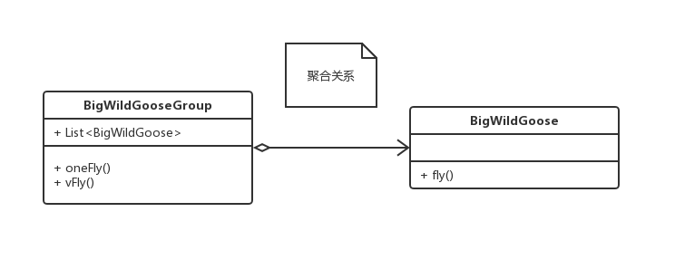

# 设计模式之UML类图

> 类图(Class diagram)主要用于描述系统的结构化设计。类图也是最常用的UML图，用类图可以显示出类、接口以及它们之间的静态结构和关系。

## 0x01.类图中的元素

### 1.类 Class / 接口 Interface


- 第一格：表示类的名字，抽象类用斜体表示，接口在前面加\<interface>
- 第二格：表示类的属性，前面符号表示作用于，冒号后面表示类的类型

|符号|解释|
|----|----|
|+|public|
|-|private|
|#|protected|
|~|default|
|下面有横线|表示static静态属性|

- 第三格：表示类的行为，同上

|符号|解释|
|----|----|
|+-#~|同上|
|斜体|抽象方法|
|下面有横线|表示static静态方法|
|:String|:后表示返回值，返回String字符串类型|
|无:|表示void无返回|

### 2.UML类图中各个类的关系


#### a).依赖关系

- 依赖关系的定义为：对于两个相对独立的对象，当一个对象负责构造另一个对象的实例，或者依赖另一个对象的服务时，这两个对象之间主要体现为依赖关系。
- 可以简单的理解为：类 A 使用到了类 B，而这种使用关系具有偶然性，临时性，非常弱的，但是 B 类中的变化会影响到类 A，比如某个学生要用笔写字，学生与笔的关系就是一种依赖关系，如果笔没水了，那学生就不能写字了(B 类的变化会影响类 A) 或者换另一只笔继续写字(临时性体现)。
- 使用虚线和箭头，箭头指向被依赖的对象
- UML图示


- 例如上面图中：**动物**的新陈代谢依赖**氧气**和**水**

```java
/**
 * 动物类
 */
public class Animal {

    /**
     * 生命
     */
    public String life;

    /**
     * 新陈代谢
     * @param oxygen 氧气
     * @param water 水
     */
    public void metabolism(Oxygen oxygen, Water water) {

    }

    public void multiply () {

    }
}

```

```java
/**
 * 水
 */
public class Water {}

/**
 * 氧气
 */
public class Oxygen {}
```

#### b).泛化继承关系

- 继承表示类与类 (或者接口与接口) 之间的父子关系。在 Java 中，用关键字 extends 表示继承关系。
- 空心箭头实线，箭头方向是子类指向父类来表示，只有知道对方信息才能指向对方
- UML图示


- 如图所示：鸟类属于动物类（鸟是动物），所以鸟继承自动物。继承了动物的新陈代谢和繁衍，同时也有自己的属性（翅膀）、行为（生蛋）。

```java
public class Animal {
    /**
     * 生命
     */
    public String life;

    /**
     * 新陈代谢
     * @param oxygen 氧气
     * @param water 水
     */
    public void metabolism(Oxygen oxygen, Water water) {

    }

    public void multiply () {

    }
}
```

```java
/**
 * 鸟
 */
public class Bird extends Animal {
    /**
     * 羽毛
     */
    public String plume;

    /**
     * 两个翅膀
     */
    public List<Wing> wings;

    /**
     * 生蛋
     */
    public void rawEgg () {

    }
}
```

#### c).组合关系

- 组合是一种耦合度更强的关联关系。存在组合关系的类表示“整体-部分”的关联关系，“**整体**”负责“**部分**”的生命周期，他们之间是共生共死的；并且“**部分**”单独存在时没有任何意义。
- 使用实心菱形和大于箭头表示，实线说明耦合性更强。组合关系可以在两侧写上数字，表示数量对应关系。组合关系对象拥有同样的生命周期。
- UML图示


- 如图所示：一只鸟有两个翅膀，失去了鸟，翅膀也没有存在的意义，所以鸟和翅膀是共同的生命周期。

```java
/**
 * 鸟
 */
public class Bird extends Animal {

    /**
     * 羽毛
     */
    public String plume;

    /**
     * 两个翅膀
     */
    public List<Wing> wings;

    /**
     * 生蛋
     */
    public void rawEgg () {

    }
}
```

```java
/**
 * 翅膀
 */
public class Wing {}
```

#### d).关联关系

- 关联关系的定义为：对于两个相对独立的对象，当一个对象的实例与另一个对象的一些特定实例存在固定的对应关系时，这两个对象之间为关联关系。
- 它体现的两个类中一种强依赖关系，比如我和我的朋友，这种关系比依赖更强，不存在依赖关系中的偶然性，关系也不是临时的，一般是长期性的。
- 关联关系分为单向关联和双向关联：
  1. 在 Java 中，单向关联表现为：类 A 当中使用了 类 B，其中类 B 是作为类 A 的成员变量。
  2. 双向关联表现为: 类 A 当中使用类 B 作为成员变量，同时类 B 中也使用了类 A 作为成员变量。
- 表示一个类和另外一个类是有关联的，一般有一个属性是另一个类，用实线和大于箭头，指向被关联对象，使用实线说明依赖性比较强。
- UML图示


- 如图所示：企鹅的生存依赖气候的变化。

```java
/**
 * 企鹅
 */
public class Penguin extends Bird {

    //气候
    public Climate climate;

    public Climate getClimate() {
        return climate;
    }

    public void setClimate(Climate climate) {
        this.climate = climate;
    }
}
```

```java
/**
 * 气候
 */
public class Climate {}
```

#### e).聚合关系

- 聚合关系是关联关系的一种，耦合度强于关联，他们的代码表现是相同的，仅仅是在语义上有所区别：关联关系的对象间是相互独立的，而聚合关系的对象之间存在着包容关系，他们之间是“整体-个体”的相互关系。
- 整体和局部的关系，两者拥有独立的生命周期，是has-a的关系。
- 聚合关系中作为成员变量的类一般使用 set 方法赋值。
- 使用空心菱形和大于箭头表示，菱形指向聚合方，箭头指向个体。空心菱形是可以放东西的盘子，可以用来装东西，东西放在盘子里就可以装进去。
- UML类图表示



- 如图所示：大雁群中有很多只大雁，大眼群有独立的行为（一字飞行，V字飞行）

```java
/**
 * 大雁群
 */
public class BigWildGooseGroup {

    public List<BigWildGoose> bigWildGooses;


    public void oneFly() {
        System.out.println("一字飞行");
    }

    public void vfly() {
        System.out.println("V字飞行");
    }

    public List<BigWildGoose> getBigWildGooses() {
        return bigWildGooses;
    }

    public void setBigWildGooses(List<BigWildGoose> bigWildGooses) {
        this.bigWildGooses = bigWildGooses;
    }
}
```

```java
/**
 * 大雁
 */
public class BigWildGoose extends Bird implements IFly{
    @Override
    public void fly() {}
}
```

#### f).实现关系

- 表示一个类实现一个或多个接口的方法。接口定义好操作的集合，由实现类去完成接口的具体操作, 在 Java 中使用 implements 表示。在 Java 中，如果实现了某个接口，那么就必须实现接口中所有的方法。
- 使用空心三角和虚线表示，箭头指向接口。实线关系对类的耦合比较弱，所以使用虚线表示。
- 一般使用接口定义抽象行为。比如鸟具有飞行的行为！
- UML表示


- 如图所示：大雁实现了飞行接口，拥有了飞行行为。

```java
/**
 * 大雁
 */
public class BigWildGoose extends Bird implements IFly{
    @Override
    public void fly() {}
}
```

```java
/**
 * 飞行接口
 */
public interface IFly {
    void fly();
}
```

- 接口的其他表示方法：棒棒糖表示法


## 0x02.相似关系比较

### 1.依赖关系和关联关系

1. 依赖关系：一般使应用实现在方法上，如果不调用方法使不需要使用的。因为依赖关系不强制，所以用虚线表示！
2. 关联关系：关联关系是类属性依赖，很关键，所以使用实线表示。

### 2.聚合关系和组合关系，空心和实心菱形

1. 数量少方向的是菱形箭头。
2. 聚合是一个盘子可以称很多东西，但是他们是相同的，只是数量不同，不同的生命周期。是一组事物形成了一个新的整体，具有独立的生命周期与行为。
3. 组合的生命周期是相同的。

### 3.继承和实现

1. 继承：是类和类之间的关系，所以用实线。
2. 实现：限制的不明显，只限制了行为，所以用虚线。
3. 只有知道对方信息，才可以被指向，所以箭头的方向都是指向父类或接口。

## 0x04.源码地址

- `uml类图`: [https://github.com/sigmaol/design-pattern/tree/master/uml](https://github.com/sigmaol/design-pattern/tree/master/uml)

## 0x05.参考

- `慕课网设计模式精讲`: [https://coding.imooc.com/class/270.html](https://coding.imooc.com/class/270.html)
- `大话设计模式`: [https://book.douban.com/subject/2334288/](https://book.douban.com/subject/2334288/)
- `设计模式之 UML 类图`: [https://zhuanlan.zhihu.com/p/24576502](https://zhuanlan.zhihu.com/p/24576502)
- `UML学习（二）-----类图`: [https://www.cnblogs.com/silent2012/archive/2011/09/07/2169946.html](https://www.cnblogs.com/silent2012/archive/2011/09/07/2169946.html)
