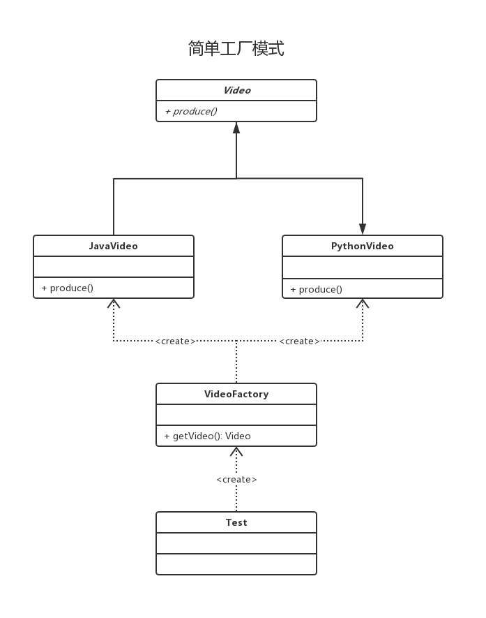

# 简单工厂模式

## 0x01.定义与类型

- 定义：由一个工厂对象决定创建出哪一种产品类的实例。
- 类型：创建型，但不属于GOF23中设计模式。
- 简介：通过一个专门的工厂类来创建其他类，这些被创建的类通常有一个共同的父类或接口。
- uml类图


- 代码
  
```java
//产品接口
public interface IProduct {
    void produce();
}

//产品实现
public class Product implements IProduct{
    @Override
    public void produce() {
        System.out.println("产品逻辑");
    }
}

//产品工厂
public class ProductFactory {
    public static IProduct createProduct(String name) {
        Product product = null;
        if ("product".equals(name)) {
            product = new Product();
        }
        return product;
    }
}
```

- 应用或测试
  
```java
public class Test {
    public static void main(String[] args) {
        IProduct product = ProductFactory.createProduct("product");
        product.produce();
    }
}
```

- 输出结果
  
```log
产品逻辑
```

- 通过简单工厂模式，可以看到有三个要素
  - 产品接口：产品接口的主要目的是定义产品的规范，所有的产品实现都必须遵循产品接口定义的规范。产品接口是调用者最为关心的，产品接口定义的优劣直接决定了调用者代码的稳定性。同样，产品接口也可以用抽象类来代替，但要注意最好不要违反里氏替换原则。
  - 产品实现：实现产品接口的具体类，决定了产品在客户端中的具体行为。
  - 产品工厂：静态方法用来生产产品，与调用者直接交互用来提供产品。一般使用静态方法提供，注意当变更发生时，这个类违反了开闭原则。

## 0x02.适用场景

- 工厂类负责创建的对象比较少
- 客户端（应用层）只知道传入工厂类的参数，对于如何创建对象（逻辑）不关心

## 0x03.简单工厂的优缺点

- 优点：只需要传入一个正确的参数，就可以获取你所需要的对象，而无须知道其创建细节
- 缺点：工厂类的职责相对过重，增加新的产品，需要修改工厂类的判断逻辑，违背开闭原则

## 0x04.简单工厂的实线样例

- 假设IT教育课程，具有Java, Python等视频。他们都是视频类的子类，而有单独的视频工厂生产这些课程！
- 课程基类

```java
public abstract class Video {
    public abstract void produce();
}
```

- 视频工厂

```java
public class VideoFactory {
    /**
     * 每次新增加产品实线会修改代码
     * 不符合开闭原则
     * @param type
     * @return
     */
    public Video getVideo(String type) {
        if ("java".equalsIgnoreCase(type)) {
            return new JavaVideo();
        } else if ("python".equalsIgnoreCase(type)) {
            return new PythonVideo();
        } else return null;
    }

    /**
     * 反射方式实现
     * @param clazz
     * @return
     */
    public Video getVideo(Class clazz) {
        Video video = null;
        try {
            video = (Video) Class.forName(clazz.getName()).newInstance();
        } catch (InstantiationException e) {
            e.printStackTrace();
        } catch (IllegalAccessException e) {
            e.printStackTrace();
        } catch (ClassNotFoundException e) {
            e.printStackTrace();
        }
        return video;
    }
}
```

- Java, Python视频的具体实线类

```java
public class JavaVideo extends Video {
    @Override
    public void produce() {
        System.out.println("录制Java课程视频");
    }
}
```

```java
public class PythonVideo extends Video{
    @Override
    public void produce() {
        System.out.println("录制Python课程");
    }
}
```

- 最后的测试类，测试视频工厂输出的视频

```java
public class Test {

//    public static void main(String[] args) {
//        Video video = new JavaVideo();
//        video.produce();
//    }

    public static void main(String[] args) {
        VideoFactory videoFactory = new VideoFactory();
        Video video1 = videoFactory.getVideo("python");
        if (video1 != null) {
            video1.produce();
        }
        Video video2 = videoFactory.getVideo("java");
        if (video2 != null) {
            video2.produce();
        }
    }

   /* public static void main(String[] args) {
        VideoFactory videoFactory = new VideoFactory();
        Video video = videoFactory.getVideo(PythonVideo.class);
        if (video != null) {
            video.produce();
        }
    }*/
}
```

- 输出结果

```log
录制Python课程
录制Java课程视频
```

## 0x05.UML类图



- 如图uml所示：直接的应用类中并没有于具体实现类的耦合，这样当新增具体实现类时是不需要修改应用层业务逻辑

## 0x06.源码中的简单工厂

- Calendar.createCalendar()：JDK时间处理类

```java
//根据输入参数区分的具体实现
if (aLocale.hasExtensions()) {
    String caltype = aLocale.getUnicodeLocaleType("ca");
    if (caltype != null) {
        switch (caltype) {
        case "buddhist":
        cal = new BuddhistCalendar(zone, aLocale);
            break;
        case "japanese":
            cal = new JapaneseImperialCalendar(zone, aLocale);
            break;
        case "gregory":
            cal = new GregorianCalendar(zone, aLocale);
            break;
        }
    }
}
```

- jdbc的Class.forname("com.mysql.driver")：通过每个db推出的不同的驱动，通过反射创建出连接。

## 0x07.相关代码

- `简单工厂模式`：[https://github.com/sigmaol/design-pattern/tree/master/simple-factory](https://github.com/sigmaol/design-pattern/tree/master/simple-factory)

## 0x08.推荐阅读

- `慕课网设计模式精讲`: [https://coding.imooc.com/class/270.html](https://coding.imooc.com/class/270.html)
- `简单工厂模式`：[https://blog.csdn.net/weiwenlongll/article/details/6918164](https://blog.csdn.net/weiwenlongll/article/details/6918164)