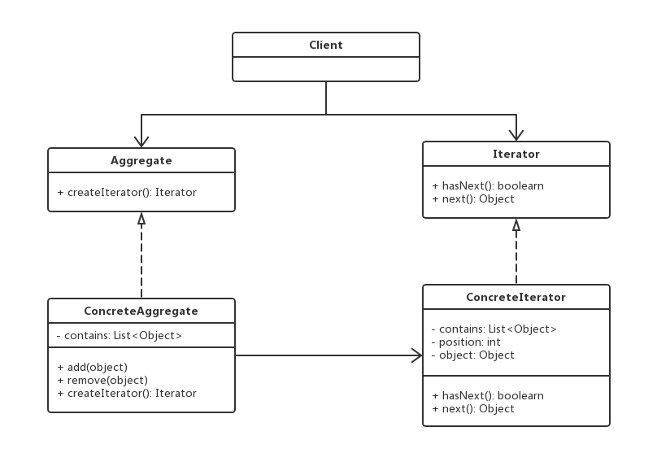

# 迭代器模式

## 0x01.定义与类型

- 定义：提供一种方法，顺序访问一个集合对象中的各个元素，而又不暴露该对象的内部表示。
- 类型：行为型

一般情况，我们自己开发时很少自定义迭代器，因为java本身已经把迭代器做到内部中了（比如：常用的list和set中都内置了迭代器）。
当然，如果真有这种需求需要我们自定义迭代器的话，可以参考jdk的迭代器实现方式来实现自己的迭代器。
迭代器是可以从前往后，或者从后往前遍历的。
为遍历不同聚集结构提供如：开始，下一个，是否有下一个，是否结束，当前哪一个等等的一个统一接口。

- 迭代器模式UML类图



- 对应的Java实现

```java
/**
 * 聚合类接口
 */
public interface Aggregate {
    Iterator createIterator();
}


/**
 * 具体的迭代器
 */
public interface Iterator {

    boolean hasNext();

    Object next();
}

/**
 * 聚合实现类
 */
public class ConcreteAggregate implements Aggregate {

    private List<Object> contains;

    public ConcreteAggregate () {
        contains = new ArrayList<>();
    }

    public boolean add (Object object) {
        return contains.add(object);
    }

    public boolean remove(Object object) {
        return contains.remove(object);
    }

    @Override
    public Iterator createIterator() {
        return new ConcreteIterator(this.contains);
    }
}


/**
 * 迭代器接口
 */
public class ConcreteIterator implements Iterator {

    private List<Object> contains;

    private int position = 0;

    private Object object;

    public ConcreteIterator(List<Object> contains) {
        this.contains = contains;
    }


    @Override
    public boolean hasNext() {
        return contains.size() > position;
    }

    @Override
    public Object next() {
        object = contains.get(position);
        position ++;
        return object;
    }
}
```

- 测试与应用类

```java
/**
 * 应用与测试
 */
public class Test {

    public static void main(String[] args) {
        ConcreteAggregate aggregate = new ConcreteAggregate();
        aggregate.add(new Object());
        aggregate.add(new Object());
        aggregate.add(new Object());

        Iterator iterator = aggregate.createIterator();

        while (iterator.hasNext()) {
            System.out.println(iterator.next().toString());
        }

    }
}

```

- 输入日志，遍历了三个地址

```log
java.lang.Object@1540e19d
java.lang.Object@677327b6
java.lang.Object@14ae5a5
```

- 迭代器模式主要包含以下角色。
  - 抽象聚合（Aggregate）角色：定义存储、添加、删除聚合对象以及创建迭代器对象的接口。
  - 具体聚合（ConcreteAggregate）角色：实现抽象聚合类，返回一个具体迭代器的实例。
  - 抽象迭代器（Iterator）角色：定义访问和遍历聚合元素的接口，通常包含 hasNext()、first()、next() 等方法。
  - 具体迭代器（Concretelterator）角色：实现抽象迭代器接口中所定义的方法，完成对聚合对象的遍历，记录遍历的当前位置。

## 0x02.使用场景

- 访问一个集合对象的内容而无需暴露它的内部表示
- 为遍历不同的集合结构提供一个统一的接口

## 0x03.优缺点

### 1.优点

- 分离了集合对象的遍历行为

### 2.缺点

- 类的个数成对增加

## 0x04.相关设计模式

- 迭代器模式和访问者模式

## 0x05.样例

> 课程的聚合类以及迭代器的应用

```java
/**
 * 聚集类接口
 */
public interface CourseAggregate {

    void addCourse(Course course);

    void removeCourse(Course course);

    CourseIterator getCourseIterator();
}


/**
 * 迭代器接口
 */
public interface CourseIterator {

    Course nextCourse();

    boolean hasNextCourse();

}

/**
 * 具体的聚集类
 */
public class CourseAggregateImpl implements CourseAggregate {


    private List<Course> courseList;

    public CourseAggregateImpl () {
        courseList = new ArrayList<>();
    }

    @Override
    public void addCourse(Course course) {
        courseList.add(course);
    }

    @Override
    public void removeCourse(Course course) {
        courseList.remove(course);
    }

    @Override
    public CourseIterator getCourseIterator() {
        return new CourseIteratorImpl(courseList);
    }
}


/**
 * 具体的迭代器
 */
public class CourseIteratorImpl implements CourseIterator {

    private List<Course> courseList;

    private int position;

    private Course course;


    public CourseIteratorImpl(List<Course> courseList) {
        this.courseList = courseList;
    }

    @Override
    public Course nextCourse() {
        System.out.println("返回的课程，位置是： " + position);
        course = courseList.get(position);
        position ++;
        return course;
    }

    @Override
    public boolean hasNextCourse() {
        return position < courseList.size();
    }
}

/**
 * 课程实体类
 */
public class Course {

    private String name;

    public Course(String name) {
        this.name = name;
    }

    public String getName() {
        return name;
    }
}

```

- 测试与应用类

```java

/**
 * 应用与测试类
 */
public class Test {

    public static void main(String[] args) {
        Course course1 = new Course("Java电商一期");
        Course course2 = new Course("Java电商二期");
        Course course3 = new Course("Java设计模式精讲");
        Course course4 = new Course("Python课程");
        Course course5 = new Course("算法课程");
        Course course6 = new Course("前端课程");

        CourseAggregate courseAggregate = new CourseAggregateImpl();

        courseAggregate.addCourse(course1);
        courseAggregate.addCourse(course2);
        courseAggregate.addCourse(course3);
        courseAggregate.addCourse(course4);
        courseAggregate.addCourse(course5);
        courseAggregate.addCourse(course6);

        System.out.println("-----课程列表------");
        printCourse(courseAggregate);

        courseAggregate.removeCourse(course4);
        courseAggregate.removeCourse(course5);

        System.out.println("------删除操作之后的课程列表-----");
        printCourse(courseAggregate);

    }

    private static void printCourse (CourseAggregate courseAggregate) {

        CourseIterator courseIterator = courseAggregate.getCourseIterator();

        while (courseIterator.hasNextCourse()) {
            Course course = courseIterator.nextCourse();
            System.out.println("-----> " + course.getName());
        }

    }

}
```

- 输出结果

```log
-----课程列表------
返回的课程，位置是： 0
-----> Java电商一期
返回的课程，位置是： 1
-----> Java电商二期
返回的课程，位置是： 2
-----> Java设计模式精讲
返回的课程，位置是： 3
-----> Python课程
返回的课程，位置是： 4
-----> 算法课程
返回的课程，位置是： 5
-----> 前端课程
------删除操作之后的课程列表-----
返回的课程，位置是： 0
-----> Java电商一期
返回的课程，位置是： 1
-----> Java电商二期
返回的课程，位置是： 2
-----> Java设计模式精讲
返回的课程，位置是： 3
-----> 前端课程
```

- 样例UML类图


## 0x06.源码中的迭代器

- java.util.Iterator
- cursor


## 0x07.代码地址

- `设计模式之迭代器模式`: [https://github.com/sigmako/design-pattern/tree/master/iterator](https://github.com/sigmako/design-pattern/tree/master/iterator)

## 0x08.推荐阅读

- `慕课网设计模式精讲`: [https://coding.imooc.com/class/270.html](https://coding.imooc.com/class/270.html)
- `迭代器模式`: [https://www.cnblogs.com/cxxjohnson/p/6403851.html](https://www.cnblogs.com/cxxjohnson/p/6403851.html)
