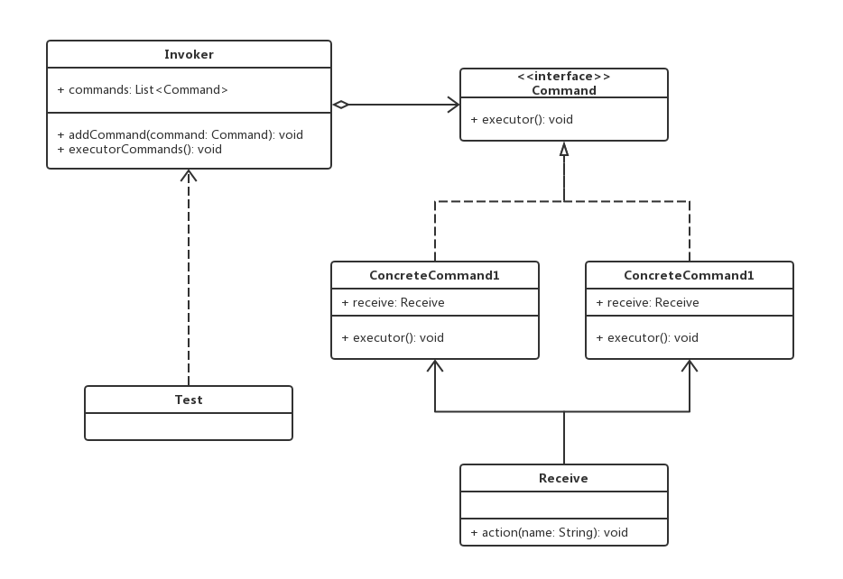

# 命令模式

## 0x01.定义与类型

- 定义：将“请求”封装成对象，以便使用不同的请求。
- 命令模式解决了应用程序中对象的职责以及它们之间的通信方式
- 类型：行为型
- UML类图



- 代码示例

```java
/**
 * 命令接口类
 */
public interface Command {
    void executor();
}

/**
 * 命令1
 */
public class ConcreteCommand1 implements Command {

    private Receiver receiver;

    public ConcreteCommand1(Receiver receiver) {
        this.receiver = receiver;
    }

    @Override
    public void executor() {
        receiver.action("concrete command 1.");
    }
}

/**
 * 命令2
 */
public class ConcreteCommand2 implements Command {

    private Receiver receiver;

    public ConcreteCommand2(Receiver receiver) {
        this.receiver = receiver;
    }

    @Override
    public void executor() {
        receiver.action("concrete command 2.");
    }
}

/**
 * 命令执行人
 */
public class Invoker {

    private List<Command> commands = new ArrayList<>();

    public void addCommand(Command command) {
        commands.add(command);
    }

    public void executorCommands() {
        commands.forEach(Command::executor);
        commands.clear();
    }
}

/**
 * 命令接收者
 */
public class Receiver {

    public void action(String name) {
        System.out.println(name);
    }
}
```

- 应用与测试

```java
/**
 * 应用与测试
 */
public class Test {

    public static void main(String[] args) {
        //创建命令接收方
        Receiver receiver = new Receiver();

        //创建执行者
        Invoker invoker = new Invoker();

        //创建命令
        ConcreteCommand1 concreteCommand1 = new ConcreteCommand1(receiver);
        ConcreteCommand2 concreteCommand2 = new ConcreteCommand2(receiver);

        //添加命令
        invoker.addCommand(concreteCommand1);
        invoker.addCommand(concreteCommand2);

        //执行
        invoker.executorCommands();
    }
}
```

- 输出结果

```log
concrete command 1.
concrete command 2.
```

- 命令模式角色介绍
  - 接收者（Receiver）：真正执行命令的对象，负责执行与请求相关的操作
  - 命令接口（Command）：定义命令的接口，封装execute()、undo()等方法
  - 具体命令（ConcreteCommand）：命令接口实现对象，实现命令接口中的方法，通常会持有接收者，并调用接收者的功能来完成命令要执行的操作
  - 请求者（Invoker）：要求命令对象执行请求，通常会持有命令对象，包含Command接口变量

## 0x02.适用场景

- 请求调用者和请求接收者需要解耦，使得调用者和接收者不直接交互
- 需要抽象出等待执行的行为

## 0x03.优缺点

### 1.优点

- 降低系统的耦合度
- 容易扩展新命令或一组命令
- 调用同一方法实现不同的功能

### 2.缺点

- 命令的无限扩展会增加类的数量，提高系统实现复杂度

## 0x04.命令模式相关案例

- 课程视频的打开和关闭

```java
/**
 * 命令接口
 */
public interface Command {
    void execute();
}

/**
 * 打开课程链接
 */
public class OpenCourseVideoCommand implements Command {

    private CourseVideo courseVideo;

    public OpenCourseVideoCommand(CourseVideo courseVideo) {
        this.courseVideo = courseVideo;
    }

    @Override
    public void execute() {
        courseVideo.open();
    }
}

/**
 * 关闭课程链接
 */
public class CloseCourseVideoCommand implements Command {

    private CourseVideo courseVideo;

    public CloseCourseVideoCommand(CourseVideo courseVideo) {
        this.courseVideo = courseVideo;
    }

    @Override
    public void execute() {
        courseVideo.close();
    }
}

/**
 * 命令接受类
 */
public class CourseVideo {

    private String name;

    public CourseVideo(String name) {
        this.name = name;
    }

    public void open () {
        System.out.println(this.name + "课程视频开放。");
    }

    public void close () {
        System.out.println(this.name + "课程视频关闭。");
    }
}

/**
 * 执行人
 */
public class Staff {

    private List<Command> commands = new ArrayList<>();

    public void addCommand (Command command) {
        commands.add(command);
    }

    public void executeCommands () {
        commands.forEach(Command::execute);
        commands.clear();
    }
}
```

- 测试与应用

```java
/**
 * 测试与应用
 */
public class Test {

    public static void main(String[] args) {
        //命令接收者
        CourseVideo courseVideo = new CourseVideo("Java设计模式精讲");

        //创建命令
        OpenCourseVideoCommand openCourseVideoCommand = new OpenCourseVideoCommand(courseVideo);
        CloseCourseVideoCommand closeCourseVideoCommand = new CloseCourseVideoCommand(courseVideo);

        //创建执行人
        Staff staff = new Staff();

        //添加命令
        staff.addCommand(openCourseVideoCommand);
        staff.addCommand(closeCourseVideoCommand);

        //执行
        staff.executeCommands();
    }
}
```

- UML类图


## 0x05.相关设计模式

- 命令模式和备忘录模式
  - 适用备忘录模式保存命令的历史记录

## 0x06.源码中的命令模式

- Runnable
- junit.frame.work.Test

## 0x07.源码地址

- `设计模式之命令模式`：[https://github.com/sigmaol/design-pattern/tree/master/command](https://github.com/sigmaol/design-pattern/tree/master/command)

## 0x08.推荐阅读

- `慕课网设计模式精讲`：[https://coding.imooc.com/class/270.html](https://coding.imooc.com/class/270.html)
- `【命令模式】设计模式之命令模式`：[https://blog.csdn.net/jiandanokok/article/details/75656873](https://blog.csdn.net/jiandanokok/article/details/75656873)
- `设计模式之命令模式`：[https://blog.csdn.net/chunqiuwei/article/details/79030816](https://blog.csdn.net/chunqiuwei/article/details/79030816)
