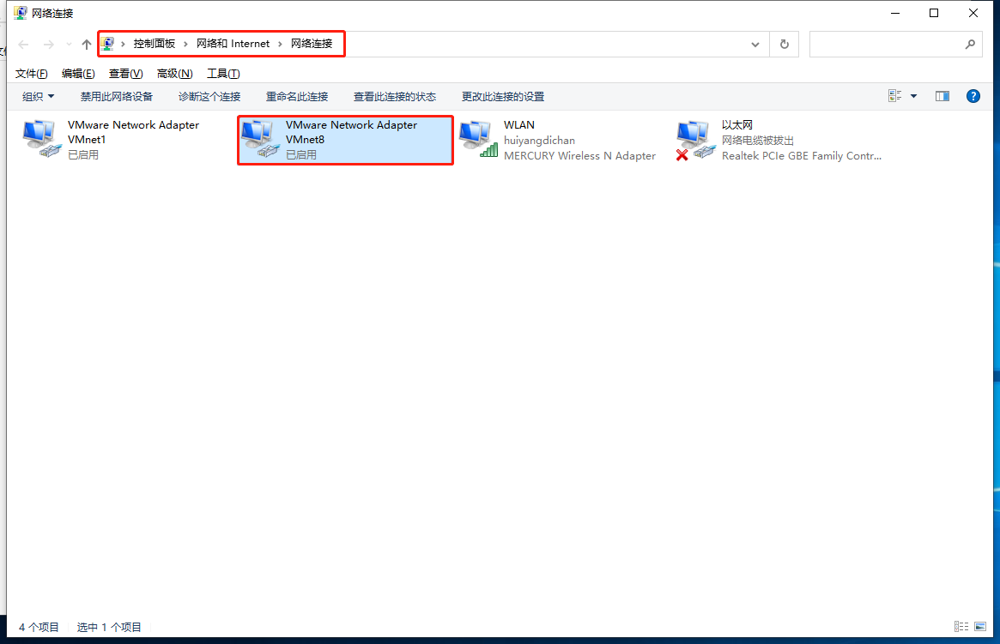

# Cloudera Manager 6.2.0 离线安装

## 0x01.准备

## 0x02.配置虚拟机

### 1.安装虚拟机

### 2.调整设置，配置静态IP

1. 点击vmware菜单栏中的 **编辑** 按钮，点击 **虚拟网络编辑器** 
2. 在弹窗中上面，选择 **NAT模式**，将下面**使用本地DHCP服务将IP地址分配给虚拟机**选项去掉（如果不能更改，点击下面的更改设置）。
   
3. 点击NAT设置，记录里面的`ip`，`子网掩码`以及`网关ip`后，点击保存。
   
4. 进入windows网络管理器，查看网络连接，选择我们刚刚调整的NAT模式网卡（VMnet8）。
   
5. 右键点击属性，双击IPv4，将记录的信息填进去，点击保存。
   
   
6. 启动虚拟机，登陆后执行命令修改IP: `vi /etc/sysconfig/network-scripts/ifcfg-ens33`
   
   ```conf
   BOOTPROTO="static"
   ONBOOT="yes"
   IPADDR=192.168.xxx.xxx
   NETMASK=255.255.255.0
   GATEWAY=192.168.xxx.x
   DNS1=8.8.8.8
   DNS2=114.114.114.114
   ```

   修改完后为：

   
7. 保存后，使用：`service network restart` 或者 `systemctl restart network` 重启网络服务。
8. 测试是否有网络：`ping www.baidu.com`。如下则正常，同样方式配置剩下的虚拟机（注意ip不同）。
   

### 3.配置hosts

1. 输入：`vim /etc/hosts`
2. 配置上面定义好的ip hostname

```hosts
192.168.91.101 zoo
192.168.91.102 lion
192.168.91.103 tiger
```

### 4.安装NTP时钟

1. 下载并安装NTP时钟：`yum install ntp`
2. 修改配置文件：`vim /etc/ntp.conf`
3. NTP基本命令
   
```shell
# 启动/停止ntp服务
service ntpd start/stop

# 设置开机自动启动
chkconfig ntpd on

# 查看ntp是否正常运行
ps -ef | grep ntp
```

4. 服务端配置

```conf
# For more information about this file, see the man pages
# ntp.conf(5), ntp_acc(5), ntp_auth(5), ntp_clock(5), ntp_misc(5), ntp_mon(5).

driftfile /var/lib/ntp/drift

# Permit time synchronization with our time source, but do not
# permit the source to query or modify the service on this system.
#restrict default nomodify notrap nopeer noquery

# Permit all access over the loopback interface.  This could
# be tightened as well, but to do so would effect some of
# the administrative functions.
# @1 控制权限相关
restrict 127.0.0.1
restrict -6 ::1

resttrict 127.127.1.0
# Hosts on local network are less restricted.
#restrict 192.168.91.101 mask 255.255.255.0 nomodify notrap

# @2 新增权限设置，这里开放 192.168.91.0/24 的网段
restrict 192.168.91.0 mask 255.255.255.0 nomodify notrap

# Use public servers from the pool.ntp.org project.
# Please consider joining the pool (http://www.pool.ntp.org/join.html).

# @3：注释掉原来的时钟配置
#server 0.centos.pool.ntp.org iburst
#server 1.centos.pool.ntp.org iburst
#server 2.centos.pool.ntp.org iburst
#server 3.centos.pool.ntp.org iburst

# @4：设置时钟使用本地时钟，注意 `127.127.1.0` 表示的是本地的时钟
server 127.127.1.0 #local clock
fudge  127.127.1.0 stratum 10

#broadcast 192.168.1.255 autokey        # broadcast server
#broadcastclient                        # broadcast client
#broadcast 224.0.1.1 autokey            # multicast server
#multicastclient 224.0.1.1              # multicast client
#manycastserver 239.255.254.254         # manycast server
#multicastclient 224.0.1.1              # multicast client
#manycastserver 239.255.254.254         # manycast server
#manycastclient 239.255.254.254 autokey # manycast client

# Enable public key cryptography.
#crypto

includefile /etc/ntp/crypto/pw

# Key file containing the keys and key identifiers used when operating
# with symmetric key cryptography.
keys /etc/ntp/keys

# Specify the key identifiers which are trusted.
#trustedkey 4 8 42

# Specify the key identifier to use with the ntpdc utility.
#requestkey 8

# Specify the key identifier to use with the ntpq utility.
#controlkey 8

# Enable writing of statistics records.
#statistics clockstats cryptostats loopstats peerstats

# Disable the monitoring facility to prevent amplification attacks using ntpdc
# monlist command when default restrict does not include the noquery flag. See
# CVE-2013-5211 for more details.
# Note: Monitoring will not be disabled with the limited restriction flag.
disable monitor
```

5. 客户端配置

```conf
# For more information about this file, see the man pages
# ntp.conf(5), ntp_acc(5), ntp_auth(5), ntp_clock(5), ntp_misc(5), ntp_mon(5).

driftfile /var/lib/ntp/drift

# Permit time synchronization with our time source, but do not
# permit the source to query or modify the service on this system.
# restrict default nomodify notrap nopeer noquery
# @1 权限相关
restrict default kod nomodify notrap nopeer noquery
restrict -6 default kod nomodify notrap nopeer noquery

# Permit all access over the loopback interface.  This could
# be tightened as well, but to do so would effect some of
# the administrative functions.
restrict 127.0.0.1
restrict -6 ::1

# Hosts on local network are less restricted.
# @2 同服务端，开放的 `192.168.91.0/24` 这个网段
restrict 192.168.91.0 mask 255.255.255.0 nomodify notrap

# Use public servers from the pool.ntp.org project.
# Please consider joining the pool (http://www.pool.ntp.org/join.html).
# server 0.centos.pool.ntp.org iburst
# server 1.centos.pool.ntp.org iburst
# server 2.centos.pool.ntp.org iburst
# server 3.centos.pool.ntp.org iburst

# @3 配置本地服务器时钟地址
server 192.168.91.101 profer

#broadcast 192.168.1.255 autokey        # broadcast server
#broadcastclient                        # broadcast client
#broadcast 224.0.1.1 autokey            # multicast server
#multicastclient 224.0.1.1              # multicast client
#manycastserver 239.255.254.254         # manycast server
#manycastclient 239.255.254.254 autokey # manycast client
#manycastserver 239.255.254.254         # manycast server
#manycastclient 239.255.254.254 autokey # manycast client

# Enable public key cryptography.
#crypto

includefile /etc/ntp/crypto/pw

# Key file containing the keys and key identifiers used when operating
# with symmetric key cryptography.
keys /etc/ntp/keys

# Specify the key identifiers which are trusted.
#trustedkey 4 8 42

# Specify the key identifier to use with the ntpdc utility.
#requestkey 8

# Specify the key identifier to use with the ntpq utility.
#controlkey 8

# Enable writing of statistics records.
#statistics clockstats cryptostats loopstats peerstats

# Disable the monitoring facility to prevent amplification attacks using ntpdc
# monlist command when default restrict does not include the noquery flag. See
# CVE-2013-5211 for more details.
# Note: Monitoring will not be disabled with the limited restriction flag.
disable monitor
```

6. 启动服务端NTP服务器
7. 测试客户端配置是否可用：`ntpdate <服务端ip>`，注意这里要先关闭**客户端的NTP服务**。


8. 启动客户端NTP服务
9. 查看NTP同步状态：`ntpstat`


10. 时间不是马上同步，等待一会后，看到如下返回值就ok了。


### 5.配置免密登录

1. 登录虚拟机输入命令：`ssh-keygen -t rsa`
2. 一路回车，会生成密钥在`~/.ssh`目录下
3. 全部节点生产完毕后，主节点执行：`ssh-copy-id -i ~/.ssh/id_rsa.pub root@[主节点hostname]`
4. 输入密码，这句话意思是**将公钥拷贝到本机的authorized_keys上**
5. 在所有从节点同样都执行这句话：`ssh-copy-id -i ~/.ssh/id_rsa.pub root@[主节点hostname]`
6. 当所有从节点的密钥都拷贝完毕后，去主节点查看是否完整。如图所示，我是三台机器：


7. 在主节点执行命令，将密钥拷贝到全部子节点：`scp ~/.ssh/authorized_keys root@[从节点hostname]:~/.ssh/`
8. 下面为全部命令合集

```shell
# 生成公钥，每台节点都要执行
ssh-keygen -t rsa

# 主节点执行，将主节点的公钥到自己的authorized_keys上
ssh-copy-id -i ~/.ssh/id_rsa.pub root@zoo

# 从节点执行，将从节点的公钥拷贝到主节点的authorized_keys上，我这里 lion 和 tiger 两个节点各执行了一次
ssh-copy-id -i ~/.ssh/id_rsa.pub root@zoo

# 查看主节点密钥是否拷贝正常
vim ~/.ssh/authorized_keys

# 将密钥拷贝到两个从节点
scp ~/.ssh/authorized_keys root@lion:~/.ssh/
scp ~/.ssh/authorized_keys root@tiger:~/.ssh/
```

## 0x03.安装Java

## 0x04.安装MySql

## 0x05.安装CDH


