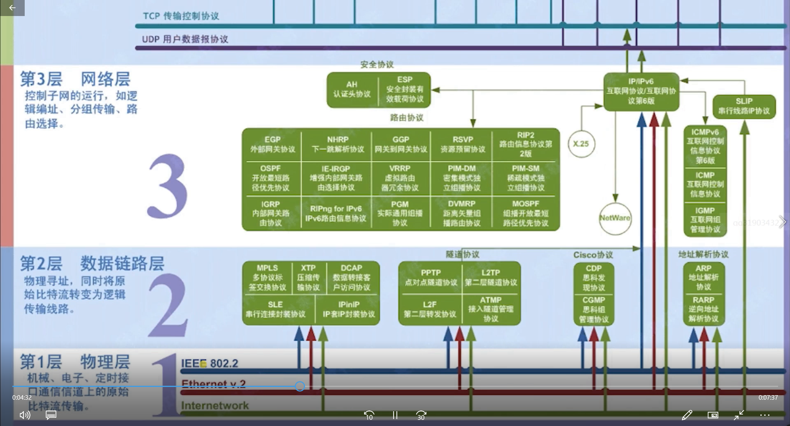
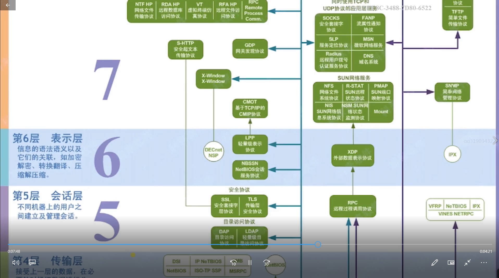
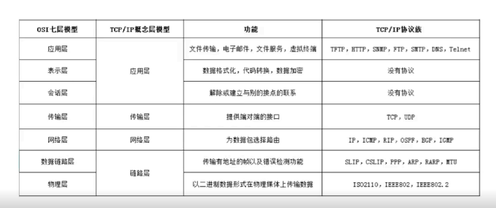

# 计算机网络知识

## OSI开放式互联参考模型

### TCP/IP 参考模型

- OSI的实现：TCP/IP

### 说说TCP的三次握手

#### 传输控制协议TCP简介

- 面向连接的，可靠的，基于字节流的传输层通信协议
- 将应用层的数据流分割成报文段并发送给目标节点的TCP层
- 数据包都有序号，对方收到则发送ACK确认，未收到则重传
- 使用校验和来检验数据在传输过程中是否有误