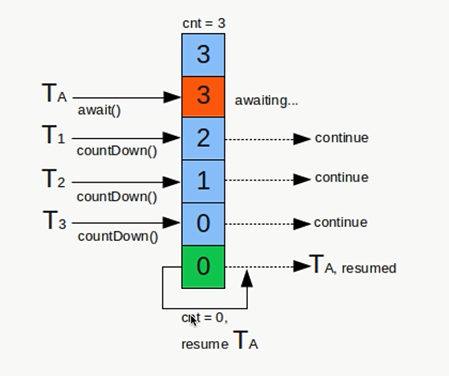

# AbstractQueuedSynchronizer - AQS

## AQS简介

- 使用Node实现FIFO队列，可以用于构建锁或者其他同步装置的基础框架。
- 利用了一个int类型表示状态
- 使用方法是继承
- 子类通过继承并通过实现它的方法管理其状态 {acquire 和 release} 的方法操纵状态
- 可以同时实现排它锁和共享锁模式（独占、共享）

## AQS同步组件

- CountDownLatch
- Semaphore
- CyclicBarrier
- ReentrantLock
- Condition
- FutureTask

## AQS同步组件 - CountDownLatch

## AQS同步组件 - 信号量 Semaphore

- 控制每个资源同一时间被访问次数
- 使用场景：
  - 限制只能限制多少访问的场景，比如数据库连接池

## AQS同步组件 - CyclicBarrier

- 允许一组线程相互等待，达到一定数量后，继续。可以循环使用。
- 与CountDownLatch差别
  - CyclicBarrier可以通过reset()方法重复使用，CountDownLatch不行。
  - CountDownLatch实现一个或多个线程等待其他线程完成后，执行任务。CyclicBarrier是多个线程相互等待，全部完成后执行任务。
  - CyclicBarrier描述各个线程相互等待的关系。

## AQS同步组件 - ReentrantLock 与 锁

### ReentrantLock(可重入锁) 和 synchronized区别

- 可重入性：同一线程可以再次获取锁
- 锁的实现：
  - synchronized是依赖JVM实现的
  - ReentrantLock是JDK实现
  - 性能的区别
  - 功能区别
    - synchronized方便书写
    - ReentrantLock锁的细粒度和灵活度要好
- ReentrantLock独有的功能
  - 可指定是公平锁还是非公平锁
  - 提供了一个Condition类，可以分组唤醒需要唤醒的线程
  - 提供能够中断等待锁的线程的机制，lock.lockInterruptibly()

### 锁的选择

- 当只有很少量的竞争者的时候，synchronized是一个很好的实现。
- 竞争者不少，但线程增长的趋势是可以预估的，ReentrantLock比较合适。