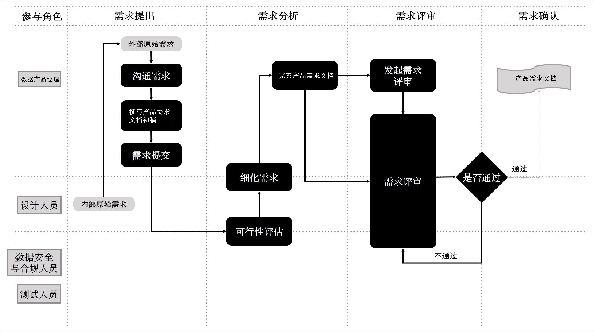
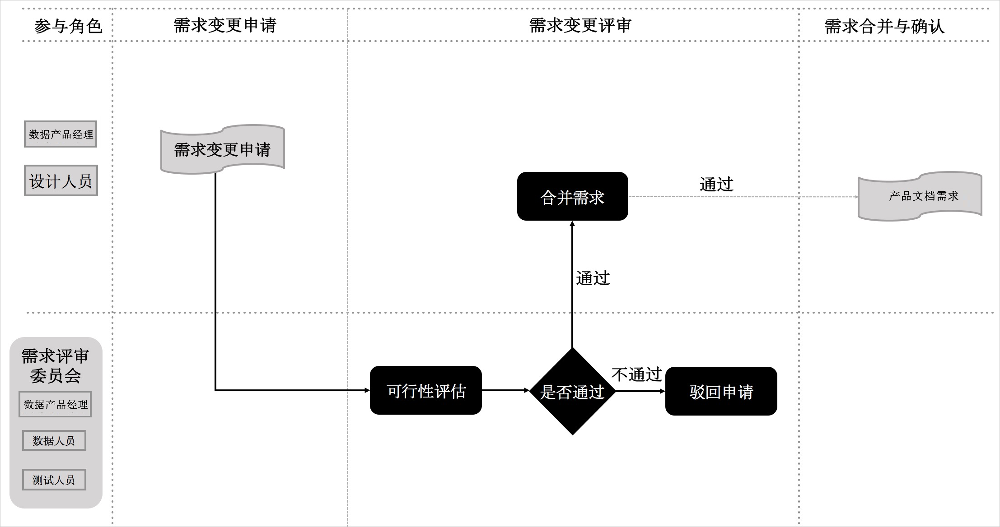

# 数据仓库研发规范概述

本文将为您介绍数据仓库研发规范的阶段规划、角色职责和整体流程。

在大数据时代，规范地进行数据资产管理已成为推动互联网、大数据、人工智能和实体经济深度融合的必要条件。贴近业务属性、兼顾研发各阶段要点的研发规范，可以切实提高研发效率，保障数据研发工作有条不紊地运作。而不完善的研发流程，会降低研发效率，增加成本与风险。
总而言之，数据资产管理实际上是对物的管理，而研发流程规范管理则是对人的行为的管理。只有落实了作为基础的后者，才能进一步实行数据资产管理方法论。

数据仓库研发规范旨在为广大数据研发者、管理者提供规范化的研发流程指导方法，目的是简化、规范日常工作流程，提高工作效率，减少无效与冗余工作，赋能企业、政府更强大的数据掌控力来应对海量增长的业务数据，从而释放更多人力与财力专注于业务创新。

**阶段规划**

鉴于对日常数据仓库研发工作的总结与归纳，本文将数据仓库研发流程抽象为如下几点：
- 需求阶段：数据产品经理应如何应对不断变化的业务需求。
- 设计阶段：数据产品经理、数据开发者应如何综合性能、成本、效率、质量等因素，更好地组织与存储数据。
- 开发阶段：数据研发者如何高效、规范地进行编码工作。
- 测试阶段：测试人员应如何准确地暴露代码问题与项目风险，提升产出质量。
- 发布阶段：如何将具备发布条件的程序平稳地发布到线上稳定产出。
- 运维阶段：运维人员应如何保障数据产出的时效性和稳定性。

**角色职责**

- 数据产品经理：负责承接、评估业务方提出的数据需求，并组织需求评审、产出产品需求文档，同时需要把控其它更为细化的技术评审。
- 设计人员：根据已定稿的产品需求文档所述需求，进行数据探查，了解数据形态（数据质量、数据分布），同时根据探查结果实现表设计、Mapping设计、调度设计等系分设计工作。
- 开发人员：根据设计人员产出的稿件，制定计划并实现代码，同时进行单元测试与代码评审。
- 测试人员：负责验证需求与结果的一致性，发现代码问题与项目风险。
- 运维人员：负责发布任务，并处理数据、程序、调度、监控告警等异常事件，保障数据产出时效、程序高效运行和生产稳定性。
- 信息安全与合规人员：在需求评审前期，负责需求实现的安全性与合规性。

## 1.需求阶段

数仓的最基本职责是定义和发现在企业决策中使用的信息，随着企业战略方向的改变与业务方对行业判断的变化，需求会不断变化。该特性决定了数据仓库需求的多样性和迭代性。
作为承接业务方数据需求的数据产品经理，在需求阶段需要规范首次需求流程和迭代需求流程。

### a.首次需求流程

对于业务方首次提出的需求，重点工作在于评估完成该需求的技术、数据、合规的可行性后，以细化需求的方式完成产品需求文档，并组织需求评审会议多方共同敲定需求最终实现方案。

首次需求流程包括以下步骤：

- 提出需求
- 外部沟通：数据产品经理主导，负责与外部门业务方充分沟通。力求获取并理解业务场景（背景）、目标和实现价值。

> **说明：**此处不必与业务方讨论需求实现的途径或细节，双方只了解需要达到什么目标，而不讨论如何实现。

- 完成产品需求文档的初稿：得到充分信息后，按照数据仓库需求模板中的常规需求申请单，将需求转化为产品需求文档的初稿。
- 分析需求
  - 可行性分析：数据产品经理主导，邀请设计、数据安全与合规人员，对需求进行评估。
  - 需求合理性：评估该需求的合理性。
  - 数据可行性：评估当前已有数据能否支撑需求开发，如果缺少数据，则需要另行规划缺失数据的抽取方案。
  - 同时建议进行深入的数据探查，包括但不限于数据完整性、字段离散值分布情况、空值、零值、重复值占比等情况。
  - 技术可行性：评估当前已有数据模型能否支撑需求开发，如果不能，则需要规划模型改造方案，并充分评估其影响。同时在测试环境进行模型测试。

  > **说明：**如果涉及资损、精确对账或其他关键模型的改造，测试人员必须进行测试。

  - 是否满足安全与合规要求：根据企业自身数据安全的要求，严格控制数据内部流向，划分研发过程中数据可流入的库、项目、表、字段等。对于流出外部的数据，更需要严格评估流出数据内容、流出目的地是否符合公司数据安全的要求。

  > **说明：**此项评估是不可跳过的步骤。

  - 实现细节分析：数据产品经理主导，对实现需求的细节关键点进行确认，包括但不限于数据口径、接口格式、供数频率和需求优先级。
- 完善产品需求文档：完善产品需求文档的初稿。
- 评审需求：数据产品经理主导，邀请设计人员、测试人员发起需求评审会。会议内容主要包括：
  - 各方提出对于产品需求文档中各细节的疑问。
  - 共同达成对于疑问的解决方案。
  > **说明：**评审会议上不得遗留影响后续研发流程的关键问题，否则视为评审不通过。

- 确认需求：N个工作日（视各企业实际情况而定）内如果无异议，则产品需求文档定稿，并开始进入后续的涉及与开发阶段。

### b.迭代需求流程

对于同一需求，在完成首次需求评审并定稿产品需求文档后，业务方再次提出的需求，均属于迭代需求。

迭代需求的流程与首次需求流程类似，均需进行可行性分析、实现细节分析。分析完成后，视实际情况来定是否需要再次进行需求评审，最终将新老需求合并至产品需求文档终稿。

迭代需求流程包括以下步骤：

- 申请需求变更

数据产品经理完成业务方迭代需求对接后，将新的需求录入数据仓库需求模板的迭代需求申请单中。说明 如果企业具备需求相关管理平台，建议通过平台+数据库形式规范化存储不断迭代的每个需求版本。

- 评审需求变更

原则上需求评审需由数据产品经理发起评审会议来完成，但如果需求迭代内容不多，评审方式可视情况而定选择邮件或现场会议方式，具体视变更内容由变更委员会决定。
评审内容仍为实现需求必须面对的技术可行性、数据可行性、安全与合规要求性展开讨论，如果多方有异议，则必须共同达成一致性解决方案。

- 确认并合并需求

数据产品经理将上一版本定稿的产品需求文档内容，与本次评审定稿的产品需求文档内容进行合并。
如果两个工作日内无异议，则视为需求确认。

## 2.设计阶段

完成需求阶段的工作后，数据产品经理会产出最终版本的产品需求文档，以供设计人员进行设计工作。

设计工作包含数据探查和系分设计两部分：

- 数据探查旨在了解来源数据的数据形态，例如数据质量、数据分布等。结合业务场景，帮助分析和判断需求实现的可行性以及找出潜在的数据问题和风险。
- 系分设计则包括表设计、Mapping设计和调度设计等最实际的设计工作。

设计完毕后，最终将产出供开发人员参照实施开发的ETL设计文档、数据探查文档、调度设计文档，为需求的有效实现打下坚实基础。

设计阶段的流程包括以下步骤：

- 数据探查：数据探查的目的是了解数据的形态，找到潜在问题与风险。数据探查是决定数据可靠性的关键步骤。数据探查报告可以为后续开发提供指导，并作为依据指定开发计划。数据探查的内容主要包括但不限于以下内容：
  - 源表数据主键字段重复数。
  - 源表字段空值/异常值的统计数。
  - 源表之间关联关系。
  - 源表字段的数据格式。
  - 源表增量规则。

> **说明：**探查完成后，最终产出数据探查报告。如果发现当前数据无法支撑需求的实现，则要将需求退回给数据产品经理，由数据产品经理发起迭代需求流程。

- 系分设计，系分设计包括表设计、Mapping设计和调度设计三部分。
- 表设计，表设计是指依据需求设计目标产出表、中间产出表。包含表名、表名解释、字段名、字段类型、字段注释以及字段安全等级等。表设计的步骤如下所示：
  1. 设计表名、字段名：要求相同的字段在不同表中的字段名相同。
  2. 设计主键和外键。
  3. 设计字段注释：通过标注字段注释、枚举值来表明字段含义，如果枚举值过多，建议为枚举值创建维表。
  4. 设计表分区：建议所有表都创建为分区表。
  5. 设计数据生命周期。

    企业应根据自身实际情况来进行设置，也可以参考如下数值：

    |数仓分层|说明|
    |-|-|
    |ODS层|非去重数据：默认不保留。ETL临时表：保留14日。镜像全量表：重要数据建议采用极限存储。流水全量表：如果不可再生，则永久保存。|
    |DWD层|维度表：按日分区的极限存储模式。事实表：按日分区且永久保留。周期性快照事实表：采用极限存储或根据自身情况设置生命周期。|
    |DWS层|汇总指标：自行选择保留月初、特定日期数据。|

  6. 设计加密技术：根据实际情况对敏感字段设计加密方案。

### a.Mapping设计

Mapping设计采用图形化或伪代码的形式编写规划以下内容：

- 每个字段的生成逻辑。
- 表与表之间的关系。
- 目标字段与原字段间的算法逻辑。

将上述内容产出为ETL文档留存，ETL将作为后续开发流程的第一参考依据。

### b.调度设计

**依赖设计**

将ETL抽象为多个相互依赖的代码节点形成上下游依赖关系，要求如下：

- 一个节点仅产出一张表，一张表仅由一个节点产出。
- 下游节点的输入数据来自于上游节点的产出数据。
- 多并行、少串行（在分布式系统下可发挥其优势）。

1. 运行周期

如果数据研发的场景是在常见T+1离线计算场景，则应将不同调度任务按照实际业务需求，赋予小时、日、周、月和季度等不同的调度粒度。

> **说明**
> 程序必须支持重跑。
> 如果SQL语句优化后，单次执行仍超过30分钟，建议拆表重新设计，建议每个节点运行时长不超过1小时。

2. 设置基线：在传统T+1（每日计算的是前一日产生的业务数据）的场景下，数据理应在第二天某个时间点按时产出以支撑BI或其他应用场景，因此应设置如下基线报警策略。

最终产出任务基线：规定产出最终数据的任务必须在公司规定的X点X分完成，否则视为破线（同时推送相应报警）。

中间任务报警：产出最终数据的任务的上游任务应稳定、按时运行完成。如果出现出错、变慢（运行时间明显长于历史过往平均运行时间）等可能影响最终任务完成时间的事件，则应第一时间推送报警给第一任务责任人。

3. 设置优先级：基于有限的计算资源来设置任务优先级，以保证在已有资源被充分调配利用的情况下，可以按照顺序产出数据，保证重要任务的准时产出。调度设计完成后，需要产出调度设计文档。

4. 数据流设计，ETL过程中，数据流向有如下限制：
  - 数据流向仅支持由低到高，即ODS->DWD->DWS->ADS。
  - 数据不能且不能跨层引用、逆向引用。
  - DWS层不同集市的数据不能相互引用，必须沉淀到DWD层。

## 3.开发阶段

完成需求评审、模型与调度设计后，即可进入数据开发阶段。
开发阶段的主要任务是将设计阶段的产出转化为具体代码。开发过程中，开发人员必须保证代码的规范性、准确性。同时进行适当的单元测试，以便后续测试工作可以顺利开展。

**开发阶段流程包括一下步骤：**

### a.代码开发

该部分内容请参见编码规范，编码时需要注意以下问题：

- 层次分明、结构化强。
- 增加必要注释，以增强代码的可读性。
- 充分考虑执行速度最优的原则。
- 四个空格为一个缩进量，所有缩进皆为一个缩进量的整数倍，按照代码层次对齐。
- 不建议使用select *操作，所有操作必须明确指定列名。
- 所有产出表都需要有物理主键或逻辑主键，并纳入周期性数据质量监控。

### b.单元测试

**代码开发完成后，开发人员需要对代码进行单元测试，单元测试阶段包括：**

- 规范性检查。
- 代码质量检查：建议单条SQL执行时间不超过30分钟。
- 数仓特殊需求检查。
- 指标特性检查。
- 单元测试完成后，需整理输出单元测试报告和发布操作文档，以便开展后续发布工作，详情请参见单元测试报告和发布操作文档。

### c.代码评审（Code Review）

单元测试完成后，需要由其它开发人员进行代码评审，最后查看代码评审报告，详情请参见代码评审报告。
代码评审包括数据一致性检查、数据完整性检查和指标间逻辑检查。

## 4.测试阶段

开发阶段已经完成了代码的实现，为了发现代码问题、暴露项目风险、提升产出质量，需要进入测试阶段，通过测试用例对代码进行分析，为最终发布提供决策的依据。

### a.测试阶段的流程

- 测试分析：根据需求阶段、设计阶段的要求，结合来源数据的探查来明确整个测试流程的目标、方案、风险与难点。
- 测试范围
- 测试策略和方法
- 具体交付物、退出标准
- 预期风险
- 测试环境、测试数据的准备

> 此外，测试分析应经过企业内部评审或项目组评审，以保证测试的科学性。
> 测试分析完成后，需输出测试方案分析报告，详情请参见测试分析方案报告。

### b.准备测试用例

> 测试方案明确后，需要编写测试用例、测试代码和准备数据。
> 测试用例编写需遵循结构有序、条理清晰、他人可执行的原则，同时各团队需有效维护和保存，以便日后进行复用、故障问题回溯。建议测试用例编写完成后组织公司内部评审。

### c.执行测试

1. 交付测试

为了将问题在前期设计、研发和自测环节完成收敛，需进行交付测试，以便保障流入到测试执行环节的代码达到一定的质量标准。
交付测试的标准包括编码是否符合规范、是否完成代码评审、是否提供数据探查报告、交付缺陷的严重程度和用例占比、选用测试用例集的执行通过率。
测试完成后输出交付测试报告，详情请参见交付测试报告。

2. 数据测试

测试期间需重点关注以下事项：
- 代码规范性：命名规范、编码类型是否符合要求。
- 数据规范性：命名规范、表结构规范、精度要求、空值处理方式、时间类型格式等是否符合要求。
- 数据基础：主键唯一性，空值、重复值、无效值占比是否符合要求。
- 业务正确性：各业务点是否被正确实现，可以通过划分边界值、等价类等样本数据进行验证。
- 代码性能：验证代码是否可在业务要求产出的时间成功运行完成。
- 测试期间，需要严格按照事前制定的测试策略和测试用例执行测试，建议将测试过程中的测试点修改补充到测试用例中，为今后线上问题进行回溯和排查提供参照和依据。

3. 测试报告：测试完成后需发布质量评估报告，报告中需表现当前项目缺陷修复情况、遗留问题排期评估、发布后的预期风险，以及最终关于发布或延期的结论。**测试报告请参见质量评估报告模板。**

4. 验收测试：交付测试、数据测试完成后，数据产品经理则应站在在业务角度，对产出数据进行验收测试，最终提供验收测试报告。**验收测试报告请参见验收测试报告模板。**

## 5.发布阶段

发布是将具备发布条件的程序发布到线上系统，并以生产标准进行数据产出的过程。

发布分为正常发布和紧急发布：
- 正常发布：发布节奏在原则上是可预见性、周期性的，发布计划可提前制定和公布。正常列入排期计划的需求，都必须按照正常的节奏安排发布计划。
- 紧急发布：紧急发布是为应对突发性、紧急性状况而额外开启的可选发布，如线上BUG紧急修复、突发性需求等。

在接到紧急发布需求后，第一时间应评估是否可以随最近一次正常发布窗口期发布。如果不可以，则根据企业实际情况发起紧急发布申请。
发布阶段的流程主要包括发布申请、发布审批和发布执行。

- 发布申请：发布申请是发布工作的进入环节，该环节主要包括程序源代码、质量评估报告、UAT验收报告和发布版本。
- 发布审批：审批环节是对发布申请合法性的赋权和放行环节。在该环节，需要对发布申请的合规性、规范性和合理性进行审核，具体审批目的包括但不限于以下几点：

  - 发布内容是否与原始需求一致。
  - 发布内容是否与数据安全、合规要求有冲突。
  - 发布内容是否会造成任务报错、脏数据写入等情况。
  - 发布内容的发布时间段是否合理或需要调整。
  - 紧急发布的必要性。

  > 建议安排对业务逻辑、代码较为熟悉的人员把控审批流程。审批通过后即进入发布执行阶段。如果不通过，则发布立即终止，或驳回申请进行调整后重新申请。
  > 审批环节是一个非常重要且不可或缺的环节，它关系到数据生产环境的稳定性和数据的可靠性、安全性。建议企业根据自身情况，安排经验丰富的相关人士来承担此项工作。

- 发布执行：审批通过后，由运维人员执行发布。

> 为保证将程序正确、完整地发布到线上，发布时应严格按照开发人员的发布操作步骤执行，且可以查询操作日志记录。发布完成后，发布人员需要启动关联通知工作。

- 关联通知：发布人员需将发布变更信息及时通知包括但不限于以下关联方：该代码所在节点的一级子节点责任人，任务关联产出基线责任人。
- 数据质量监控与冒烟测试：发布完成后，开发人员根据数据与业务特点配置数据质量监控规则，并进行冒烟测试。

> 冒烟测试必须完成至少一个调度周期的运行，以验证新发布或者变更的任务节点可行性。如果冒烟测试不通过，则发布执行人员需根据情况，执行代码回滚或者通知开发人员进行紧急线上发布。

## 6.运维阶段

开发人员按需将代码发布上线后，还需要及时处理数据、程序、调度、监控告警等的异常事件，保障数据产出时效、程序高效运行和生产稳定性。

数据开发人员主要需要处理以下线上事项：

- 程序异常处理、性能优化。
- 调度异常处理。
- 数据质量监控规则异常分析、规则优化。
- 数据异常的核查。

运维阶段的流程包括影响分析、方案制定与实施、实施验证。

- 影响分析：通过监控规则捕获、自主发现或其他方法获取关于数据产出时效性、数据准确性等指标的异常情况。异常情况包括但不限于：

  - 任务运行失败。
  - 任务运行时间过长。
  - 产出表中出现脏数据。

- 方案制定与实施：根据影响分析的结果判断是否对线上数据应用有影响，如有则需及时将告警信息推送至任务责任人，并判断原因、确定可行性解决方案。

  1. 开发人员提交线上变更申请。
  2. 审批人员（建议安排为对业务逻辑、代码较为熟悉的人员）审批允许发布变更。
  3. 运维人员按照步骤实施发布，完成后通知数据开发人员进行验证。如果验证失败，则运维人员按修正脚本的回滚方法回滚，并将结果反馈给开发人员。

- 实施验证：开发人员在收到运维人员实施成功的通知后，开始验证变更结果是否符合预期，如符合预期，则开发人员需要将此次变更的原因、内容及生效时间通知直接下游及关联方的人员。如果未通过，则反馈运维人员执行回滚。