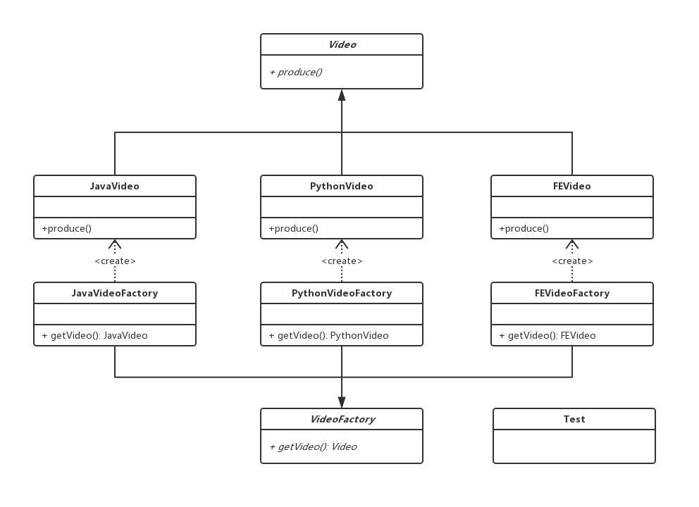

# 工厂方法

## 0x01.定义与类型

- 定义：定义一个创建对象的接口，但让实现这个接口的类来决定实例化那个类，工厂方法让类的实例化推迟到子类中进行
- 类型：创建型
- uml类图


- 代码

```java
//工厂接口
public interface IFactory {
    IProduct createProduct();
}

//产品接口
public interface IProduct {
    void produce();
}

//工厂实现
public class Factory implements IFactory {
    @Override
    public IProduct createProduct() {
        return new Product();
    }
}

//产品实现
public class Product implements IProduct{
    @Override
    public void produce() {
        System.out.println("具体产品业务。");
    }
}

//应用 / 测试类
public class Test {
    public static void main(String[] args) {
        IFactory factory = new Factory();
        IProduct product = factory.createProduct();
        product.produce();
    }
}
```

- 应用 / 测试类输出结果

```log
具体产品业务。
```

- 通过工厂方法模式的类图可以看到，工厂方法模式有四个要素：
  1. 工厂接口：工厂接口是工厂方法模式的核心，与调用者直接交互用来提供产品。在实际编程中，有时候也会使用一个抽象类来作为与调用者交互的接口，其本质上是一样的。
  2. 工厂实现：在编程中，工厂实现决定如何实例化产品，是实现扩展的途径，需要有多少种产品，就需要有多少个具体的工厂实现。
  3. 产品接口：产品接口的主要目的是定义产品的规范，所有的产品实现都必须遵循产品接口定义的规范。产品接口是调用者最为关心的，产品接口定义的优劣直接决定了调用者代码的稳定性。同样，产品接口也可以用抽象类来代替，但要注意最好不要违反里氏替换原则。
  4. 产品实现：实现产品接口的具体类，决定了产品在客户端中的具体行为。

## 0x02.简单工厂对比工厂方法

- 简单工厂只有三个要素，他没有工厂接口，并且得到产品的方法一般是静态的。
- 因为没有工厂接口，所以在工厂实现的扩展性方面稍弱，可以算是工厂方法模式的简化版。
- 简单工厂如果发生变动是需要修改工厂方法，违反了开闭原则。

## 0x03.使用场景

- 创建类模式，在任何需要生成复杂对象的地方，都可以使用工厂方法模式。有一点需要注意的地方就是复杂对象适合使用工厂模式，而简单对象，特别是只需要通过new就可以完成创建的对象，无需使用工厂模式。如果使用工厂模式，就需要引入一个工厂类，会增加系统的复杂度。
- 工厂模式是一种典型的解耦模式，迪米特法则在工厂模式中表现的尤为明显。假如调用者自己组装产品需要增加依赖关系时，可以考虑使用工厂模式。将会大大降低对象之间的耦合度。
- 由于工厂模式是依靠抽象架构的，它把实例化产品的任务交由实现类完成，扩展性比较好。也就是说，当需要系统有比较好的扩展性时，可以考虑工厂模式，不同的产品用不同的实现工厂来组装。
- 总结的说
  1. 创建对象需要大量重复的代码
  2. 客户端（应用层）不依赖于产品类实例如何被创建、实现等细节
  3. 一个类通过其子类来指定创建那个对象（具有产品抽象）

## 0x04.优点

- 用户只需要关心所需要产品对应的工厂，无需关心创建细节
- 加入新产品符合开闭原则，提高可扩展性

## 0x05.缺点

- 类的个数容易过多，增加复杂度
- 增加了系统的抽象性和理解难度

## 0x06.实现样例

- 在线教育网站具有多种技术种类视频
- 视频工厂与视频类的定义

```java
//视频工厂
public abstract class VideoFactory {
    public abstract Video getVideo();
}

//视频类
public abstract class Video {
    public abstract void produce();
}
```

- Java视频的实现

```java
//Java视频工厂
public class JavaVideoFactory extends VideoFactory {
    @Override
    public JavaVideo getVideo() {
        return new JavaVideo();
    }
}

//Java视频
public class JavaVideo extends Video {
    @Override
    public void produce() {
        System.out.println("录制Java课程视频");
    }
}
```

- Python视频实现

```java
//Python视频工厂
public class PythonVideoFactory extends VideoFactory {
    @Override
    public PythonVideo getVideo() {
        return new PythonVideo();
    }
}

//Python视频
public class PythonVideo extends Video{
    @Override
    public void produce() {
        System.out.println("录制Python课程");
    }
}
```

- 前端课程实现

```java
//前端视频实现
public class FEVideoFactory extends VideoFactory {
    @Override
    public FEVideo getVideo() {
        return new FEVideo();
    }
}

//前端视频
public class FEVideo extends Video {
    @Override
    public void produce() {
        System.out.println("录制前端视频");
    }
}
```

- 应用与测试类实现

```java
public class Test {

    public static void main(String[] args) {
        VideoFactory videoFactory = new JavaVideoFactory();
        Video video1 = videoFactory.getVideo();
        video1.produce();

        videoFactory = new PythonVideoFactory();
        Video video2 = videoFactory.getVideo();
        video2.produce();

        videoFactory = new FEVideoFactory();
        Video video3 = videoFactory.getVideo();
        video3.produce();
    }
}
```

- 输出结果

```log
录制Java课程视频
录制Python课程
录制前端视频
```

- 实现UML类图



## 0x07.源码中的工厂方法

- Collection.iterator()方法
  - 每个集合的具体实现都有一个实现了Iterator的具体实现
  - Collection.iterator相当于是工厂方法
  - ArrayList中的iterator是其中的内部类的实现的工厂
  
  ```java
  public Iterator<E> iterator() {
      return new Itr();
  }
  private class Itr implements Iterator<E> {
      //省略了具体实现
  }
  ```

  - 使用私有内部类来实现具体产品，实现iterator方法，来生成具体的实现。

- URLStreamHandlerFactory工厂
- log4j, logback---->LoggerFactory

## 0x08.源码地址

`工厂方法模式`：[https://github.com/sigmako/design-pattern/tree/master/factory-method](https://github.com/sigmako/design-pattern/tree/master/factory-method)

## 0x09.参考

- `慕课网设计模式精讲`: [https://coding.imooc.com/class/270.html](https://coding.imooc.com/class/270.html)
- `23种设计模式（2）：工厂方法模式`: [https://blog.csdn.net/zhengzhb/article/details/7348707](https://blog.csdn.net/zhengzhb/article/details/7348707)