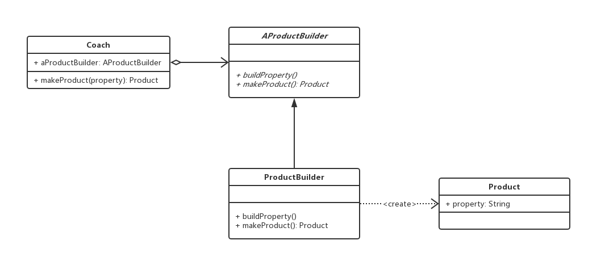
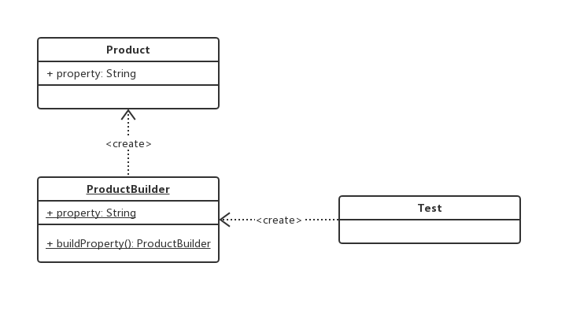
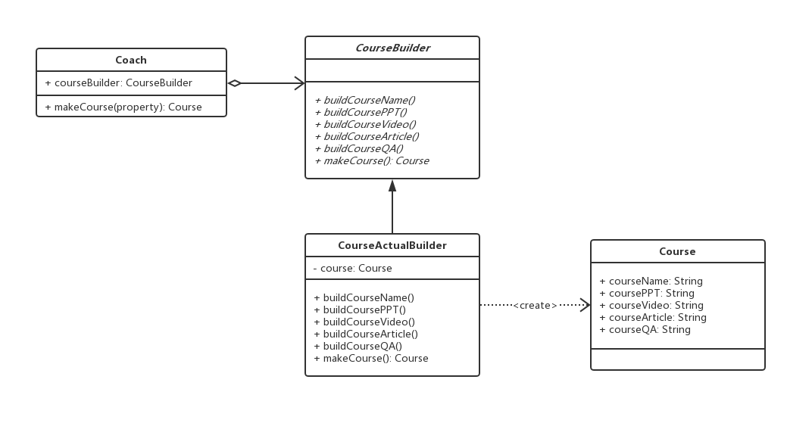
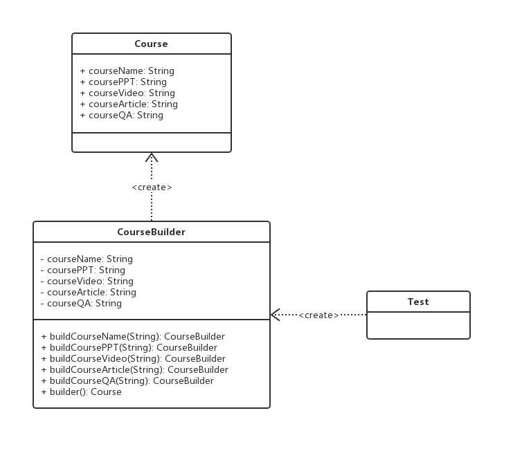

# 建造者模式

## 0x01.定义与类型

- 定义：将一个复杂对象的构建与它的表示分离，使得同样的构建过程可以创建不同的表示。
- 用户只需指定需要建造的类型就可以得到他们，建造过程及细节不需要知道
- 类型：创建型
- 建造模式有两种使用方式

### 1.抽象建造者

- UML：




- Java实现

```java
/**
* 教练类，封装了具体构建的细节
*/
public class Coach {

    private AProductBuilder productBuilder;

    public void setProductBuilder(AProductBuilder productBuilder) {
        this.productBuilder = productBuilder;
    }

    public Product createProduct(String property) {
        productBuilder.buildProperty(property);
        return this.productBuilder.makeProduct();
    }
}

/**
* 抽象的构建，每添加新的构建方式，只需要继承这个抽象类即可
*/
public abstract class AProductBuilder {

    /**
    * 构建具体属性，只是mock一个，可以有很多个
    * @param property
    */
    abstract void buildProperty(String property);

    /**
    * 返回被构建的对象
    * @return
    */
    abstract Product makeProduct();
}

/**
* 产品具体的构建类
*/
public class ProductActualBuilder extends AProductBuilder {

    private Product product = new Product();

    @Override
    void buildProperty(String property) {
        product.setProperty(property);
    }

    @Override
    Product makeProduct() {
        return product;
    }
}

/**
* 产品类
*/
public class Product {

    /**
    * 产品实现细节，可以很多个属性，这里只mock了一个
    */
    private String property;

    public void setProperty(String property) {
        this.property = property;
    }

    public String getProperty() {
        return property;
    }
}
```

- 测试应用类

```java
public class Test {

    public static void main(String[] args) {
        Coach coach = new Coach();
        coach.setProductBuilder(new ProductActualBuilder());
        Product product = coach.createProduct("测试属性");
        System.out.println(product.getProperty());
    }
}
```

- 输出结果

```log
测试属性
```

- 抽象建造者模式中的元素
  - 产品类：一般是一个较为复杂的对象，也就是说创建对象的过程比较复杂，一般会有比较多的代码量。在本类图中，产品类是一个具体的类，而非抽象类。实际编程中，产品类可以是由一个抽象类与它的不同实现组成，也可以是由多个抽象类与他们的实现组成。
  - 抽象建造者：引入抽象建造者的目的，是为了将建造的具体过程交与它的子类来实现。这样更容易扩展。一般至少会有两个抽象方法，一个用来建造产品，一个是用来返回产品。
  - 建造者：实现抽象类的所有未实现的方法，具体来说一般是两项任务：组建产品；返回组建好的产品。
  - 教练类：负责调用适当的建造者来组建产品，教练类一般不与产品类发生依赖关系，与教练类直接交互的是建造者类。一般来说，教练类被用来封装程序中易变的部分。

### 2.使用静态内部类和链式调用

- UML：




- Java实现

```java
/**
* 产品类
*/
public class Product {
   /**
    * 产品属性，只是举了一个例子，可以有很多个
    */
   private String property;

   /**
    * 产品的构建 构造方法
    * @param productBuilder
    */
   public Product (ProductBuilder productBuilder) {
       this.property = productBuilder.property;
   }

   public String getProperty() {
       return property;
   }

   public void setProperty(String property) {
       this.property = property;
   }

   /**
    * 产品构建类
    */
   public static class ProductBuilder {

       private String property;

       public ProductBuilder builderProperty (String property) {
           this.property = property;
           return this;
       }

       public Product build() {
           return new Product(this);
       }
   }
}
```

- 输出结果

```log
测试属性
```

- 静态内部类建造者模式的元素
  - 产品：最终我们需要的结果，较为复杂或创建过程较为复杂的对象。
  - 产品的构建类：builder类是整个建造者模式的核心，具体由两项任务，一是构建产品细节，二是返回构建好的产品。

## 0x02.适用场景

- 如果一个对象有非常复杂的内部结构（很多属性），这个时候可以考虑适用建造者模式。
- 想把复杂对象的创建和使用分离的时候。

## 0x03.优点

- 封装性好，创建和使用分离，使用建造者模式可以有效的封装变化，在使用建造者模式的场景中，一般产品类和建造者类是比较稳定的。
- 扩展性好，建造类之间独立，一定程度上解耦，如果有新的需求，通过实现一个新的建造者类就可以完成，基本上不用修改之前已经测试通过的代码，因此也就不会对原有功能引入风险。

## 0x04.缺点

- 会产生多余的Builder对象。
- 产品内部发生变化，建造者都要修改，成本较大。

## 0x05.具体Java实现

- 场景介绍：课程有课程名字，视频，PPT和手记，举例构建这个对象

### 1.抽象建造类的实现

- 具体的实现

```java
/**
* 课程教练类
*/
public class Coach {

    private CourseBuilder courseBuilder;

    public void setCourseBuilder(CourseBuilder courseBuilder) {
        this.courseBuilder = courseBuilder;
    }

    public Course makeCourse(String courseName,
                            String coursePPT,
                            String courseVideo,
                            String courseArticle,
                            String courseQA) {
        this.courseBuilder.buildCourseName(courseName);
        this.courseBuilder.buildCoursePPT(coursePPT);
        this.courseBuilder.buildCourseArticle(courseArticle);
        this.courseBuilder.buildCourseVideo(courseVideo);
        this.courseBuilder.buildCourseQA(courseQA);
        return this.courseBuilder.makeCourse();
    }
}

/**
* 建造者的具体实现与应用
*/
public abstract class CourseBuilder {

    public abstract void buildCourseName(String courseName);

    public abstract void buildCoursePPT(String coursePPT);

    public abstract void buildCourseVideo(String courseVideo);

    public abstract void buildCourseArticle(String courseArticle);

    public abstract void buildCourseQA(String courseQA);

    public abstract Course makeCourse();
}


/**
* 建造者的具体实现
*/
public class CourseActualBuilder extends CourseBuilder {

    private Course course = new Course();

    @Override
    public void buildCourseName(String courseName) {
        course.setCourseName(courseName);
    }

    @Override
    public void buildCoursePPT(String coursePPT) {
        course.setCoursePPT(coursePPT);
    }

    @Override
    public void buildCourseVideo(String courseVideo) {
        course.setCourseVideo(courseVideo);
    }

    @Override
    public void buildCourseArticle(String courseArticle) {
        course.setCourseArticle(courseArticle);
    }

    @Override
    public void buildCourseQA(String courseQA) {
        course.setCourseQA(courseQA);
    }

    @Override
    public Course makeCourse() {
        return course;
    }
}

/**
* 具体产品的实例：课程
*/
public class Course {

    private String courseName;

    private String coursePPT;

    private String courseVideo;

    private String courseArticle;

    //question & answer
    private String courseQA;

    public String getCourseName() {
        return courseName;
    }

    public void setCourseName(String courseName) {
        this.courseName = courseName;
    }

    public String getCoursePPT() {
        return coursePPT;
    }

    public void setCoursePPT(String coursePPT) {
        this.coursePPT = coursePPT;
    }

    public String getCourseVideo() {
        return courseVideo;
    }

    public void setCourseVideo(String courseVideo) {
        this.courseVideo = courseVideo;
    }

    public String getCourseArticle() {
        return courseArticle;
    }

    public void setCourseArticle(String courseArticle) {
        this.courseArticle = courseArticle;
    }

    public String getCourseQA() {
        return courseQA;
    }

    public void setCourseQA(String courseQA) {
        this.courseQA = courseQA;
    }

    @Override
    public String toString() {
        return "Course{" +
                "courseName='" + courseName + '\'' +
                ", coursePPT='" + coursePPT + '\'' +
                ", courseVideo='" + courseVideo + '\'' +
                ", courseArticle='" + courseArticle + '\'' +
                ", courseQA='" + courseQA + '\'' +
                '}';
    }
}
```

- 测试与应用

```java
/**
* 测试与应用
*/
public class Test {
    public static void main(String[] args) {
        CourseBuilder courseBuilder = new CourseActualBuilder();

        Coach coach = new Coach();
        coach.setCourseBuilder(courseBuilder);

        Course course = coach.makeCourse(
                "Java设计模式精讲",
                "Java设计模式精讲PPT",
                "Java设计模式精讲视频",
                "Java设计模式精讲手记",
                "Java设计模式精讲问答"
                );

        System.out.println(course);
    }
}
```

- 输出结果

```log
Course{courseName='Java设计模式精讲', coursePPT='Java设计模式精讲PPT', courseVideo='Java设计模式精讲视频', courseArticle='Java设计模式精讲手记', courseQA='Java设计模式精讲问答'}
```

- UML类图



### 2.静态内部类建造者模式

- 具体的实现

```java
/**
 * 课程类
 */
public class Course {

    private String courseName;

    private String coursePPT;

    private String courseVideo;

    private String courseArticle;

    //question & answer
    private String courseQA;

    public Course(CourseBuilder courseBuilder) {
        this.courseName = courseBuilder.courseName;
        this.courseArticle = courseBuilder.courseArticle;
        this.coursePPT = courseBuilder.coursePPT;
        this.courseVideo = courseBuilder.courseVideo;
        this.courseQA = courseBuilder.courseQA;
    }

    @Override
    public String toString() {
        return "Course{" +
                "courseName='" + courseName + '\'' +
                ", coursePPT='" + coursePPT + '\'' +
                ", courseVideo='" + courseVideo + '\'' +
                ", courseArticle='" + courseArticle + '\'' +
                ", courseQA='" + courseQA + '\'' +
                '}';
    }

    /**
     * 课程静态builder类
     */
    public static class CourseBuilder {

        private String courseName;

        private String coursePPT;

        private String courseVideo;

        private String courseArticle;

        //question & answer
        private String courseQA;


        public CourseBuilder buildCourseName(String courseName) {
            this.courseName = courseName;
            return this;
        }

        public CourseBuilder buildCoursePPT(String coursePPT) {
            this.coursePPT = coursePPT;
            return this;
        }

        public CourseBuilder buildCourseVideo(String courseVideo) {
            this.courseVideo = courseVideo;
            return this;
        }

        public CourseBuilder buildCourseArticle(String courseArticle) {
            this.courseArticle = courseArticle;
            return this;
        }

        public CourseBuilder buildCourseQA(String courseQA) {
            this.courseQA = courseQA;
            return this;
        }

        public Course build() {
            return new Course(this);
        }
    }
}
```

- 测试与应用

```java
/**
 * 测试与应用
 */
public class Test {
    public static void main(String[] args) {
        Course course1 = new Course.CourseBuilder()
                .buildCourseName("Java课程精讲")
                .buildCourseArticle("Java课程精讲手机")
                .buildCoursePPT("Java课程精讲PPT")
                .buildCourseVideo("Java课程精讲视频")
                .build();

        System.out.println(course1.toString());

        Course course2 = new Course.CourseBuilder()
                .buildCourseName("Java课程精讲")
                .buildCourseVideo("Java课程精讲视频")
                .build();

        System.out.println(course2.toString());
    }
}
```

- 输出结果

```log
Course{courseName='Java课程精讲', coursePPT='Java课程精讲PPT', courseVideo='Java课程精讲视频', courseArticle='Java课程精讲手机', courseQA='null'}
Course{courseName='Java课程精讲', coursePPT='null', courseVideo='Java课程精讲视频', courseArticle='null', courseQA='null'}
```

- UML



## 0x06.建造者和工厂对比

- 建造者和工厂模式都属于创建类的设计模式，本身的场景很相似。
- 建造者：注重方法的调用顺序，建造复杂的产品，由很多复杂的部件组成，不止创建产品还要知道产品的组成。
- 工厂：注重产品，产品基本都是一个样子，只是生产产品，不关心产品组成。

## 0x07.源码中的建造者模式

- StringBuilder
- StringBuffer
- Guava: ImtableSet
- CacheBuilder
- Spring: BeanDefinitionBuilder
- MyBatis: SqlSessionFactoryBuilder

## 0x08.样例代码

`建造者模式`：[https://github.com/sigmako/design-pattern/tree/master/builder](https://github.com/sigmako/design-pattern/tree/master/builder)

## 0x09.参考

- `慕课网设计模式精讲`: [https://coding.imooc.com/class/270.html](https://coding.imooc.com/class/270.html)
- `23种设计模式（4）：建造者模式`: [https://blog.csdn.net/zhengzhb/article/details/7375966](https://blog.csdn.net/zhengzhb/article/details/7375966)
