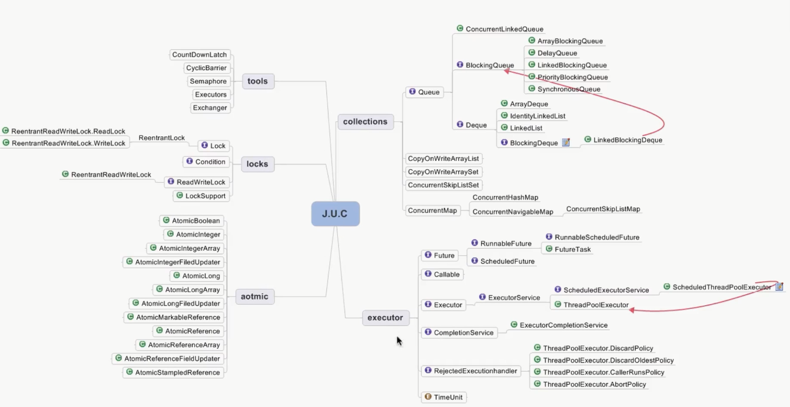

# 线程安全策略

## 不可变对象需要满足的条件

- 对象创建以后其状态就不能修改
- 对象所有域都是final类型
- 对象是正确创建的（在对象创建期间，this引用没有逸出）

## final关键字：类，方法，变量

- 修饰类：不能被继承
- 修饰方法
  - 锁定方法不被继承类修改
  - 效率，类比较重时候感知为0
  - private方法会隐式指定为final
- 修饰变量：基本数据类型变量，引用类型变量

## 其他不可变对象的方法

- Collections.unmodifiableXXX: Collection, List, Set, Map...
- Guava: ImmutableXXX: Collection, List, Set, Map...

## 线程封闭

- Ad-hoc线程封闭：程序控制实现，最糟糕，忽略
- 堆栈封闭：局部变量，无并发问题
- ThreadLocal线程封闭：特别好的封闭方法（数据库连接的conn对象，使用线程封闭最好的方法）

## 线程不安全类与写法

- StringBuffer -> StringBuilder
- SimpleDataFormat -> JodaTime
- ArrayList, HashSet, HashMap等Collections
- **先检查再执行：if(condition(a)) { handle(a); }**

## 线程安全 - 同步容器

- ArrayList -> Vector, Stack
- HashMap -> HashTable(key, value不能为null)
- Collections.synchronizedXXX(List, Set, Map) 同步容器
- 很少场景使用了

## 线程安全 - 并发容器 J.U.C

- ArrayList -> CopyOnWriteArrayList
  - 当新增数组时，会Copy一份原来数组添加完元素后会将原数组的引用指向新的数组。添加方法有锁存在，防止复制多个数组。
  - 缺点1：写操作需要Copy数组，就会消耗内存，导致young GC/full GC
  - 缺点2：不能用于实时读的要求，因为可能数据添加完，引用还没改，读取老的数据。
  - 适合读多写少的场景
  - 读写分离
  - 最终一致性
  - 新开辟空间
- HashSet, TreeSet -> CopyOnWriteArraySet, ConcurrentSkipListSet
  - CopyOnWriteArraySet 线程安全和CopyOnWriteArrayList类似
  - ConcurrentSkipListSet JDK6新增，和TreeSet一样支持自然排序
- HashMap, TreeMap -> ConcurrencyHashMap, ConcurrentSkipListMap

## 安全共享对象策略 - 总结

- 线程限制：一个被线程限制的对象，由线程独占，并且只能被占有它的线程修改。
- 共享只读：一个共享只读的对象，在没有额外同步的情况下，可以被多个线程并发访问，但是任何线程都不能修改它
- 线程安全对象：一个线程安全的对象或者容器，在内部通过同步机制来保证线程安全，所以其他线程无需额外的同步就可以通过公共接口随意访问它
- 被守护对象：被守护对象只能通过获取特定的锁来访问