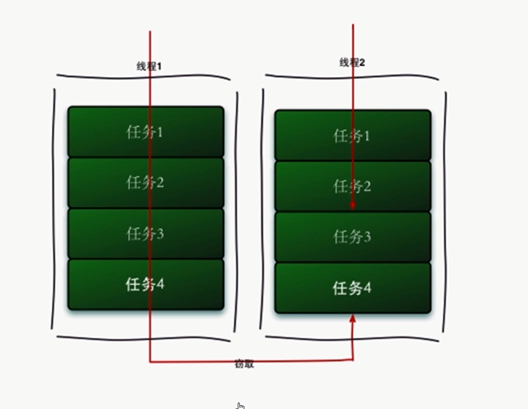

# FutureTask

## Callable与Runnable接口对比

## Future接口

## FutureTask类

## Fork/Join 框架

## BlockingQueue

- 阻塞队列：生产线程向队列中插入数据，直至队列满了，生产线程阻塞，只有当消费线程成功消费一个数据，生产线程才可以向里面插入数据。写入与读取互相阻塞，只有满了读线程才可以读，而只有有空间，写线程才可以写入数据。

- ArrayBlockingQueue: 有界的阻塞队列，内部实现是一个数组，容量是有限的，在初始化时指定大小，以先进先出的方式存储数据。
- DelayQueue: 阻塞的是内部元素，元素必须实现一个接口Delay, 其中元素需要排序。定时关闭连接，缓存对象，超时处理。
- LinkedBlockingQueue: 大小配置时可选的，指定就有边界，不指定就是最大的INT值，使用链表实现，也是先进先出存储数据。
- PriorityBlockingQueue: 带优先级的阻塞队列，没有边界，允许插入null, 有排序规则。
- SynchronousQueue: 内部只允许容纳一个元素，只有读取才可写入，同步队列。无界非缓存的队列。