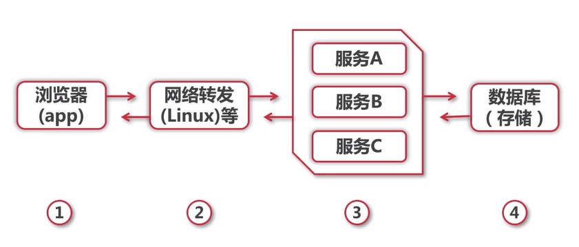
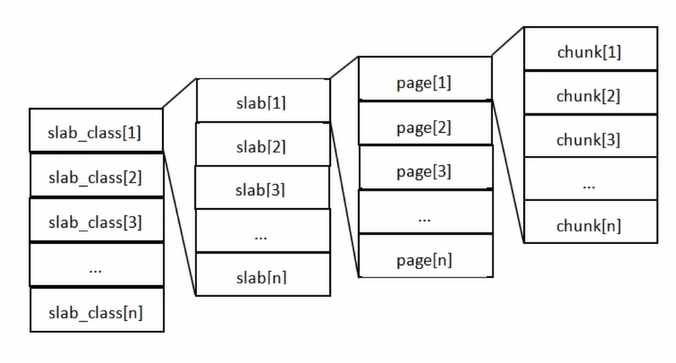
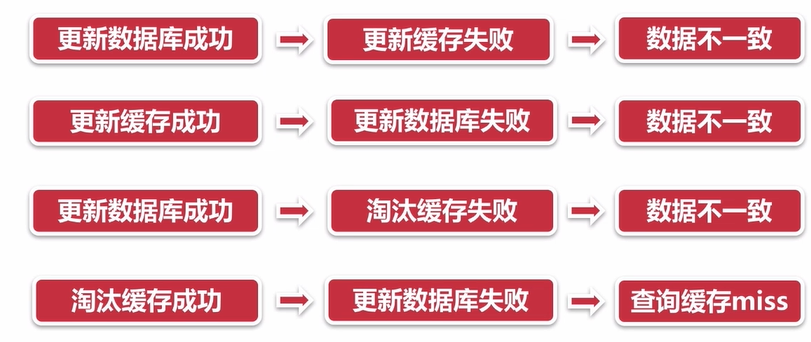
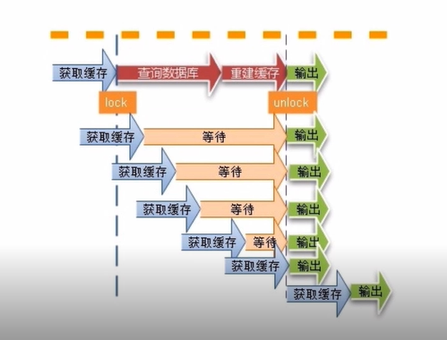
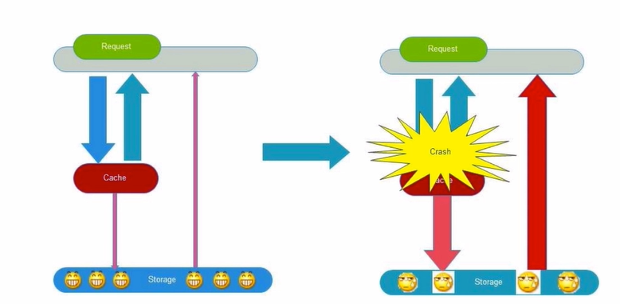

# 高并发处理思路与手段

## 扩容

- 垂直扩容（纵向扩展）：提高系统部件能力
- 水平扩容（横向扩展）：增加更多系统成员来实现

### 扩容 - 数据库

- 读操作扩展：memcache, redis, CDN等缓存
- 写操作扩展：Cassandar, HBase等

## 缓存

### 缓存特征

- 命中率：命中数 / （命中数 + 没有命中数）
- 最大元素（空间）
- 清空策略：FIFO, LFU, LRU, 过期时间，随机等
  - FIFO（first in first out）: 先进先出策略
  - LFU：最少使用策略，清除最少使用的元素
  - LRU：最近最少使用策略，优先保证热点数据有效性。

### 缓存命中率的影响因素

- 业务场景和业务需求
- 缓存的设计（粒度和策略）
- 缓存容量和基础设施

### 提高缓存命中率的方法

### 缓存分类和应用场景

- 本地缓存：编程实现（成员变量，局部变量，静态变量），Guava Cache
- 分布式缓存：Memcache，Redis

### 缓存 - Guava Cache

### 缓存 - Memcache

### 缓存 - Redis

- 性能极高
- 丰富的数据类型
- 原子性
- 通知，key过期

### 高并发场景下缓存常见问题

- 缓存一致性
- 缓存并发问题
- 缓存穿透问题
- 缓存雪崩问题

#### 缓存一致性

#### 缓存并发问题

#### 缓存穿透问题

> 一般情况使用缓存，是当查询缓存未命中的时候接着去查询DB，而当DB中有没有数据，则这就是一个无效查询，这种情况叫缓存击穿。

- 解决办法
  - 对结果为空的情况也进行缓存，缓存为null，保证时效性
  - 添加过滤器，对结果为空的数据添加统一管理

#### 缓存雪崩现象

- 缓存颠簸问题

由于缓存单点故障导致，一般通过一致性Hash算法解决的。

- 缓存雪崩现象，由于缓存的问题，使大量的请求到达后台数据库，使数据库系统崩溃。
  - 系统缓存周期性失效（设置不同的过期时间）
  - 单点故障
  - 分布式问题等
- 如何避免
  - 熔断降级等
  - 多级缓存

## 消息队列

### 消息队列特性

- 业务无关：只做消息分发
- FIFO：先投递先到达
- 容灾：节点的动态增删和消息的持久化
- 性能：吞吐量提升，系统内部通信效率提高

### 为什么需要消息队列

- 【生产】和【消费】的速度或稳定性等因素不一致

### 消息队列的好处

- 业务解耦
- 最终一致性
- 广播
- 错峰与流控

### 消息队列距离

- Kafka
- RabbitMQ

### 消息队列 - Kafka

