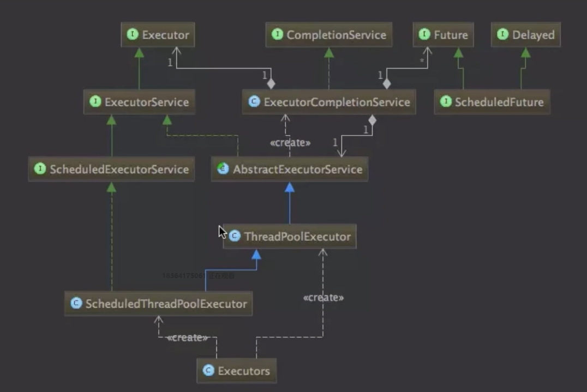
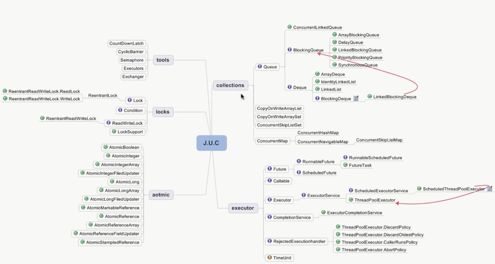

# 线程调度 - 线程池

## 线程池

- new Thread弊端
  - 每次new Thread新建对象，性能差
  - 线程缺乏统一管理，可能无限制的新建线程，相互竞争，有可能占用过多系统资源导致死机或OOM
  - 缺少更多功能，如更多执行，定期执行，线程中断等。
- 线程池的好处
  - 重用存在的此案成，减少对象创建，消亡的开销，性能佳
  - 可有效控制最大并发线程数，提高系统资源利用率，同时可以避免过多资源竞争，避免阻塞。
  - 提供定时执行，定期执行，单线程，并发数控制等功能

## 线程池 - ThreadPoolExecutor

- 参数
  - corePoolSize: 核心线程数量
  - maximumPoolSize: 线程最大线程数
  - workQueue: 阻塞队列，存储等待执行的任务，很重要，会对线程池运行过程产生重大影响
  - keepAliveTime: 线程没有任务执行时最多保持多久时间终止
  - unit: keepAliveTime的时间单位
  - threadFactory: 线程工厂，用来创建线程
  - rejectHandler: 当拒绝处理任务时的策略
- 处理规则：
  - 如果运行的线程数少于corePoolSize的数量，直接创建新的线程来进行任务，不管有没有线程正在空闲
  - 如果正在运行的线程数量大于corePoolSize切小于等于maximumPoolSize的时候，则只有workQueue满的时候才会创建新的线程去处理任务。
  - 如果设置的corePoolSize和maximumPoolSize值是相同的话，那么创建线程池的大小是固定的，如果有新任务，而workQueue还没满的时候，会将任务放入workQueue里，等待有空闲线程去处理。
  - 如果运行的线程大于maximumPoolSize并且workQueue也已经满了，那么通过拒绝策略这个参数去指定策略
  - 任务提交执行顺序corePoolSize --> workQueue --> maximumPoolSize
- workQueue
  - 保存等待执行任务的阻塞队列，当我们提交一个新的任务到线程池，线程池会根据当前线程池中正在运行的线程数量来决定线程的处理方式，处理方式一共有三种，分别是直接切换（SynchronousQueue），使用无线队列（LinkedBlockingQueue），使用有机队列（ArrayBlockingQueue）

## 线程池 - ThreadPoolExecutor提供的方法

- execute(): 提交任务，交给线程池执行
- submit(): 提交任务，能够返回执行结果 execute + Future
- shutdown(): 关闭线程池，等待任务都执行完
- showdownNow(): 关闭线程池，不等待任务执行完
- getTaskCount(): 线程池已执行和未执行的任务总数
- getCompletedTaskCount(): 已完成的任务数量
- getPoolSize(): 线程池当前的线程数量
- getActiveCount(): 当前线程池中正在执行任务的线程数量

## 线程池 - Executor框架接口

- Executors.newCachedThreadPool: 创建一个可缓存的线程池，如果线程的数量超过了设置的长度，可以灵活回收线程，如果没有回收的就新建线程。
- Executors.newFixedThreadPool: 创建定长的线程池，可以控制最大的并发数，超过长度的线程会在队列中等待。
- Executors.newScheduledThreadPool: 创建定常的线程池，支持定时，周期性的任务执行。
- Executors.newSingleThreadExecutor: 创建单线程化的线程池，只有一个工作线程的线程池，保证按照一定顺序去执行。先进先出！

## 线程池 - 合理配置

- CPU密集型任务，就需要尽量压榨CPU，参考值可以设为 NCPU + 1
- IO密集型任务，参考值可以设置为 2 * NCPU

## J.U.C回顾

