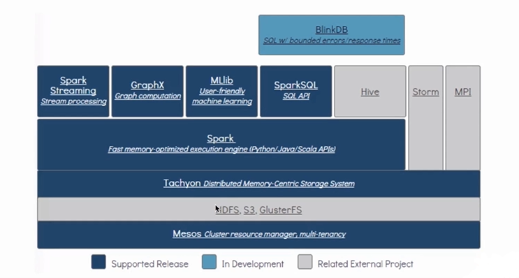
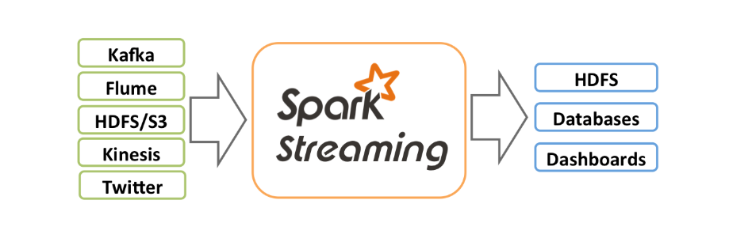
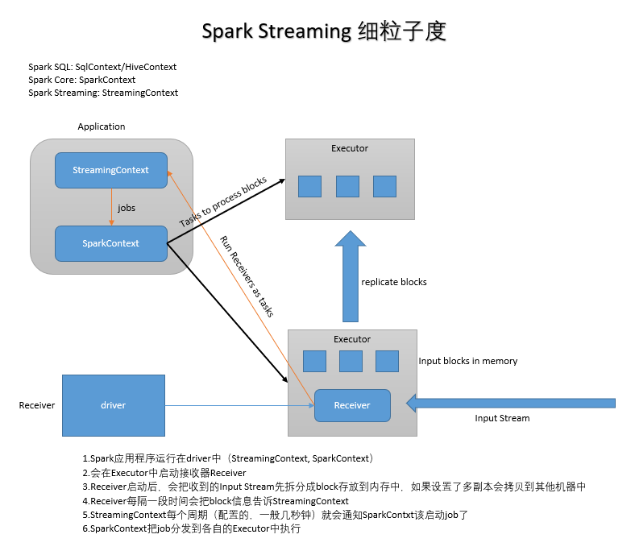

# 1. Spark Streaming入门

## 1. 概述



- Spark Streaming is an extension of the core Spark API that enables scalable(Spark Streaming是基于Spark Core的扩展)
- high-throughput(高可用)
- fault-tolerant(容错)
- stream processing of live data streams(作用在实时数据流上)
- Spark Streaming: 将不同的数据源的数据经过Spark Streaming处理之后将结果输出到外部文件系统
- 特点:
  - 低延时
  - 能从错误中高效的恢复: fault-tolerant
  - 能够运行在成百上千的节点
  - 能够将批处理、机器学习、图计算等子框架和Spark Streaming综合起来使用
- Spark Streaming 不需要单独部署，包含在Spark Project里。
- One stack to rule them all: 一栈式解决。



## 2. 应用场景

- Real-time fraud detection in transactions(实时交易金融欺诈检测，银行业等)
- React to anomalies in sensors in real-time(实时反应，电子业等)
- 电商网站（推荐系统等，以前是离线处理的）
- 实时监控（发现外界攻击等）
- Java EE应用（实时日志错误统计、应变等）

## 3. 集成Spark生态系统使用


> Spark生态的组件，他们都是依托Spark Core进行各自的扩展，那么Spark Streaming如何与各组件间调用呢？

- Join data streams with static data sets(数据流和静态数据)

```scala
//Create data set from Hadoop file
val dataset = sparkContext.hadoopFile("file")

//Join each batch in stream with the dataset
//kafka数据 => RDD
kafkaStream.transform(batchRDD => {
    batchRDD.join(dataset).filter(...)
})

```

- Learn models offline, apply them online(使用机器学习模型))

```scala
//Learn model offline
val model = KMeans.train(dataset, ...)

//Apply model online on stream
kafkaStream.map(event => {
    model.predict(event.featrue)
})
```

- Interactively query straming data with SQL(使用SQL查询交互式数据流)

```scala
//Register each batch in stream as table
kafkaStream.map(batchRDD => {
    batchRDD.registerTempTable("latestEvents")
})

//interactively query table
sqlContext.sql("SELECT * FROM latestEvents")
```

## 4. Spark Streaming发展史

- Late 2011 - idea AMPLab, UC Berkeley
- Q2 2012 - prototype Rewrote large parts of Spark core Smallest job - 900 ms -> < 50ms
- Q3 2012 - Spark core improvements open source in Spark 0.6
- Feb 2013 - Alpha release 7.7k lines, merged in 7 days Released with Spark 0.7
- Jan 2014 - Stable release Graduation with Spark 0.9

## 5. 从词频统计功能着手入门

- spark-submit执行

```shell
./spark-submit --master local[2] \
--class org.apache.spark.examples.streaming.NetworkWordCount \
/usr/local/spark/examples/jars/spark-examples.jar [args1] [args2]
```

- spark-shell执行

```shell
import org.apache.spark.streaming.{Seconds, StreamingContext}
val ssc = new StreamingContext(sc, Seconds(1))
val lines = ssc.socketTextStream("localhost", 9999)
val wordCounts = lines.flatMap(_.split(" ")).map(x => (x, 1)).recudeByKey(_ + _)
wordCounts.print()
ssc.start()
ssc.awaitTermination()
```

- 测试

```shell
#向端口发送消息
nc -lk 9999
```

## 6. 工作原理

- 粗粒度：Spark Streaming接收到实时数据流，把数据按照指定的时间段切成一片片小的数据块，然后把小的数据库传给Spark Engine处理。


- 细粒度

