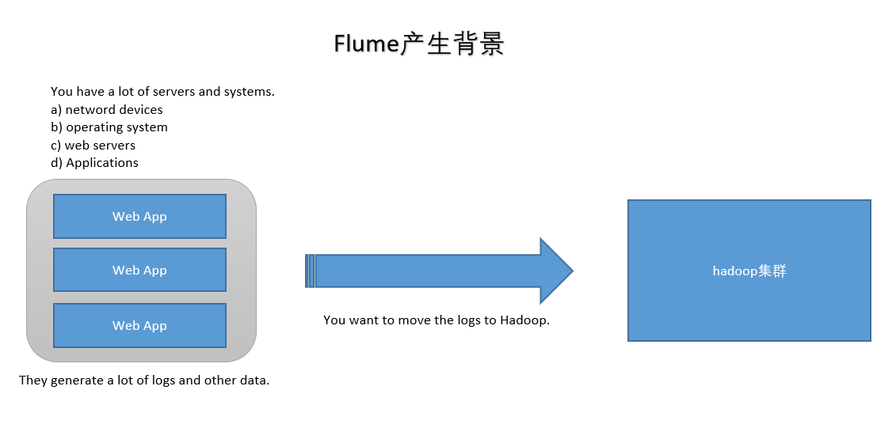
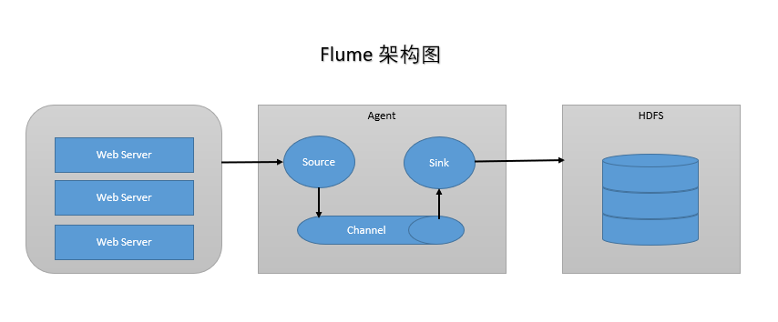
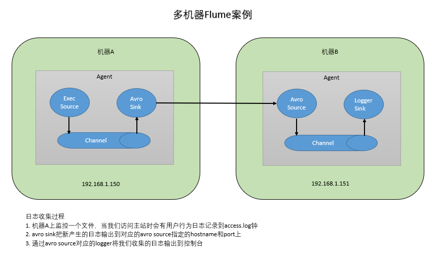

# 分布式日志收集框架Flume

## 1.业务现状分析



- WebServer/ApplicationServer分散在各个机器上
- 想在大数据平台Hadoop进行统计分析
- 日志如何收集到Hadoop平台上
- 解决方案及存在的问题

- 如何解决我们的数据从其他的server上移动到Hadoop之上？
  1. shell: cp --> Hadoop集群的机器上，hdfs dfs -put ....（有很多问题不好解决，容错、负载均衡、时效性、压缩）
  2. Flume，从 A --> B 移动日志

## 2.Flume概述

- Flume官网：[http://flume.apache.org/](http://flume.apache.org/)
> Flume is a distributed, reliable, and available service for efficiently collecting, aggregating, and moving large amounts of log data.
> Flume是由Apache基金会提供的一个分布式、高可靠、高可用的服务，用于分布式的海量日志的高效收集、聚合、移动系统。

- Flume设计目标
  1. 可靠性：高科要
  2. 扩展性：模块可扩展
  3. 管理性：agent管理
  
- 界同类产品对比
  1. **Flume: Cloudera/Apache, Java语言开发。**
  2. **Logstash: ELK(ElasticsSearch, Logstash, Kibana)**
  3. Scribe: Facebook, 使用C/C++开发, 负载均衡不是很好, 已经不维护了。
  4. Chukwa: Yahoo/Apache, 使用Java语言开发, 负载均衡不是很好, 已经不维护了。
  5. Fluentd: 和Flume类似, Ruby开发。

- Flume发展史
  1. Cloudera公司提出0.9.2，叫Flume-OG
  2. 2011年Flume-728编号，重要里程碑(Flume-NG)，贡献给Apache社区
  3. 2012年7月 1.0版本
  4. 2015年5月 1.6版本
  5. ~ 1.7版本

## 3.Flume架构及核心组件



### Flume有三大组件

- Source: 收集，指定数据源从哪里来（Avro, Thrift, Spooling, Kafka, Exec）
- Channel: 聚集，把数据先存在（Memory, File, Kafka等用的比较多）
- Sink: 把数据写到某个地方去（HDFS, Hive, Logger, Avro, Thrift, File, ES, HBase, Kafka等）

## 4.Flume环境部署

- 前置条件
  - Java Runtime Environment - Java 1.8 or later（安装Java）
  - Memory - Sufficient memory for configurations used by sources, channels or sinks（足够内存）
  - Disk Space - Sufficient disk space for configurations used by channels or sinks（足够空间）
  - Directory Permissions - Read/Write permissions for directories used by agent（读写权限）
- 1.安装JDK（下载，解压，安装，配置环境变量）
- 2.安装Flume（下载，加压，安装，配置环境变量，检测：flume-ng version）

## 5.Flume实战

- 需求1：从指定网络端口采集数据输出到控制台
  - flume-conf.properties
    - A) 配置Source
    - B) 配置Channel
    - C) 配置Sink
    - D) 把以上三个组件串起来

  ```properties
  # example.conf: A single-node Flume configuration

  # a1: agent名称
  # r1：source的名称
  # k1：sink的名称
  # c1：channel的名称

  # Name the components on this agent
  a1.sources = r1
  a1.sinks = k1
  a1.channels = c1

  # Describe/configure the source
  a1.sources.r1.type = netcat
  a1.sources.r1.bind = localhost
  a1.sources.r1.port = 44444

  # Describe the sink
  a1.sinks.k1.type = logger

  # Use a channel which buffers events in memory
  a1.channels.c1.type = memory
  a1.channels.c1.capacity = 1000
  a1.channels.c1.transactionCapacity = 100

  # Bind the source and sink to the channel
  a1.sources.r1.channels = c1
  a1.sinks.k1.channel = c1
  ```

  - 启动Agent

  ```shell
  flume-ng agent \
  --name $agent_name \
  --conf conf \
  --conf-file conf/flume-conf.properties \
  -Dflume.root.logger=INFO,console

  flume-ng agent \
  --name a1 \
  --conf $FLUME_HOME/conf \
  --conf-file $FLUME_HOME/conf/example.conf \
  -Dflume.root.logger=INFO,console
  ```

- 需求2：监控一个文件实时采集新增的数据输出到控制台
  - 1.Agent选型：exec source + memory channel + logger sink
  - 2.配置文件

  ```properties
  # exec-memory-logger.conf: A single-node Flume configuration

  # a1: agent名称
  # r1：source的名称
  # k1：sink的名称
  # c1：channel的名称

  # Name the components on this agent
  a1.sources = r1
  a1.sinks = k1
  a1.channels = c1

  # Describe/configure the source
  a1.sources.r1.type = exec
  a1.sources.r1.command = tail -F /home/k.o/data/data.log
  a1.sources.r1.shell = /bin/sh -c

  # Describe the sink
  a1.sinks.k1.type = logger

  # Use a channel which buffers events in memory
  a1.channels.c1.type = memory
  a1.channels.c1.capacity = 1000
  a1.channels.c1.transactionCapacity = 100

  # Bind the source and sink to the channel
  a1.sources.r1.channels = c1
  a1.sinks.k1.channel = c1
  ```

  - 启动Agent

  ```shell
  flume-ng agent \
  --name $agent_name \
  --conf conf \
  --conf-file conf/flume-conf.properties \
  -Dflume.root.logger=INFO,console

  flume-ng agent \
  --name a1 \
  --conf $FLUME_HOME/conf \
  --conf-file $FLUME_HOME/conf/exec-memory-logger.conf \
  -Dflume.root.logger=INFO,console
  ```

- 需求3：将A服务器上的日志实时采集到B服务器

  

  - 技术选型：
    1.exec source + memory channel + avro sink
    2.arro source + memory channel + logger sink

  ```properties
  # exec-memory-avro.conf: A single-node Flume configuration

  # exec-memory-avro: agent名称
  # exec-source：source的名称
  # avro-sink：sink的名称
  # memory-channel：channel的名称

  # Name the components on this agent
  exec-memory-avro.sources = exec-source
  exec-memory-avro.sinks = avro-sink
  exec-memory-avro.channels = memory-channel

  # Describe/configure the source
  exec-memory-avro.sources.exec-source.type = exec
  exec-memory-avro.sources.exec-source.command = tail -F /home/k.o/data/data.log
  exec-memory-avro.sources.exec-source.shell = /bin/sh -c

  # Describe the sink
  exec-memory-avro.sinks.avro-sink.type = avro
  exec-memory-avro.sinks.avro-sink.hostname = localhost
  exec-memory-avro.sinks.avro-sink.port = 44444

  # Use a channel which buffers events in memory
  exec-memory-avro.channels.memory-channel.type = memory
  exec-memory-avro.channels.memory-channel.capacity = 1000
  exec-memory-avro.channels.memory-channel.transactionCapacity = 100

  # Bind the source and sink to the channel
  exec-memory-avro.sources.exec-source.channels = memory-channel
  exec-memory-avro.sinks.avro-sink.channel = memory-channel
  ```

  ```properties
  # avro-memory-logger.conf: A single-node Flume configuration

  # avro-memory-logger: agent名称
  # exec-source：source的名称
  # logger-sink：sink的名称
  # memory-channel：channel的名称

  # Name the components on this agent
  avro-memory-logger.sources = avro-source
  avro-memory-logger.sinks = logger-sink
  avro-memory-logger.channels = memory-channel

  # Describe/configure the source
  avro-memory-logger.sources.avro-source.type = avro
  avro-memory-logger.sources.avro-source.bind = localhost
  avro-memory-logger.sources.avro-source.port = 44444

  # Describe the sink
  avro-memory-logger.sinks.logger-sink.type = logger

  # Use a channel which buffers events in memory
  avro-memory-logger.channels.memory-channel.type = memory
  avro-memory-logger.channels.memory-channel.capacity = 1000
  avro-memory-logger.channels.memory-channel.transactionCapacity = 100

  # Bind the source and sink to the channel
  avro-memory-logger.sources.avro-source.channels = memory-channel
  avro-memory-logger.sinks.logger-sink.channel = memory-channel
  ```

  - 启动Agent

  ```shell
  # 先启动 avro-memory-logger
  flume-ng agent \
  --name avro-memory-logger \
  --conf $FLUME_HOME/conf \
  --conf-file $FLUME_HOME/conf/avro-memory-logger.conf \
  -Dflume.root.logger=INFO,console

  # 再启动 exec-memory-avro
  flume-ng agent \
  --name exec-memory-avro \
  --conf $FLUME_HOME/conf \
  --conf-file $FLUME_HOME/conf/exec-memory-avro.conf \
  -Dflume.root.logger=INFO,console
  ```

  - 日志收集过程
    1. 机器A上监控一个文件，当我们访问主站时会有用户行为日志记录到access.log钟
    2. avro sink把新产生的日志输出到对应的avro source指定的hostname和port上
    3. 通过avro source对应的logger将我们收集的日志输出到控制台