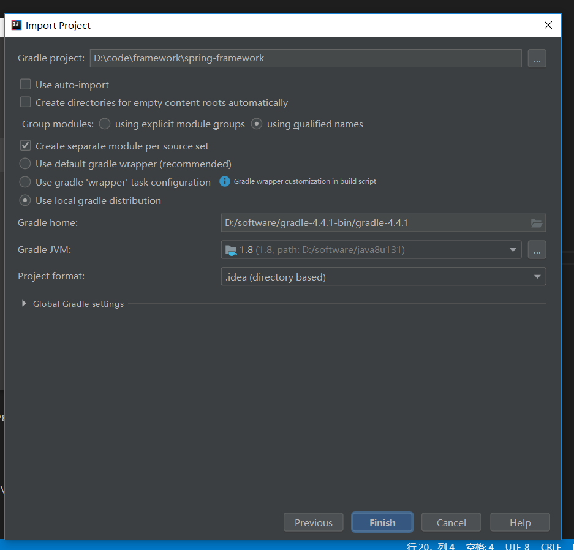

# SpringMVC 源码调试环境搭建

## 0x01 依赖环境

- 安装**JDK 1.8**，并配置环境变量
- 安装**Gradle 4.4.1**，并配置环境变量
- Git
- IntellJ IDEA

## 0x02 下载源码到本地，导入IDEA

- [https://github.com/spring-projects/spring-framework](https://github.com/spring-projects/spring-framework)
- 这里建议fork到自己仓库，便于翻看源码添加注释

## 0x03 构建编译顺序

- 1.直接导入IDEA
- 2.选择本地的gradle目录环境，点击完成



```log
* Where:
Build file 'D:\code\framework\spring-framework\spring-beans\spring-beans.gradle' line: 28

* What went wrong:
A problem occurred evaluating project ':spring-beans'.
> No such property: immutableValues for class: org.gradle.api.internal.tasks.DefaultTaskDependency


注释掉：spring-beans.gradle: 28, 29行
```

```log
* Where:
Build file 'D:\code\framework\spring-framework\spring-test\spring-test.gradle' line: 103

* What went wrong:
A problem occurred evaluating project ':spring-test'.
> Could not find method useJUnitPlatform() for arguments [spring_test_f5fp54pu50zhhzke93j1kdcu1$_run_closure4$_closure13@61e2341b] on task ':spring-test:testJUnitJupiter' of type org.gradle.api.tasks.testing.Te
st.

注释掉：spring-test.gradle: 102-135行
```

- 2.将阿里云的库添加到build.gradle 151行
- 3.等待项目Jar包下载完

```groovy
maven { url "http://maven.aliyun.com/nexus/content/groups/public" }
```

- 4.进入spring-core目录下，执行gradle build命令将spring-core项目打包，要不然cglib报错

## 0x04 构建异常合集

1. Could not resolve io.spring.gradle:propdeps-plugin:0.0.9.RELEASE.

```log
org.gradle.api.ProjectConfigurationException: A problem occurred configuring root project 'spring'.
    at org.gradle.configuration.project.LifecycleProjectEvaluator.addConfigurationFailure(LifecycleProjectEvaluator.java:94)
    at org.gradle.configuration.project.LifecycleProjectEvaluator.doConfigure(LifecycleProjectEvaluator.java:66)
    at org.gradle.configuration.project.LifecycleProjectEvaluator.access$100(LifecycleProjectEvaluator.java:34)
    at org.gradle.configuration.project.LifecycleProjectEvaluator$ConfigureProject.run(LifecycleProjectEvaluator.java:110)
    at org.gradle.internal.progress.DefaultBuildOperationExecutor$RunnableBuildOperationWorker.execute(DefaultBuildOperationExecutor.java:336)
    at org.gradle.internal.progress.DefaultBuildOperationExecutor$RunnableBuildOperationWorker.execute(DefaultBuildOperationExecutor.java:328)
    at org.gradle.internal.progress.DefaultBuildOperationExecutor.execute(DefaultBuildOperationExecutor.java:199)
    at org.gradle.internal.progress.DefaultBuildOperationExecutor.run(DefaultBuildOperationExecutor.java:110)
    at org.gradle.configuration.project.LifecycleProjectEvaluator.evaluate(LifecycleProjectEvaluator.java:50)
    at org.gradle.api.internal.project.DefaultProject.evaluate(DefaultProject.java:666)
    at org.gradle.api.internal.project.DefaultProject.evaluate(DefaultProject.java:135)
    at org.gradle.execution.TaskPathProjectEvaluator.configure(TaskPathProjectEvaluator.java:35)
    at org.gradle.execution.TaskPathProjectEvaluator.configureHierarchy(TaskPathProjectEvaluator.java:60)
    at org.gradle.configuration.DefaultBuildConfigurer.configure(DefaultBuildConfigurer.java:38)
    at org.gradle.initialization.DefaultGradleLauncher$ConfigureBuild.run(DefaultGradleLauncher.java:249)
    at org.gradle.internal.progress.DefaultBuildOperationExecutor$RunnableBuildOperationWorker.execute(DefaultBuildOperationExecutor.java:336)
    at org.gradle.internal.progress.DefaultBuildOperationExecutor$RunnableBuildOperationWorker.execute(DefaultBuildOperationExecutor.java:328)
    at org.gradle.internal.progress.DefaultBuildOperationExecutor.execute(DefaultBuildOperationExecutor.java:199)
    at org.gradle.internal.progress.DefaultBuildOperationExecutor.run(DefaultBuildOperationExecutor.java:110)
    at org.gradle.initialization.DefaultGradleLauncher.configureBuild(DefaultGradleLauncher.java:167)
    at org.gradle.initialization.DefaultGradleLauncher.doBuildStages(DefaultGradleLauncher.java:126)
    at org.gradle.initialization.DefaultGradleLauncher.getConfiguredBuild(DefaultGradleLauncher.java:104)
    at org.gradle.internal.invocation.GradleBuildController$2.call(GradleBuildController.java:87)
    at org.gradle.internal.invocation.GradleBuildController$2.call(GradleBuildController.java:84)
    at org.gradle.internal.work.DefaultWorkerLeaseService.withLocks(DefaultWorkerLeaseService.java:152)
    at org.gradle.internal.invocation.GradleBuildController.doBuild(GradleBuildController.java:100)
    at org.gradle.internal.invocation.GradleBuildController.configure(GradleBuildController.java:84)
    at org.gradle.tooling.internal.provider.runner.ClientProvidedBuildActionRunner.run(ClientProvidedBuildActionRunner.java:64)
    at org.gradle.launcher.exec.ChainingBuildActionRunner.run(ChainingBuildActionRunner.java:35)
    at org.gradle.launcher.exec.ChainingBuildActionRunner.run(ChainingBuildActionRunner.java:35)
    at org.gradle.tooling.internal.provider.ValidatingBuildActionRunner.run(ValidatingBuildActionRunner.java:32)
    at org.gradle.launcher.exec.RunAsBuildOperationBuildActionRunner$1.run(RunAsBuildOperationBuildActionRunner.java:43)
    at org.gradle.internal.progress.DefaultBuildOperationExecutor$RunnableBuildOperationWorker.execute(DefaultBuildOperationExecutor.java:336)
    at org.gradle.internal.progress.DefaultBuildOperationExecutor$RunnableBuildOperationWorker.execute(DefaultBuildOperationExecutor.java:328)
    at org.gradle.internal.progress.DefaultBuildOperationExecutor.execute(DefaultBuildOperationExecutor.java:199)
    at org.gradle.internal.progress.DefaultBuildOperationExecutor.run(DefaultBuildOperationExecutor.java:110)
    at org.gradle.launcher.exec.RunAsBuildOperationBuildActionRunner.run(RunAsBuildOperationBuildActionRunner.java:40)
    at org.gradle.tooling.internal.provider.SubscribableBuildActionRunner.run(SubscribableBuildActionRunner.java:51)
    at org.gradle.launcher.exec.InProcessBuildActionExecuter.execute(InProcessBuildActionExecuter.java:47)
    at org.gradle.launcher.exec.InProcessBuildActionExecuter.execute(InProcessBuildActionExecuter.java:30)
    at org.gradle.launcher.exec.BuildTreeScopeBuildActionExecuter.execute(BuildTreeScopeBuildActionExecuter.java:39)
    at org.gradle.launcher.exec.BuildTreeScopeBuildActionExecuter.execute(BuildTreeScopeBuildActionExecuter.java:25)
    at org.gradle.tooling.internal.provider.ContinuousBuildActionExecuter.execute(ContinuousBuildActionExecuter.java:80)
    at org.gradle.tooling.internal.provider.ContinuousBuildActionExecuter.execute(ContinuousBuildActionExecuter.java:53)
    at org.gradle.tooling.internal.provider.ServicesSetupBuildActionExecuter.execute(ServicesSetupBuildActionExecuter.java:57)
    at org.gradle.tooling.internal.provider.ServicesSetupBuildActionExecuter.execute(ServicesSetupBuildActionExecuter.java:32)
    at org.gradle.tooling.internal.provider.GradleThreadBuildActionExecuter.execute(GradleThreadBuildActionExecuter.java:36)
    at org.gradle.tooling.internal.provider.GradleThreadBuildActionExecuter.execute(GradleThreadBuildActionExecuter.java:25)
    at org.gradle.tooling.internal.provider.ParallelismConfigurationBuildActionExecuter.execute(ParallelismConfigurationBuildActionExecuter.java:43)
    at org.gradle.tooling.internal.provider.ParallelismConfigurationBuildActionExecuter.execute(ParallelismConfigurationBuildActionExecuter.java:29)
    at org.gradle.tooling.internal.provider.StartParamsValidatingActionExecuter.execute(StartParamsValidatingActionExecuter.java:69)
    at org.gradle.tooling.internal.provider.StartParamsValidatingActionExecuter.execute(StartParamsValidatingActionExecuter.java:30)
    at org.gradle.tooling.internal.provider.SessionFailureReportingActionExecuter.execute(SessionFailureReportingActionExecuter.java:59)
    at org.gradle.tooling.internal.provider.SessionFailureReportingActionExecuter.execute(SessionFailureReportingActionExecuter.java:44)
    at org.gradle.tooling.internal.provider.SetupLoggingActionExecuter.execute(SetupLoggingActionExecuter.java:45)
    at org.gradle.tooling.internal.provider.SetupLoggingActionExecuter.execute(SetupLoggingActionExecuter.java:30)
    at org.gradle.launcher.daemon.server.exec.ExecuteBuild.doBuild(ExecuteBuild.java:67)
    at org.gradle.launcher.daemon.server.exec.BuildCommandOnly.execute(BuildCommandOnly.java:36)
    at org.gradle.launcher.daemon.server.api.DaemonCommandExecution.proceed(DaemonCommandExecution.java:122)
    at org.gradle.launcher.daemon.server.exec.WatchForDisconnection.execute(WatchForDisconnection.java:37)
    at org.gradle.launcher.daemon.server.api.DaemonCommandExecution.proceed(DaemonCommandExecution.java:122)
    at org.gradle.launcher.daemon.server.exec.ResetDeprecationLogger.execute(ResetDeprecationLogger.java:26)
    at org.gradle.launcher.daemon.server.api.DaemonCommandExecution.proceed(DaemonCommandExecution.java:122)
    at org.gradle.launcher.daemon.server.exec.RequestStopIfSingleUsedDaemon.execute(RequestStopIfSingleUsedDaemon.java:34)
    at org.gradle.launcher.daemon.server.api.DaemonCommandExecution.proceed(DaemonCommandExecution.java:122)
    at org.gradle.launcher.daemon.server.exec.ForwardClientInput$2.call(ForwardClientInput.java:74)
    at org.gradle.launcher.daemon.server.exec.ForwardClientInput$2.call(ForwardClientInput.java:72)
    at org.gradle.util.Swapper.swap(Swapper.java:38)
    at org.gradle.launcher.daemon.server.exec.ForwardClientInput.execute(ForwardClientInput.java:72)
    at org.gradle.launcher.daemon.server.api.DaemonCommandExecution.proceed(DaemonCommandExecution.java:122)
    at org.gradle.launcher.daemon.server.exec.LogAndCheckHealth.execute(LogAndCheckHealth.java:55)
    at org.gradle.launcher.daemon.server.api.DaemonCommandExecution.proceed(DaemonCommandExecution.java:122)
    at org.gradle.launcher.daemon.server.exec.LogToClient.doBuild(LogToClient.java:62)
    at org.gradle.launcher.daemon.server.exec.BuildCommandOnly.execute(BuildCommandOnly.java:36)
    at org.gradle.launcher.daemon.server.api.DaemonCommandExecution.proceed(DaemonCommandExecution.java:122)
    at org.gradle.launcher.daemon.server.exec.EstablishBuildEnvironment.doBuild(EstablishBuildEnvironment.java:82)
    at org.gradle.launcher.daemon.server.exec.BuildCommandOnly.execute(BuildCommandOnly.java:36)
    at org.gradle.launcher.daemon.server.api.DaemonCommandExecution.proceed(DaemonCommandExecution.java:122)
    at org.gradle.launcher.daemon.server.exec.StartBuildOrRespondWithBusy$1.run(StartBuildOrRespondWithBusy.java:50)
    at org.gradle.launcher.daemon.server.DaemonStateCoordinator$1.run(DaemonStateCoordinator.java:295)
    at org.gradle.internal.concurrent.ExecutorPolicy$CatchAndRecordFailures.onExecute(ExecutorPolicy.java:63)
    at org.gradle.internal.concurrent.ManagedExecutorImpl$1.run(ManagedExecutorImpl.java:46)
    at java.util.concurrent.ThreadPoolExecutor.runWorker(ThreadPoolExecutor.java:1142)
    at java.util.concurrent.ThreadPoolExecutor$Worker.run(ThreadPoolExecutor.java:617)
    at org.gradle.internal.concurrent.ThreadFactoryImpl$ManagedThreadRunnable.run(ThreadFactoryImpl.java:55)
    at java.lang.Thread.run(Thread.java:748)
Caused by: org.gradle.api.internal.artifacts.ivyservice.DefaultLenientConfiguration$ArtifactResolveException: Could not resolve all files for configuration ':classpath'.
    at org.gradle.api.internal.artifacts.configurations.DefaultConfiguration.rethrowFailure(DefaultConfiguration.java:918)
    at org.gradle.api.internal.artifacts.configurations.DefaultConfiguration.access$1600(DefaultConfiguration.java:116)
    at org.gradle.api.internal.artifacts.configurations.DefaultConfiguration$ConfigurationFileCollection.getFiles(DefaultConfiguration.java:892)
    at org.gradle.api.internal.artifacts.configurations.DefaultConfiguration.getFiles(DefaultConfiguration.java:404)
    at org.gradle.api.internal.artifacts.configurations.DefaultConfiguration_Decorated.getFiles(Unknown Source)
    at org.gradle.api.internal.file.AbstractFileCollection.iterator(AbstractFileCollection.java:68)
    at org.gradle.internal.classpath.DefaultClassPath.<init>(DefaultClassPath.java:48)
    at org.gradle.api.internal.initialization.DefaultScriptClassPathResolver.resolveClassPath(DefaultScriptClassPathResolver.java:39)
    at org.gradle.api.internal.initialization.DefaultScriptHandler.getScriptClassPath(DefaultScriptHandler.java:72)
    at org.gradle.plugin.use.internal.DefaultPluginRequestApplicator.defineScriptHandlerClassScope(DefaultPluginRequestApplicator.java:204)
    at org.gradle.plugin.use.internal.DefaultPluginRequestApplicator.applyPlugins(DefaultPluginRequestApplicator.java:140)
    at org.gradle.configuration.DefaultScriptPluginFactory$ScriptPluginImpl.apply(DefaultScriptPluginFactory.java:179)
    at org.gradle.configuration.BuildOperationScriptPlugin$1.run(BuildOperationScriptPlugin.java:61)
    at org.gradle.internal.progress.DefaultBuildOperationExecutor$RunnableBuildOperationWorker.execute(DefaultBuildOperationExecutor.java:336)
    at org.gradle.internal.progress.DefaultBuildOperationExecutor$RunnableBuildOperationWorker.execute(DefaultBuildOperationExecutor.java:328)
    at org.gradle.internal.progress.DefaultBuildOperationExecutor.execute(DefaultBuildOperationExecutor.java:199)
    at org.gradle.internal.progress.DefaultBuildOperationExecutor.run(DefaultBuildOperationExecutor.java:110)
    at org.gradle.configuration.BuildOperationScriptPlugin.apply(BuildOperationScriptPlugin.java:58)
    at org.gradle.configuration.project.BuildScriptProcessor.execute(BuildScriptProcessor.java:41)
    at org.gradle.configuration.project.BuildScriptProcessor.execute(BuildScriptProcessor.java:26)
    at org.gradle.configuration.project.ConfigureActionsProjectEvaluator.evaluate(ConfigureActionsProjectEvaluator.java:34)
    at org.gradle.configuration.project.LifecycleProjectEvaluator.doConfigure(LifecycleProjectEvaluator.java:64)
    ... 84 more
Caused by: org.gradle.internal.resolve.ModuleVersionResolveException: Could not resolve io.spring.gradle:propdeps-plugin:0.0.9.RELEASE.
Required by:
    project :
    at org.gradle.api.internal.artifacts.ivyservice.ivyresolve.RepositoryChainComponentMetaDataResolver.resolveModule(RepositoryChainComponentMetaDataResolver.java:103)
    at org.gradle.api.internal.artifacts.ivyservice.ivyresolve.RepositoryChainComponentMetaDataResolver.resolve(RepositoryChainComponentMetaDataResolver.java:63)
    at org.gradle.api.internal.artifacts.ivyservice.resolveengine.ComponentResolversChain$ComponentMetaDataResolverChain.resolve(ComponentResolversChain.java:93)
    at org.gradle.api.internal.artifacts.ivyservice.clientmodule.ClientModuleResolver.resolve(ClientModuleResolver.java:48)
    at org.gradle.api.internal.artifacts.ivyservice.resolveengine.graph.builder.ComponentState.resolve(ComponentState.java:157)
    at org.gradle.api.internal.artifacts.ivyservice.resolveengine.graph.builder.ComponentState.getMetaData(ComponentState.java:168)
    at org.gradle.api.internal.artifacts.ivyservice.resolveengine.graph.builder.EdgeState.calculateTargetConfigurations(EdgeState.java:134)
    at org.gradle.api.internal.artifacts.ivyservice.resolveengine.graph.builder.EdgeState.attachToTargetConfigurations(EdgeState.java:105)
    at org.gradle.api.internal.artifacts.ivyservice.resolveengine.graph.builder.DependencyGraphBuilder.attachToTargetRevisionsSerially(DependencyGraphBuilder.java:239)
    at org.gradle.api.internal.artifacts.ivyservice.resolveengine.graph.builder.DependencyGraphBuilder.resolveEdges(DependencyGraphBuilder.java:229)
    at org.gradle.api.internal.artifacts.ivyservice.resolveengine.graph.builder.DependencyGraphBuilder.traverseGraph(DependencyGraphBuilder.java:143)
    at org.gradle.api.internal.artifacts.ivyservice.resolveengine.graph.builder.DependencyGraphBuilder.resolve(DependencyGraphBuilder.java:109)
    at org.gradle.api.internal.artifacts.ivyservice.resolveengine.DefaultArtifactDependencyResolver.resolve(DefaultArtifactDependencyResolver.java:90)
    at org.gradle.api.internal.artifacts.ivyservice.DefaultConfigurationResolver.resolveGraph(DefaultConfigurationResolver.java:146)
    at org.gradle.api.internal.artifacts.ivyservice.ShortCircuitEmptyConfigurationResolver.resolveGraph(ShortCircuitEmptyConfigurationResolver.java:73)
    at org.gradle.api.internal.artifacts.ivyservice.ErrorHandlingConfigurationResolver.resolveGraph(ErrorHandlingConfigurationResolver.java:66)
    at org.gradle.api.internal.artifacts.configurations.DefaultConfiguration$4.run(DefaultConfiguration.java:483)
    at org.gradle.internal.progress.DefaultBuildOperationExecutor$RunnableBuildOperationWorker.execute(DefaultBuildOperationExecutor.java:336)
    at org.gradle.internal.progress.DefaultBuildOperationExecutor$RunnableBuildOperationWorker.execute(DefaultBuildOperationExecutor.java:328)
    at org.gradle.internal.progress.DefaultBuildOperationExecutor.execute(DefaultBuildOperationExecutor.java:199)
    at org.gradle.internal.progress.DefaultBuildOperationExecutor.run(DefaultBuildOperationExecutor.java:110)
    at org.gradle.api.internal.artifacts.configurations.DefaultConfiguration.resolveGraphIfRequired(DefaultConfiguration.java:474)
    at org.gradle.api.internal.artifacts.configurations.DefaultConfiguration.resolveToStateOrLater(DefaultConfiguration.java:459)
    at org.gradle.api.internal.artifacts.configurations.DefaultConfiguration.access$1700(DefaultConfiguration.java:116)
    at org.gradle.api.internal.artifacts.configurations.DefaultConfiguration$ConfigurationFileCollection.getSelectedArtifacts(DefaultConfiguration.java:901)
    at org.gradle.api.internal.artifacts.configurations.DefaultConfiguration$ConfigurationFileCollection.getFiles(DefaultConfiguration.java:889)
    ... 103 more
Caused by: org.gradle.internal.resolve.ModuleVersionResolveException: Could not resolve io.spring.gradle:propdeps-plugin:0.0.9.RELEASE.
    at org.gradle.api.internal.artifacts.ivyservice.ivyresolve.ErrorHandlingModuleComponentRepository$ErrorHandlingModuleComponentRepositoryAccess.resolveComponentMetaData(ErrorHandlingModuleComponentRepository.java:129)
    at org.gradle.api.internal.artifacts.ivyservice.ivyresolve.ComponentMetaDataResolveState.process(ComponentMetaDataResolveState.java:66)
    at org.gradle.api.internal.artifacts.ivyservice.ivyresolve.ComponentMetaDataResolveState.resolve(ComponentMetaDataResolveState.java:58)
    at org.gradle.api.internal.artifacts.ivyservice.ivyresolve.RepositoryChainComponentMetaDataResolver.findBestMatch(RepositoryChainComponentMetaDataResolver.java:138)
    at org.gradle.api.internal.artifacts.ivyservice.ivyresolve.RepositoryChainComponentMetaDataResolver.findBestMatch(RepositoryChainComponentMetaDataResolver.java:119)
    at org.gradle.api.internal.artifacts.ivyservice.ivyresolve.RepositoryChainComponentMetaDataResolver.resolveModule(RepositoryChainComponentMetaDataResolver.java:92)
    ... 128 more
Caused by: org.gradle.api.resources.ResourceException: Could not get resource 'https://repo.spring.io/plugins-release/io/spring/gradle/propdeps-plugin/0.0.9.RELEASE/propdeps-plugin-0.0.9.RELEASE.pom'.
    at org.gradle.internal.resource.ResourceExceptions.failure(ResourceExceptions.java:74)
    at org.gradle.internal.resource.ResourceExceptions.getFailed(ResourceExceptions.java:57)
    at org.gradle.api.internal.artifacts.repositories.resolver.DefaultExternalResourceArtifactResolver.downloadByCoords(DefaultExternalResourceArtifactResolver.java:138)
    at org.gradle.api.internal.artifacts.repositories.resolver.DefaultExternalResourceArtifactResolver.downloadStaticResource(DefaultExternalResourceArtifactResolver.java:95)
    at org.gradle.api.internal.artifacts.repositories.resolver.DefaultExternalResourceArtifactResolver.resolveArtifact(DefaultExternalResourceArtifactResolver.java:65)
    at org.gradle.api.internal.artifacts.repositories.resolver.ExternalResourceResolver.parseMetaDataFromArtifact(ExternalResourceResolver.java:216)
    at org.gradle.api.internal.artifacts.repositories.resolver.MavenResolver.parseMetaDataFromArtifact(MavenResolver.java:170)
    at org.gradle.api.internal.artifacts.repositories.resolver.MavenResolver.parseMetaDataFromArtifact(MavenResolver.java:65)
    at org.gradle.api.internal.artifacts.repositories.resolver.ExternalResourceResolver.resolveStaticDependency(ExternalResourceResolver.java:193)
    at org.gradle.api.internal.artifacts.repositories.resolver.MavenResolver.doResolveComponentMetaData(MavenResolver.java:145)
    at org.gradle.api.internal.artifacts.repositories.resolver.ExternalResourceResolver$RemoteRepositoryAccess.resolveComponentMetaData(ExternalResourceResolver.java:467)
    at org.gradle.api.internal.artifacts.ivyservice.ivyresolve.CachingModuleComponentRepository$ResolveAndCacheRepositoryAccess.resolveComponentMetaData(CachingModuleComponentRepository.java:363)
    at org.gradle.api.internal.artifacts.ivyservice.ivyresolve.BaseModuleComponentRepositoryAccess.resolveComponentMetaData(BaseModuleComponentRepositoryAccess.java:50)
    at org.gradle.api.internal.artifacts.ivyservice.ivyresolve.memcache.InMemoryCachedModuleComponentRepository$CachedAccess.resolveComponentMetaData(InMemoryCachedModuleComponentRepository.java:95)
    at org.gradle.api.internal.artifacts.ivyservice.ivyresolve.ErrorHandlingModuleComponentRepository$ErrorHandlingModuleComponentRepositoryAccess.resolveComponentMetaData(ErrorHandlingModuleComponentRepository.java:126)
    ... 133 more
Caused by: org.gradle.internal.resource.transport.http.HttpRequestException: Could not HEAD 'https://repo.spring.io/plugins-release/io/spring/gradle/propdeps-plugin/0.0.9.RELEASE/propdeps-plugin-0.0.9.RELEASE.pom'.
    at org.gradle.internal.resource.transport.http.HttpClientHelper.performRequest(HttpClientHelper.java:96)
    at org.gradle.internal.resource.transport.http.HttpClientHelper.performRawHead(HttpClientHelper.java:72)
    at org.gradle.internal.resource.transport.http.HttpClientHelper.performHead(HttpClientHelper.java:76)
    at org.gradle.internal.resource.transport.http.HttpResourceAccessor.getMetaData(HttpResourceAccessor.java:65)
    at org.gradle.internal.resource.transfer.DefaultExternalResourceConnector.getMetaData(DefaultExternalResourceConnector.java:63)
    at org.gradle.internal.resource.transfer.AccessorBackedExternalResource.getMetaData(AccessorBackedExternalResource.java:201)
    at org.gradle.internal.resource.BuildOperationFiringExternalResourceDecorator$1.call(BuildOperationFiringExternalResourceDecorator.java:61)
    at org.gradle.internal.resource.BuildOperationFiringExternalResourceDecorator$1.call(BuildOperationFiringExternalResourceDecorator.java:58)
    at org.gradle.internal.progress.DefaultBuildOperationExecutor$CallableBuildOperationWorker.execute(DefaultBuildOperationExecutor.java:350)
    at org.gradle.internal.progress.DefaultBuildOperationExecutor$CallableBuildOperationWorker.execute(DefaultBuildOperationExecutor.java:340)
    at org.gradle.internal.progress.DefaultBuildOperationExecutor.execute(DefaultBuildOperationExecutor.java:199)
    at org.gradle.internal.progress.DefaultBuildOperationExecutor.call(DefaultBuildOperationExecutor.java:120)
    at org.gradle.internal.resource.BuildOperationFiringExternalResourceDecorator.getMetaData(BuildOperationFiringExternalResourceDecorator.java:58)
    at org.gradle.internal.resource.transfer.DefaultCacheAwareExternalResourceAccessor$1.create(DefaultCacheAwareExternalResourceAccessor.java:102)
    at org.gradle.internal.resource.transfer.DefaultCacheAwareExternalResourceAccessor$1.create(DefaultCacheAwareExternalResourceAccessor.java:82)
    at org.gradle.cache.internal.ProducerGuard$AdaptiveProducerGuard.guardByKey(ProducerGuard.java:97)
    at org.gradle.internal.resource.transfer.DefaultCacheAwareExternalResourceAccessor.getResource(DefaultCacheAwareExternalResourceAccessor.java:82)
    at org.gradle.api.internal.artifacts.repositories.resolver.DefaultExternalResourceArtifactResolver.downloadByCoords(DefaultExternalResourceArtifactResolver.java:129)
    ... 145 more
Caused by: java.net.SocketTimeoutException: Read timed out
    at java.net.SocketInputStream.socketRead0(Native Method)
    at java.net.SocketInputStream.socketRead(SocketInputStream.java:116)
    at java.net.SocketInputStream.read(SocketInputStream.java:171)
    at java.net.SocketInputStream.read(SocketInputStream.java:141)
    at sun.security.ssl.InputRecord.readFully(InputRecord.java:465)
    at sun.security.ssl.InputRecord.read(InputRecord.java:503)
    at sun.security.ssl.SSLSocketImpl.readRecord(SSLSocketImpl.java:973)
    at sun.security.ssl.SSLSocketImpl.readDataRecord(SSLSocketImpl.java:930)
    at sun.security.ssl.AppInputStream.read(AppInputStream.java:105)
    at org.apache.http.impl.io.SessionInputBufferImpl.streamRead(SessionInputBufferImpl.java:139)
    at org.apache.http.impl.io.SessionInputBufferImpl.fillBuffer(SessionInputBufferImpl.java:155)
    at org.apache.http.impl.io.SessionInputBufferImpl.readLine(SessionInputBufferImpl.java:284)
    at org.apache.http.impl.conn.DefaultHttpResponseParser.parseHead(DefaultHttpResponseParser.java:140)
    at org.apache.http.impl.conn.DefaultHttpResponseParser.parseHead(DefaultHttpResponseParser.java:57)
    at org.apache.http.impl.io.AbstractMessageParser.parse(AbstractMessageParser.java:261)
    at org.apache.http.impl.DefaultBHttpClientConnection.receiveResponseHeader(DefaultBHttpClientConnection.java:165)
    at org.apache.http.impl.conn.CPoolProxy.receiveResponseHeader(CPoolProxy.java:167)
    at org.apache.http.protocol.HttpRequestExecutor.doReceiveResponse(HttpRequestExecutor.java:272)
    at org.apache.http.protocol.HttpRequestExecutor.execute(HttpRequestExecutor.java:124)
    at org.apache.http.impl.execchain.MainClientExec.execute(MainClientExec.java:271)
    at org.apache.http.impl.execchain.ProtocolExec.execute(ProtocolExec.java:184)
    at org.apache.http.impl.execchain.RetryExec.execute(RetryExec.java:88)
    at org.apache.http.impl.execchain.RedirectExec.execute(RedirectExec.java:110)
    at org.apache.http.impl.client.InternalHttpClient.doExecute(InternalHttpClient.java:184)
    at org.apache.http.impl.client.CloseableHttpClient.execute(CloseableHttpClient.java:82)
    at org.gradle.internal.resource.transport.http.HttpClientHelper.performHttpRequest(HttpClientHelper.java:148)
    at org.gradle.internal.resource.transport.http.HttpClientHelper.performHttpRequest(HttpClientHelper.java:126)
    at org.gradle.internal.resource.transport.http.HttpClientHelper.executeGetOrHead(HttpClientHelper.java:103)
    at org.gradle.internal.resource.transport.http.HttpClientHelper.performRequest(HttpClientHelper.java:94)
    ... 162 more

```

```log
A problem occurred configuring root project 'spring'.
> Could not resolve all files for configuration ':classpath'.
   > Could not resolve io.spring.gradle:propdeps-plugin:0.0.9.RELEASE.
     Required by:
         project :
      > Could not resolve io.spring.gradle:propdeps-plugin:0.0.9.RELEASE.
         > Could not get resource 'https://repo.spring.io/plugins-release/io/spring/gradle/propdeps-plugin/0.0.9.RELEASE/propdeps-plugin-0.0.9.RELEASE.pom'.
            > Could not GET 'https://repo.spring.io/plugins-release/io/spring/gradle/propdeps-plugin/0.0.9.RELEASE/propdeps-plugin-0.0.9.RELEASE.pom'.
               > Read timed out

* Try:
Run with --stacktrace option to get the stack trace. Run with --info or --debug option to get more log output. Run with --scan to get full insights.

* Get more help at https://help.gradle.org
```